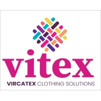

# Vircatex
\
**Rubro:** Textil

## Misión
Establecer un estándar ejemplar en la industria textil y de confección al combinar la excelencia en la calidad, la flexibilidad en la producción y el cumplimiento riguroso de los plazos, todo ello respaldado por un compromiso inquebrantable con la generación de empleo y el desarrollo socioeconómico del Perú.

## Visión
En un plazo de cinco años, Vitex se visualiza como el líder indiscutible en la mente de sus compradores. Siendo elegidos por su capacidad excepcional para entender, atender y superar las expectativas de nuestros clientes en términos de tiempos de entrega, flexibilidad y calidad de producto, contribuyendo de manera significativa al crecimiento del mercado textil y de confecciones de exportación peruano.

## Servicios
- Desarrollo de productos
- Desarrollo de telas
- Proceso de manufactura **(corte, costura y acabados)**
- Lavanderia
- Bordado, estampado y transfer

## Diagrama del proceso de negocio

## Recursos adicionales
[Sitio web de Vircatex](https://vircatex.com)

## Contacto
William Enrique Valencia Mallma\
Cargo: Contador general\
Correo: wvalencia@vircatex.com\
Celular: 945 298 505

**[Regresar a opciones de empresas](../empresas.md)**

***[Regresar al índice](../../README.md)***