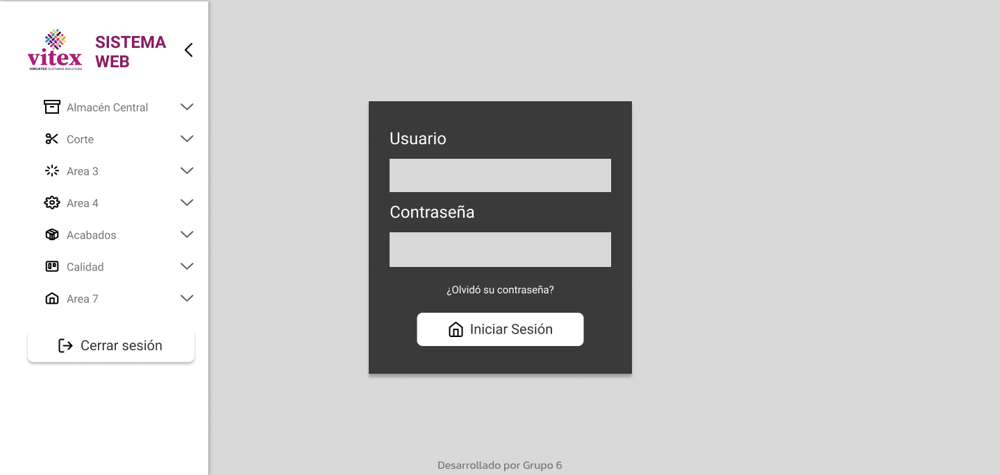
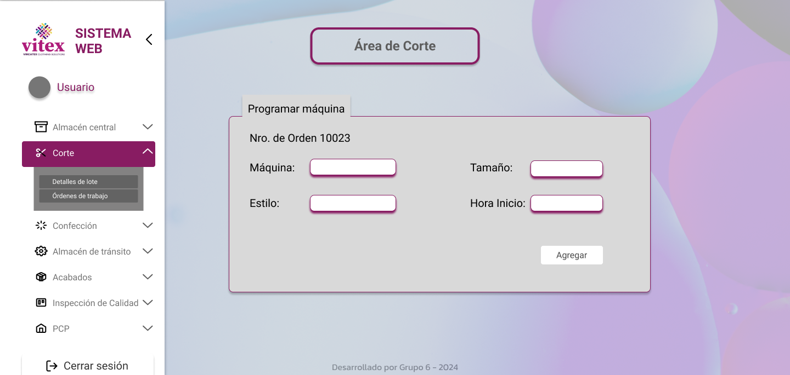
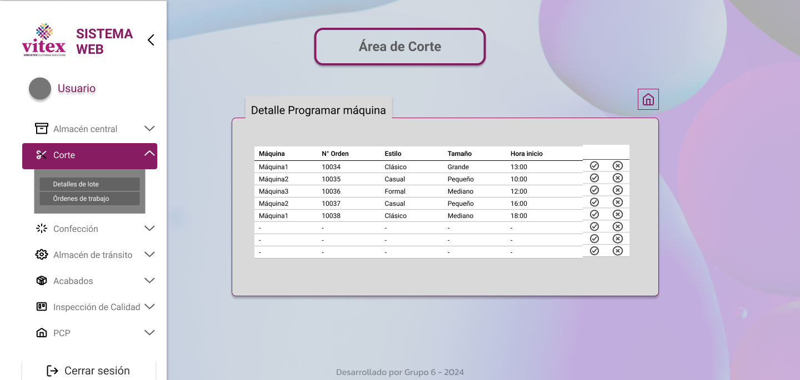
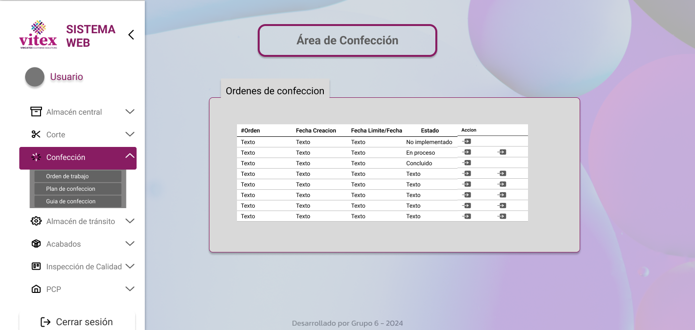
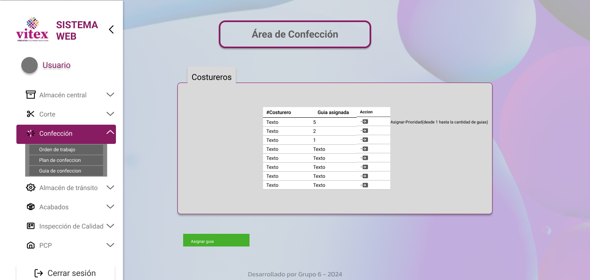
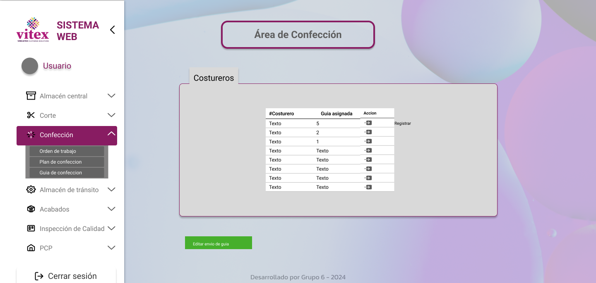
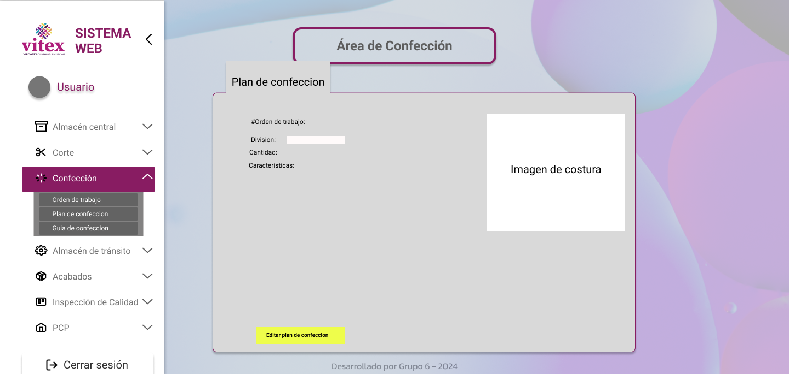
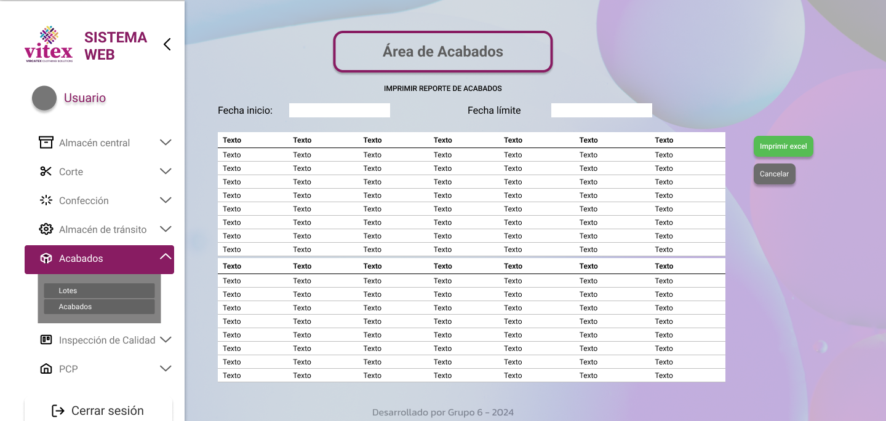
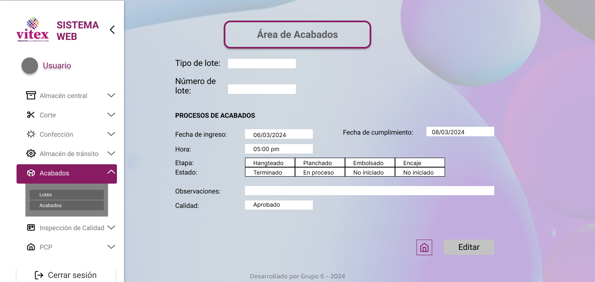

# Mockups Figma

-Bienvenida
-Sesion terminada
-Bienvenida al sistema

- Almacén central
- Corte
- Confección
- Almacén de tránsito
- Acabados
- Inspeccion de calidad
- PCP - abastecimiento de materia prima

- ## Principales

- ## Corte

- ## Confección

.png)

- ## Almacén de tránsito

- ## Acabados

- ## Inspección de Calidad

- ## PCP

