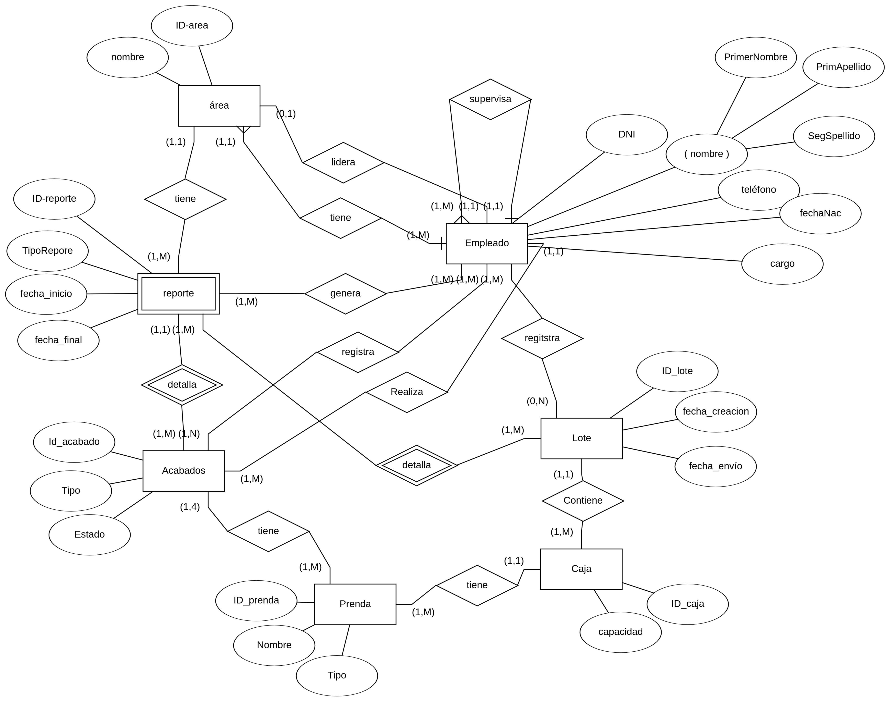
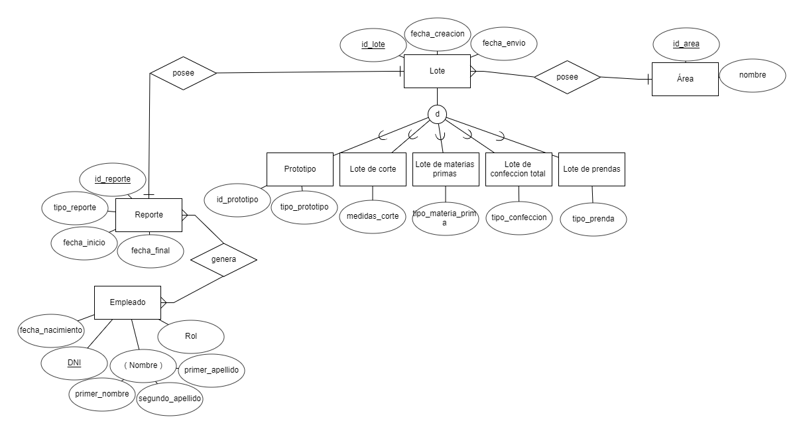

# Entregable 1 del proyecto

## 5. Diseño Conceptual

### 1. Almacén Central

### 2. Corte

#### Diccionario de datos: 

**Entidad:	Empleado_corte**

**Semántica:	Personas de la empresa que trabajan en los procesos de corte.**

| **Atributo** | **Naturaleza** | **Formato** | **Valores válidos** | **Unidad** | **Derivada de** | **Semántica** | **Ontología** |
|--------------|----------------|-------------|---------------------|------------|-----------------|---------------|---------------|
| Cod_empleCor | int            | 999999      | 6 dígitos           |            |                 | Número de identificación único de la persona en el sistema | Identificador principal de la persona en la empresa |
| dni          | int            | 99999999    | 8 dígitos           |            |                 | Número de identificación de la persona | Identificador de la persona |
| nombre       | char           | xxxxxxxxx   | Cadena              |            |                 | Nombre Completo del cliente | Nombre del trabajador en el negocio |
| telefono     | int            | 99999999999 | 10 dígitos          |            |                 | Número de teléfono de contacto de la persona | Número de teléfono asociado a la persona en la empresa |
| correo       | CHAR           | X*@X*.X*    |  cadena             |            |                 | Dirección de correo electrónico del empleado | Permite la comunicación con el empleado en la empresa |
| cargo        | char           | xxxxxxxxxxx | Cadena              |            |                 | Cargo actual de la persona en la empresa |  |

**Entidad:	Orden_de_trabajo**

**Semántica:	Representa el detalle de orden de trabajo para el corte de tela.**

| **Atributo** | **Naturaleza** | **Formato** | **Valores válidos** | **Unidad** | **Derivada de** | **Semántica** | **Ontología** |
|--------------|----------------|-------------|---------------------|------------|-----------------|---------------|---------------|
| Num_Orden    | int            | 99999       | 5 dígitos           |            |                 | Número de identificación único del orden de trabajo | Identificador principal del orden de trbajo en el area de corte |
| Tipo_tela    | char           | xxxxxxxxx   | Cadena              |            |                 | Tipo de tela del corte que se va a programar | Tipo de tela de acuerdo al orden de trabajo  |
| color_tela   | char           | xxxxxxxxx   | Cadena              |            |                 | Tipo de color de tela del corte que se va a programar | Tipo del color de tela de acuerdo al orden de trabajo |
| tipo_corte   | char           | xxxxxxxxx   | Cadena              |            |                 | Tipo de corte de la tela que se va a programar  | Tipo de corte de acuerdo al orden de trabajo |
| cantidad_corte| int           | xxxxx       |  5 digitos          |            |                 | Cantidad de la tela que se va a cortar | Cantidad de tela de acuerdo al orden de trbajo|
| prioridad    | int            | x           | 1 digito            |            |                 | Prioridad del orden de trabajo del corte | Priorida del corte de la tela segun el tiempo, calidad|

**Entidad:	Maquina**

**Semántica:	Dispositivo que se utiliza en el corte de tela.**

| **Atributo** | **Naturaleza** | **Formato** | **Valores válidos** | **Unidad** | **Derivada de** | **Semántica** | **Ontología** |
|--------------|----------------|-------------|---------------------|------------|-----------------|---------------|---------------|
| id_maquina     | int            | 9999       | 4 dígitos           |            |                 | Número de identificación único dela máquina de corte | Identificador principal de la máquina de corte |
| velocidad_corte| int           | 9999   | 4 digitos             |            |                 | Velocidad de corte de la tela | Velocidad de cuanto puede cortar en un deteminado tiempo  |
| capacidad_corte| int           | 99999   | 5 digitos              |            |                 | Cantidad de corte de la máquina | Cantidad máxima que la máquina puede cortar  |

**Entidad:	Lote_corte**

**Semántica:	Agrupación de la tela para que se envia a almacén central .**

| **Atributo** | **Naturaleza** | **Formato** | **Valores válidos** | **Unidad** | **Derivada de** | **Semántica** | **Ontología** |
|--------------|----------------|-------------|---------------------|------------|-----------------|---------------|---------------|
| Cod_lote_corte | int           | 99999       | 5 dígitos           |            |                 | Identificador de lote como conjunto de tela | Identificador de la tela en el sistema |
| tipo_corte_terminado | char           | xxxxxxxxx   | Cadena              |            |                 | Tipo de corte terminado del lote| Tipo de corte terminado que se envia a almacén |
| color_lote   | char           | xxxxxxxxx   | Cadena              |            |                 | Tipo de color de tela del conjunto de lote | Tipo del color de tela de corte terminado que se envia a almacén |
| tamaño_lote   | char           | xxxxxxxxx   | Cadena              |            |                 | Tamaño del corte de la tela del conjunto de lote | Tamaño de la tela del lote que se envia a almacén |
| estilo_lote   | char           | xxxxxxxxx   | Cadena              |            |                 | Estilo del corte de la tela del conjunto de lote | Estilo de tela de corte terminado que se envia a almacén |
| fecha  | date          | DD/MM/AAAA   | calendario             |            |                 | Fecha de la finalización de la maquina de corte | Parámetro de final de la finalización de la máquina |
| hora   | time        | HH:MM   | Tiempo              |            |                 | Hora de la finalización de la maquina de corte| Parámetro de final de la finalización de la maquina  |

### 3. Confección

### 4. Almacén de Tránsito

### 5. Acabados

### 6. Inspeccion de Calidad

#### Diccionario de datos: 

**Entidad:	Empleado**

**Semántica:	Personas de la empresa que trabajan en los procesos del mismo.**

| **Atributo** | **Naturaleza** | **Formato** | **Valores válidos** | **Unidad** | **Derivada de** | **Semántica** | **Ontología** |
|--------------|----------------|-------------|---------------------|------------|-----------------|---------------|---------------|
| dni          | int            | 99999999    | 8 dígitos           |            |                 | Número de identificación único de la persona en el sistema | Identificador principal de la persona en la empresa |
| nombre       | char           | xxxxxxxxx   | Cadena              |            |                 | Nombre Completo del cliente | Nombre del trabajador en el negocio |
| telefono     | int            | 99999999999| 10 dígitos          |            |                 | Número de teléfono de contacto de la persona | Número de teléfono asociado a la persona en la empresa |
| fechaNac     | date           | DD/MM/AAAA | calendario          |            |                 | Fecha de nacimiento de una persona | Fecha de nacimiento de la persona que es empleado en la empresa |
| cargo        | char           | xxxxxxxxxxx| Cadena              |            |                 | Cargo actual de la persona en la empresa |  |

**Entidad:	Área**

**Semántica:	Unidad de negocio con procesos para un objetivo en específico**

| **Atributo** | **Naturaleza** | **Formato** | **Valores válidos** | **Unidad** | **Derivada de** | **Semántica** | **Ontología** |
|--------------|----------------|-------------|---------------------|------------|-----------------|---------------|---------------|
| IdArea       | int            | XXX999      | Cadena y números    |            |                 | Número de identificación único de área en el sistema | Identificador principal del área en la empresa |
| nombre       | char           | xxxxxxxx    | Cadena              |            |                 | Nombre del área | Nombre del área en el negocio |

**Entidad:	Reporte**

**Semántica:	Representa los registros completos del área en forma de listas con lotes, prendas, cajas y fechas en la que se hizo un proceso de acabado.**

| **Atributo** | **Naturaleza** | **Formato** | **Valores válidos** | **Unidad** | **Derivada de** | **Semántica** | **Ontología** |
|--------------|----------------|-------------|---------------------|------------|-----------------|---------------|---------------|
| IdReporte    | int            | XXX999      | Cadena y números    |            |                 | Número del reporte de área de acabados en el sistema | Identificador principal del reporte del área en la empresa |
| TipoReporte  | char           | xxxxxxxxx   | Cadena              |            |                 | Nombre del reporte | Nombre de los tipos del área de acabados |
| FechaInicio  | date           | DD/MM/AAAA  | calendario          |            |                 | Fecha de inicio del periodo para mostrar el reporte | Parámetro de inicio de registro en el reporte |
| FechaFinal   | date           | DD/MM/AAAA  | calendario          |            |                 | Fecha de final del periodo para mostrar el reporte | Parámetro de final de registro en el reporte |

**Entidad:	Acabados**

**Semántica:	Procesos internos del área en la cual el operario del área se encarga de terminar y terminar los lotes de prendas.**

| **Atributo** | **Naturaleza** | **Formato** | **Valores válidos** | **Unidad** | **Derivada de** | **Semántica** | **Ontología** |
|--------------|----------------|-------------|---------------------|------------|-----------------|---------------|---------------|
| IdAcabado    | int            | XXX999      | Cadena y números    |            |                 | Número de Id del proceso interno de acabados | Identificador principal del de los proceso de acabados |
| TipoAcabado  | char           | xxxxxxxxx   | Cadena              |            |                 | Nombre del proceso de acabado | Nombre del proceso de acabados |
| Estado       | booleano       | true - false| true - false        |            |                 | Estado de cada proceso interno del área de acabados | Parámetro que permitirá avanzar por cada proceso de acabado en secuencia. |

**Entidad:	Prenda**

**Semántica:	unidad mínima del sistema, producto final del área de confección y elemento de los lotes de prendas.**

| **Atributo** | **Naturaleza** | **Formato** | **Valores válidos** | **Unidad** | **Derivada de** | **Semántica** | **Ontología** |
|--------------|----------------|-------------|---------------------|------------|-----------------|---------------|---------------|
| IdPrenda     | int            | XXX999999   | Cadena y números    |            |                 | Identificador de prenda de ropa | Identificador de prenda de ropa en el sistema |
| nombre       | char           | xxxxxxxxx   | Cadena              |            |                 | Nombre de la prenda asignada | Nombre de prendas del negocio |
| TipoPrenda   | char           | xxxxxxxxx   | Cadena              |            |                 | Tipo de prenda según la clasificación en el sistema | Tipo de prendas registradas en el negocio |

**Entidad:	Caja**

**Semántica:	Agrupación de prendas según su tipo o entrega previa.**

| **Atributo** | **Naturaleza** | **Formato** | **Valores válidos** | **Unidad** | **Derivada de** | **Semántica** | **Ontología** |
|--------------|----------------|-------------|---------------------|------------|-----------------|---------------|---------------|
| IdCaja       | int            | XXX999999   | Cadena y números    |            |                 | Identificador de caja como conjunto de prendas | Identificador de prenda de ropa en el sistema |
| capacidad    | int            | 99999999    | 8 dígitos           |            |                 | Capacidad máxima de caja | Capacidad máxima en la cual se puede llenar de prendas |

**Entidad:	Lote**

**Semántica:	Agrupación de cajas con prendas para envío a distribución.**

| **Atributo**   | **Naturaleza** | **Formato** | **Valores válidos** | **Unidad** | **Derivada de** | **Semántica** | **Ontología** |
|----------------|----------------|-------------|---------------------|------------|-----------------|---------------|---------------|
| IdLote         | int            | XXX999999   | Cadena y números    |            |                 | Identificador de lote como conjunto de prendas | Identificador de prenda de ropa en el sistema |
| fecha_creacion | date           | DD/MM/AAAA  | calendario          |            |                 | Fecha de creación de lote que se designa en el área de acabados para el inicio de procesos | Parámetro inicial para comenzar trabajo de acabados |
| fecha_envío    | date           | DD/MM/AAAA  | calendario          |            |                 | Fecha de envío de lote a distribución | Fecha máxima para realizar las tareas de acabados y envío a distribución |

**REGLAS DE NEGOCIO**

* **Supervisor - Reporte**

El supervisor de aŕea debe realizar un reporte diario del sistema y un reporte mensual.

* **Operario - Reporte**

Cada operario debe realizar un reporte diario del sistema y un reporte mensual.

* **Operario - Acabados**

Cada operario debe realizar cada acabado en forma secuencial y registrarlo en el sistema según su estado. Un mismo operario puede realizar todos los acabados con maquinaria.

### 7. PCP

**[Regresar al índice](../README.md)**

