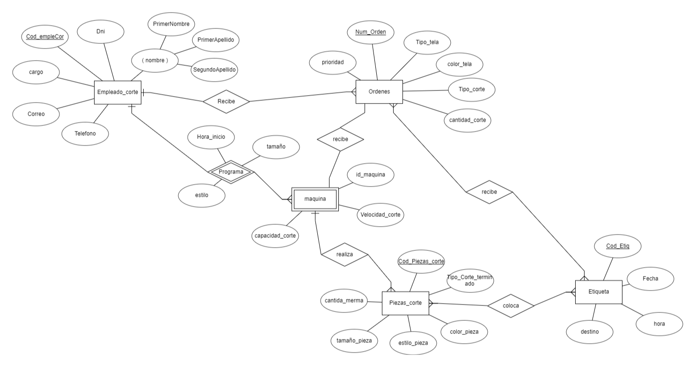
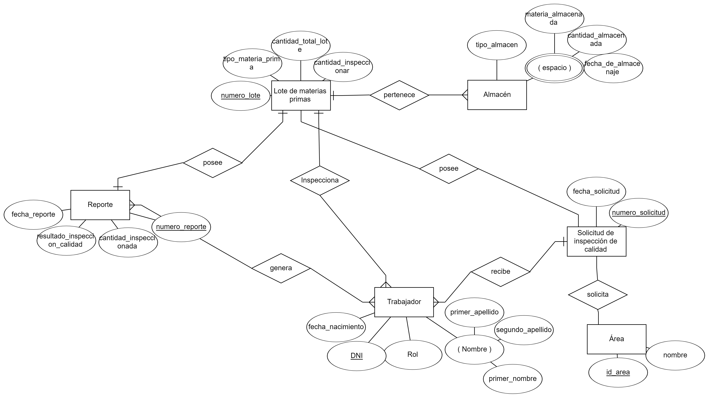

# Entregable 1 del proyecto

## 5. Diseño Conceptual

### 1. Almacén Central

### 2. Corte

### 3. Confección

### 4. Almacén de Tránsito

### 5. Acabados

#### Diccionario de datos: 

**Entidad:	Empleado**

**Semántica:	Personas de la empresa que trabajan en los procesos del mismo.**

| **Atributo** | **Naturaleza** | **Formato** | **Valores válidos** | **Unidad** | **Derivada de** | **Semántica** | **Ontología** |
|--------------|----------------|-------------|---------------------|------------|-----------------|---------------|---------------|
| dni          | int            | 99999999    | 8 dígitos           |            |                 | Número de identificación único de la persona en el sistema | Identificador principal de la persona en la empresa |
| nombre       | char           | xxxxxxxxx   | Cadena              |            |                 | Nombre Completo del cliente | Nombre del trabajador en el negocio |
| telefono     | int            | 99999999999| 10 dígitos          |            |                 | Número de teléfono de contacto de la persona | Número de teléfono asociado a la persona en la empresa |
| fechaNac     | date           | DD/MM/AAAA | calendario          |            |                 | Fecha de nacimiento de una persona | Fecha de nacimiento de la persona que es empleado en la empresa |
| cargo        | char           | xxxxxxxxxxx| Cadena              |            |                 | Cargo actual de la persona en la empresa |  |

**Entidad:	Área**

**Semántica:	Unidad de negocio con procesos para un objetivo en específico**

| **Atributo** | **Naturaleza** | **Formato** | **Valores válidos** | **Unidad** | **Derivada de** | **Semántica** | **Ontología** |
|--------------|----------------|-------------|---------------------|------------|-----------------|---------------|---------------|
| IdArea       | int            | XXX999      | Cadena y números    |            |                 | Número de identificación único de área en el sistema | Identificador principal del área en la empresa |
| nombre       | char           | xxxxxxxx    | Cadena              |            |                 | Nombre del área | Nombre del área en el negocio |

### 6. Inspeccion de Calidad

### 7. PCP

**[Regresar al índice](../README.md)**

