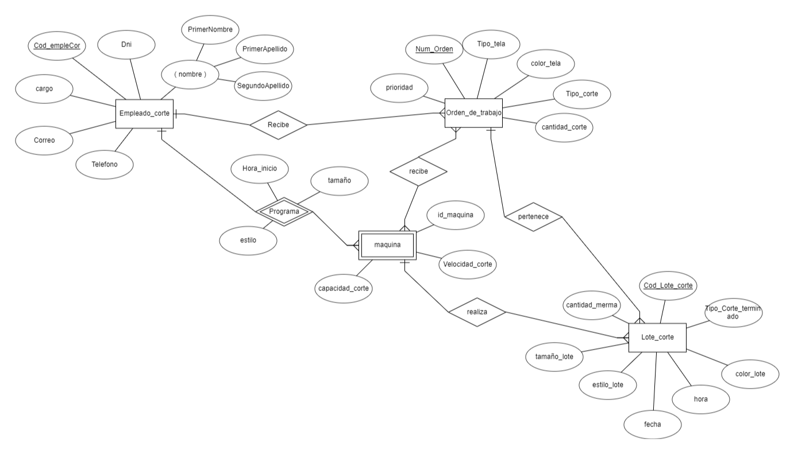

# Entregable 1 del proyecto

## 5. Diseño Conceptual

### 1. Almacén Central

### 2. Corte

#### Diccionario de datos: 

**Entidad:	Empleado_corte**

**Semántica:	Personas de la empresa que trabajan en los procesos de corte.**

| **Atributo** | **Naturaleza** | **Formato** | **Valores válidos** | **Unidad** | **Derivada de** | **Semántica** | **Ontología** |
|--------------|----------------|-------------|---------------------|------------|-----------------|---------------|---------------|
| Cod_empleCor | int            | 999999      | 6 dígitos           |            |                 | Número de identificación único de la persona en el sistema | Identificador principal de la persona en la empresa |
| dni          | int            | 99999999    | 8 dígitos           |            |                 | Número de identificación de la persona | Identificador de la persona |
| nombre       | char           | xxxxxxxxx   | Cadena              |            |                 | Nombre Completo del cliente | Nombre del trabajador en el negocio |
| telefono     | int            | 99999999999 | 10 dígitos          |            |                 | Número de teléfono de contacto de la persona | Número de teléfono asociado a la persona en la empresa |
| correo       | CHAR           | X*@X*.X*    |  cadena             |            |                 | Dirección de correo electrónico del empleado | Permite la comunicación con el empleado en la empresa |
| cargo        | char           | xxxxxxxxxxx | Cadena              |            |                 | Cargo actual de la persona en la empresa |  |

**Entidad:	Orden_de_trabajo**

**Semántica:	Representa el detalle de orden de trabajo para el corte de tela.**

| **Atributo** | **Naturaleza** | **Formato** | **Valores válidos** | **Unidad** | **Derivada de** | **Semántica** | **Ontología** |
|--------------|----------------|-------------|---------------------|------------|-----------------|---------------|---------------|
| Num_Orden    | int            | 99999       | 5 dígitos           |            |                 | Número de identificación único del orden de trabajo | Identificador principal del orden de trbajo en el area de corte |
| Tipo_tela    | char           | xxxxxxxxx   | Cadena              |            |                 | Tipo de tela del corte que se va a programar | Tipo de tela de acuerdo al orden de trabajo  |
| color_tela   | char           | xxxxxxxxx   | Cadena              |            |                 | Tipo de color de tela del corte que se va a programar | Tipo del color de tela de acuerdo al orden de trabajo |
| tipo_corte   | char           | xxxxxxxxx   | Cadena              |            |                 | Tipo de corte de la tela que se va a programar  | Tipo de corte de acuerdo al orden de trabajo |
| cantidad_corte| int           | xxxxx       |  5 digitos          |            |                 | Cantidad de la tela que se va a cortar | Cantidad de tela de acuerdo al orden de trbajo|
| prioridad    | int            | x           | 1 digito            |            |                 | Prioridad del orden de trabajo del corte | Priorida del corte de la tela segun el tiempo, calidad|

**Entidad:	Maquina**

**Semántica:	Dispositivo que se utiliza en el corte de tela.**

| **Atributo** | **Naturaleza** | **Formato** | **Valores válidos** | **Unidad** | **Derivada de** | **Semántica** | **Ontología** |
|--------------|----------------|-------------|---------------------|------------|-----------------|---------------|---------------|
| id_maquina     | int            | 9999       | 4 dígitos           |            |                 | Número de identificación único dela máquina de corte | Identificador principal de la máquina de corte |
| velocidad_corte| int           | 9999   | 4 digitos             |            |                 | Velocidad de corte de la tela | Velocidad de cuanto puede cortar en un deteminado tiempo  |
| capacidad_corte| int           | 99999   | 5 digitos              |            |                 | Cantidad de corte de la máquina | Cantidad máxima que la máquina puede cortar  |

**Entidad:	Lote_corte**

**Semántica:	Agrupación de la tela para que se envia a almacén central .**

| **Atributo** | **Naturaleza** | **Formato** | **Valores válidos** | **Unidad** | **Derivada de** | **Semántica** | **Ontología** |
|--------------|----------------|-------------|---------------------|------------|-----------------|---------------|---------------|
| Cod_lote_corte | int           | 99999       | 5 dígitos           |            |                 | Identificador de lote como conjunto de tela | Identificador de la tela en el sistema |
| tipo_corte_terminado | char           | xxxxxxxxx   | Cadena              |            |                 | Tipo de corte terminado del lote| Tipo de corte terminado que se envia a almacén |
| color_lote   | char           | xxxxxxxxx   | Cadena              |            |                 | Tipo de color de tela del conjunto de lote | Tipo del color de tela de corte terminado que se envia a almacén |
| tamaño_lote   | char           | xxxxxxxxx   | Cadena              |            |                 | Tamaño del corte de la tela del conjunto de lote | Tamaño de la tela del lote que se envia a almacén |
| estilo_lote   | char           | xxxxxxxxx   | Cadena              |            |                 | Estilo del corte de la tela del conjunto de lote | Estilo de tela de corte terminado que se envia a almacén |
| fecha  | date          | DD/MM/AAAA   | calendario             |            |                 | Fecha de la finalización de la maquina de corte | Parámetro de final de la finalización de la máquina |
| hora   | time        | HH:MM   | Tiempo              |            |                 | Hora de la finalización de la maquina de corte| Parámetro de final de la finalización de la maquina  |

**REGLAS DE NEGOCIO**

* **Empleado_corte - Orden_de_trabajo**

Un empleado de corte recibe varios ordenes de trabajo de acuerdo del día, la prioridad que pueda tener el corte, y una orden de trabajo puede ser supervisado por un empleado.

* **Empleado_corte - Máquina**

Un empleado puede programar varias maquinas de acuerdo del orden de trabajo que reciba, la prioridad para realizar el orden, y una maquina es programada por un solo empleado.

* **Orden_de_trabajo - Máquina**

El empleado de acuerdo con el orden de trabajo va a programar la maquina, donde una maquina recibe varias ordenes de trabajo en su repectiva hora, y una orden de trabajo puede ser programada en varias maquinas ya sea por su estilo, tamaño y la relacion seria de muchos a muchos.

* **Máquina - Lote_corte**

Una máquina al terminar el corte se divide en varios lotes de corte, pero un lote de corte ha sido relizado por una máquina.

* **Orden_de_trabajo - Lote_corte**

Una orden de trabajo se va a dividir en varios lotes de corte, ya que una pieza de corte estaria perteneciendo a una orden de trabajo, y una orden de trabajo tendria varios lotes de corte

### 3. Confección

#### Diccionario de datos: 

**Entidad:	Empleado**

**Semántica:	Personas de la empresa que ocupan un puesto (jefe, supervisor, operario) y realizan labores.**

| **Atributo** | **Naturaleza** | **Formato** | **Valores válidos** | **Unidad** | **Derivada de** | **Semántica** | **Ontología** |
|--------------|----------------|-------------|---------------------|------------|-----------------|---------------|---------------|
| Codigo | int            | 999999      | 6 dígitos           |            |                 | Número de identificación único de la persona en el sistema | Identificador principal de la persona en la empresa |
| dni          | int            | 99999999    | 8 dígitos           |            |                 | Número de identificación de la persona | Identificador de la persona |
| nombre       | char           | xxxxxxxxx   | Cadena              |            |                 | Nombre Completo del cliente | Nombre del trabajador en el negocio |
| telefono     | int            | 99999999999 | 10 dígitos          |            |                 | Número de teléfono de contacto de la persona | Número de teléfono asociado a la persona en la empresa |
| dirección       | CHAR           | xxxxxxx    |  cadena             |            |                 | Dirección de residencia del empleado | Permite la ubicación con el empleado en la empresa |
| cargo        | char           | xxxxxxxxxxx | Cadena              |            |                 | Cargo actual de la persona en la empresa | Puede ser: jefe, supervisor y operario |
| fecha_nacimiento| datetime           | xx/xx/xxxx | datetime      |            |                 | Fecha de nacimiento de la persona |  |

**Entidad:	Orden_confección**

**Semántica:	Representa el detalle general para la confección de la orden de trabajo.**

| **Atributo** | **Naturaleza** | **Formato** | **Valores válidos** | **Unidad** | **Derivada de** | **Semántica** | **Ontología** |
|--------------|----------------|-------------|---------------------|------------|-----------------|---------------|---------------|
| codigo    | int            | 99999       | 5 dígitos           |            |                 | Número de identificación del orden de confección | Identificador parcial del orden de confección en el area de confección que se complementa con el codigo de orden de trabajo |
| plan_costuras    | char           | xxxxxxxxx   | Cadena              |            |                 | Costuras que se deben realizar y la cantidad por cada tipo de costura| costuras de acuerdo al orden de trabajo  |

**Entidad:	Plan de confección**

**Semántica:	Representa el detalle general para la confección de la orden de trabajo que se encarga la division.**

| **Atributo** | **Naturaleza** | **Formato** | **Valores válidos** | **Unidad** | **Derivada de** | **Semántica** | **Ontología** |
|--------------|----------------|-------------|---------------------|------------|-----------------|---------------|---------------|
| codigo    | int            | 99999       | 5 dígitos           |            |                 | Número de identificación del plan de confección | Identificador parcial del plan de confección en el area de confección que se complementa con el identificador de orden de confección |
| descripcion_costuras    | char           | xxxxxxxxx   | Cadena              |            |                 | Costuras que se deben realizar | costuras de acuerdo al orden de trabajo  |

**Entidad:	Guia de confección**

**Semántica:	Representa el manual para la confección de la orden de trabajo que se encarga el operario de confección.**

| **Atributo** | **Naturaleza** | **Formato** | **Valores válidos** | **Unidad** | **Derivada de** | **Semántica** | **Ontología** |
|--------------|----------------|-------------|---------------------|------------|-----------------|---------------|---------------|
| codigo    | int            | 99999       | 5 dígitos           |            |                 | Número de identificación del plan de confección | Identificador parcial del plan de confección en el area de confección que se complementa con el identificador de plan de confección |
| pasos_costuras    | char           | xxxxxxxxx   | Cadena              |            |                 | Instrucciones en que lado de la tela coser | costuras de acuerdo al orden de trabajo  |

**Entidad:	Prototipo**

**Semántica:	Representa el prototipo de confección para verificar que es el producto deseado y sea de buena calidad.**

| **Atributo** | **Naturaleza** | **Formato** | **Valores válidos** | **Unidad** | **Derivada de** | **Semántica** | **Ontología** |
|--------------|----------------|-------------|---------------------|------------|-----------------|---------------|---------------|
| codigo    | int            | 99999       | 5 dígitos           |            |                 | Número de identificación único del prototipo | |
| descripcion    | char           | xxxxxxxxx   | Cadena              |            |                 | descripcion del prototipo que se confecciono | De acuerdo a la guia de trabajo  |

**Entidad:	Reporte diario**

**Semántica:	Representa el registro del progreso del costurero, por ende,de las ordenes de confección a su cargo.**

| **Atributo** | **Naturaleza** | **Formato** | **Valores válidos** | **Unidad** | **Derivada de** | **Semántica** | **Ontología** |
|--------------|----------------|-------------|---------------------|------------|-----------------|---------------|---------------|
| codigo    | int            | 99999       | 5 dígitos           |            |                 | Número de identificación único del reporte diario |  |

**Entidad:	Reporte final**

**Semántica:	Representa el registro de la confección completada, por ende, la conclusión de la orden de confección.**

| **Atributo** | **Naturaleza** | **Formato** | **Valores válidos** | **Unidad** | **Derivada de** | **Semántica** | **Ontología** |
|--------------|----------------|-------------|---------------------|------------|-----------------|---------------|---------------|
| codigo    | int            | 99999       | 5 dígitos           |            |                 | Número de identificación único del reporte final | |

**Entidad:	Confección**

**Semántica:	Representa el subtipo de lote que se usa para la confección.**

| **Atributo** | **Naturaleza** | **Formato** | **Valores válidos** | **Unidad** | **Derivada de** | **Semántica** | **Ontología** |
|--------------|----------------|-------------|---------------------|------------|-----------------|---------------|---------------|
| codigo    | int            | 99999       | 5 dígitos           |            |                 | Número de identificación único del lote de confección | |
| cantidad    | int            | 99999       | 5 dígitos           |            |                 | Cantidad de confecciones que tiene el lote | |
| color    | char            | xxxxx       | Cadena           |            |                 | El color de la tela que esta hecha las confecciones | |
| tipo_prenda    | char            | xxxxx       | Cadena           |            |                 | Tipo de prenda que contiene el lote de confección | puede ser jeans, camisa, polo, chaqueta, etc. |
| estado    | char            | xxxxx       | Cadena           |            |                 | Identifica el estado en que se encuentra el lote de confección | Puede ser: no iniciado, en proceso y completado |

**REGLAS DE NEGOCIO**

* **Empleado(operario) - Guia de confección**

Un operario recibe varios guias de confección de acuerdo del día, la prioridad que pueda tener, y una orden de trabajo puede ser supervisado por un supervisor. Ademas la cantidad de guias asignadas no puede sobrepasar a la capacidad promedio que tienen los operarios para confeccionar.

* **Guia de confección - Empleado(operario)**

La misma guia de confección se puede entregar a varios operarios para que se pueda realizar la orden de trabajo más rapido

### 4. Almacén de Tránsito

### 5. Acabados

#### Diccionario de datos: 

**Entidad:	Empleado**

**Semántica:	Personas de la empresa que trabajan en los procesos del mismo.**

| **Atributo** | **Naturaleza** | **Formato** | **Valores válidos** | **Unidad** | **Derivada de** | **Semántica** | **Ontología** |
|--------------|----------------|-------------|---------------------|------------|-----------------|---------------|---------------|
| dni          | int            | 99999999    | 8 dígitos           |            |                 | Número de identificación único de la persona en el sistema | Identificador principal de la persona en la empresa |
| nombre       | char           | xxxxxxxxx   | Cadena              |            |                 | Nombre Completo del cliente | Nombre del trabajador en el negocio |
| telefono     | int            | 99999999999| 10 dígitos          |            |                 | Número de teléfono de contacto de la persona | Número de teléfono asociado a la persona en la empresa |
| fechaNac     | date           | DD/MM/AAAA | calendario          |            |                 | Fecha de nacimiento de una persona | Fecha de nacimiento de la persona que es empleado en la empresa |
| cargo        | char           | xxxxxxxxxxx| Cadena              |            |                 | Cargo actual de la persona en la empresa |  |

**Entidad:	Área**

**Semántica:	Unidad de negocio con procesos para un objetivo en específico**

| **Atributo** | **Naturaleza** | **Formato** | **Valores válidos** | **Unidad** | **Derivada de** | **Semántica** | **Ontología** |
|--------------|----------------|-------------|---------------------|------------|-----------------|---------------|---------------|
| IdArea       | int            | XXX999      | Cadena y números    |            |                 | Número de identificación único de área en el sistema | Identificador principal del área en la empresa |
| nombre       | char           | xxxxxxxx    | Cadena              |            |                 | Nombre del área | Nombre del área en el negocio |

**Entidad:	Reporte**

**Semántica:	Representa los registros completos del área en forma de listas con lotes, prendas, cajas y fechas en la que se hizo un proceso de acabado.**

| **Atributo** | **Naturaleza** | **Formato** | **Valores válidos** | **Unidad** | **Derivada de** | **Semántica** | **Ontología** |
|--------------|----------------|-------------|---------------------|------------|-----------------|---------------|---------------|
| IdReporte    | int            | XXX999      | Cadena y números    |            |                 | Número del reporte de área de acabados en el sistema | Identificador principal del reporte del área en la empresa |
| TipoReporte  | char           | xxxxxxxxx   | Cadena              |            |                 | Nombre del reporte | Nombre de los tipos del área de acabados |
| FechaInicio  | date           | DD/MM/AAAA  | calendario          |            |                 | Fecha de inicio del periodo para mostrar el reporte | Parámetro de inicio de registro en el reporte |
| FechaFinal   | date           | DD/MM/AAAA  | calendario          |            |                 | Fecha de final del periodo para mostrar el reporte | Parámetro de final de registro en el reporte |

**Entidad:	Acabados**

**Semántica:	Procesos internos del área en la cual el operario del área se encarga de terminar y terminar los lotes de prendas.**

| **Atributo** | **Naturaleza** | **Formato** | **Valores válidos** | **Unidad** | **Derivada de** | **Semántica** | **Ontología** |
|--------------|----------------|-------------|---------------------|------------|-----------------|---------------|---------------|
| IdAcabado    | int            | XXX999      | Cadena y números    |            |                 | Número de Id del proceso interno de acabados | Identificador principal del de los proceso de acabados |
| TipoAcabado  | char           | xxxxxxxxx   | Cadena              |            |                 | Nombre del proceso de acabado | Nombre del proceso de acabados |
| Estado       | booleano       | true - false| true - false        |            |                 | Estado de cada proceso interno del área de acabados | Parámetro que permitirá avanzar por cada proceso de acabado en secuencia. |
| Observaciones      | Cadena       | -| -      |            |                 | Anotaciones de texto largo que serán registrado por los actores del sistema. | Parámetro opcional ingresado por cada actor del sistema. |

**Entidad:	Caja**

**Semántica:	Agrupación de prendas según su tipo o entrega previa.**

| **Atributo** | **Naturaleza** | **Formato** | **Valores válidos** | **Unidad** | **Derivada de** | **Semántica** | **Ontología** |
|--------------|----------------|-------------|---------------------|------------|-----------------|---------------|---------------|
| IdCaja       | int            | XXX999999   | Cadena y números    |            |                 | Identificador de caja como conjunto de prendas | Identificador de prenda de ropa en el sistema |
| capacidad    | int            | 99999999    | 8 dígitos           |            |                 | Capacidad máxima de caja | Capacidad máxima en la cual se puede llenar de prendas |

**Entidad:	Lote**

**Semántica:	Agrupación de cajas con prendas para envío a distribución.**

| **Atributo**   | **Naturaleza** | **Formato** | **Valores válidos** | **Unidad** | **Derivada de** | **Semántica** | **Ontología** |
|----------------|----------------|-------------|---------------------|------------|-----------------|---------------|---------------|
| IdLote         | int            | XXX999999   | Cadena y números    |            |                 | Identificador de lote como conjunto de prendas | Identificador de prenda de ropa en el sistema |
| fecha_creacion | date           | DD/MM/AAAA  | calendario          |            |                 | Fecha de creación de lote que se designa en el área de acabados para el inicio de procesos | Parámetro inicial para comenzar trabajo de acabados |
| fecha_envío    | date           | DD/MM/AAAA  | calendario          |            |                 | Fecha de envío de lote a distribución | Fecha máxima para realizar las tareas de acabados y envío a distribución |
| Observaciones      | Cadena       | -| -      |            |                 | Anotaciones de texto largo que serán registrado por los actores del sistema. | Parámetro opcional ingresado por cada actor del sistema. |

**REGLAS DE NEGOCIO**

* **Supervisor - Reporte**

El supervisor de aŕea debe realizar un reporte diario del sistema y un reporte mensual. Debe tener dos datos previsto, la fecha inicial y la fecha final es cual serán parámetros dindamentales por cada reporte

* **Operario - Reporte**

Cada operario debe realizar un reporte diario del sistema y un reporte mensual.Debe tener dos datos previsto, la fecha inicial y la fecha final es cual serán parámetros dindamentales por cada reporte.

* **Operario - Acabados**

Cada operario debe realizar cada acabado en forma secuencial y registrarlo en el sistema según su estado. Un mismo operario puede realizar todos los acabados con maquinaria. Debe ingresar múltiples veces para actualizar el estado en una sola pantalla hasta el subproceso final de encaje.

### 6. Inspeccion de Calidad

#### Diccionario de datos: 

**Entidad:	Lote de prototipos**

**Semántica:	Agrupación de prototipos de alguna prenda**

| **Atributo** | **Naturaleza** | **Formato** | **Valores válidos** | **Unidad** | **Derivada de** | **Semántica** | **Ontología** |
|--------------|----------------|-------------|---------------------|------------|-----------------|---------------|---------------|
| id_prototipo | int            | 999999      | 6 dígitos           |            |                 | Número de identificación único del lote de prototipos en el sistema | Identificador principal del lote de prototipos |
| tipo_prototipo          | char            | xxxxxxxxx    | Cadena           |            |                 | Tipo de prototipo que se va a inspeccionar | Tipo de prototipo de acuerdo a una solicitud previa |

**Entidad:	Lote de corte**

**Semántica:	Agrupación de cortes de tela a inspeccionar**

| **Atributo** | **Naturaleza** | **Formato** | **Valores válidos** | **Unidad** | **Derivada de** | **Semántica** | **Ontología** |
|--------------|----------------|-------------|---------------------|------------|-----------------|---------------|---------------|
| medidas_corte        | char            | xxxxxxxxx    | Cadena           |            |                 | Todas las medidas de un lote de corte segun programación | Medidas para validar la calidad de un lote de corte de telas |

**Entidad:	Lote de materias primas**

**Semántica:	Agrupación de materias primas (avíos o no avíos)**

| **Atributo** | **Naturaleza** | **Formato** | **Valores válidos** | **Unidad** | **Derivada de** | **Semántica** | **Ontología** |
|--------------|----------------|-------------|---------------------|------------|-----------------|---------------|---------------|
| tipo_materia_prima        | char            | xxxxxxxxx    | Cadena           |            |                 | Tipo de materia prima | Tipo de materia prima que se va a enviar a inspeccionar |

**Entidad:	Lote de confeccion total**

**Semántica:	Agrupación de confecciones de prendas**

| **Atributo** | **Naturaleza** | **Formato** | **Valores válidos** | **Unidad** | **Derivada de** | **Semántica** | **Ontología** |
|--------------|----------------|-------------|---------------------|------------|-----------------|---------------|---------------|
| tipo_confeccion        | char            | xxxxxxxxx    | Cadena           |            |                 | Tipo de confecciones que se han realizado | Tipo de confecciones que se va a inspeccionar en el area de inspección de calidad |

**Entidad:	Lote de prendas**

**Semántica:	Agrupación de prendas en caja**

| **Atributo** | **Naturaleza** | **Formato** | **Valores válidos** | **Unidad** | **Derivada de** | **Semántica** | **Ontología** |
|--------------|----------------|-------------|---------------------|------------|-----------------|---------------|---------------|
| tipo_prenda        | char            | xxxxxxxxx    | Cadena           |            |                 | Tipo de prendas embaladas y empaquetadas | Tipo de prendas que se van a inspeccionar antes de estar listas para la venta |

**REGLAS DE NEGOCIO**

* **Empleado - Reporte**

El empleado después de realizar una inspección de calidad de cualquier tipo de lote debe realizar un reporte de calidad donde detalla lo inspeccionado y confirma o rechaza que el lote siga el proceso dentro del sistema.

* **Lote - Área**

Todo lote posee a un área específica, antes de llegar al área de calidad, todo lote debe provenir de un área específica y el área de inspección de calidad decidirá si este debe regresar a esta misma área en caso de no haber aprobado la inspección o de continuar y ser enviado a una siguiente área.

* **Empleado - Protocolo de Inspección**

Todo empleado de Inspección de calidad debe conocer los protocolos de inspección de calidad para cada tipo de lote, se tiene en cuenta que cada protocolo es distinto entre lotes y que no se puede aplicar a otro tipo, sino el proceso de calidad sería erróneo.

### 7. PCP

**[Ir a videos](entregable%201-videos.md)**

**[Regresar al índice](../README.md)**

