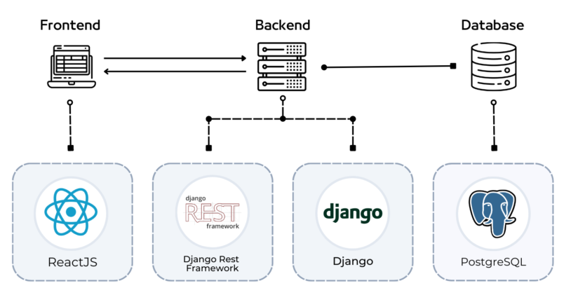
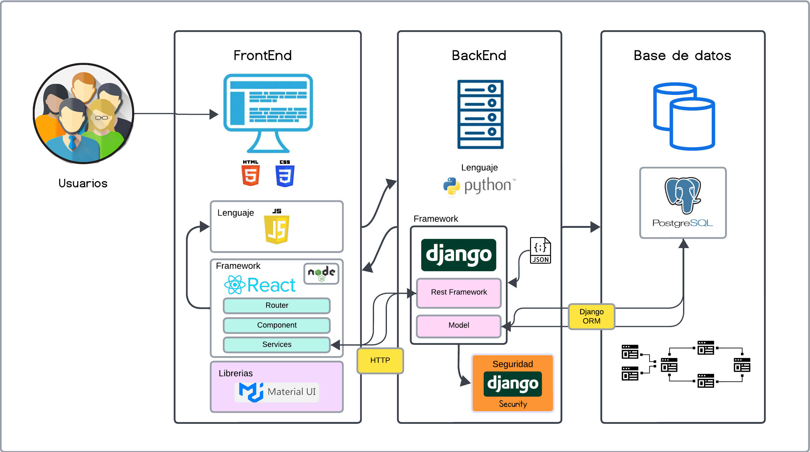
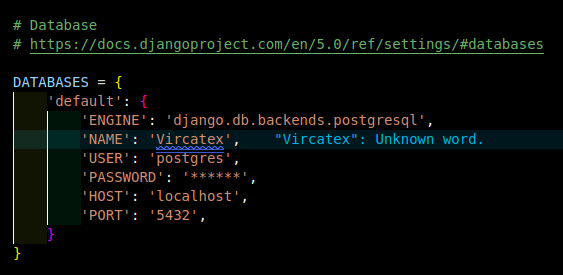

# Entregable 3 del proyecto
## Stack Tecnológico

### Arquitectura de Software

| Aspecto de Arquitectura       | Detalle                                               |
|-------------------------------|-------------------------------------------------------|
| Frameworks de Front End      | React                                                   |
| Frameworks de Back End       | Django                                                  |
| Frameworks de Seguridad      | Django Security                                         |
| Lenguaje de Programación de Base | JavaScript para el front-end (con React), Python para el back-end (con Django)     |
| Editor de código             | Visual Studio Code                                   |
| Bibliotecas                  | Material UI    |

### Arquitectura de Datos

| Aspecto de Arquitectura | Detalle       |
|--------------------------|---------------|
| Motor de Base de Datos   | PostgreSQL       |

### Stack

### Arquitectura

### Front end
[Vircatex](https://vircatex.netlify.app/)  

### App Web
Despliegue: [ Render](https://render.com/)

### Conexión Base de datos (local)

***[Regresar al índice](./entregable%203-indice.md)***
