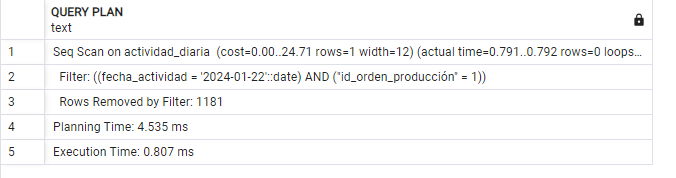

# Entregable 4 del proyecto
## 1. Objetos de BD
Presentamos diversos objetos de base de datos, como índices y vistas, y las mostramos por módulos del sistema:
- [Almacén Central](#almacén_central)
- [Corte](#corte)
- [Confección](#confección)
- [Almacén_de_tránsito](#almacén_de_tránsito)
- [Acabados](#acabados)
- [Inspección_de_calidad](#inspección_de_calidad)
- [PCP - Abastecimiento](#pcp)

---
Acontinuación le presentamos cada módulo:
## Almacén_Central


***Querys***
<details>
  <summary>SENTENCIAS SQL COMPLEJAS</summary>
  
```sql

```
</details>

<details>
  <summary>ÍNDICES</summary>
  
```sql

```
</details>

<details>
  <summary>VISTAS</summary>
  
```sql

```
</details>

<details>
  <summary>SECUENCIAS</summary>
  
```sql

```
</details>

<details>
  <summary>TRIGGERS</summary>
  
```sql

```
</details>

  [](#1-objetos-de-bd)
  
---
  
### Corte


***Querys***

<details>
  <summary>ÍNDICES</summary>
  
* **Índices:**
1. Consultar datos en actividad_diaria en los campos fecha_actividad, id_orden_producción

```sql
-- 
EXPLAIN ANALYZE
SELECT * FROM actividad_diaria
WHERE fecha_actividad = '2024-01-22'
  AND id_orden_producción = 1;

```


```sql
-- Índice:

CREATE INDEX idx_actividad_fecha_orden1 ON actividad_diaria (fecha_actividad, id_orden_producción);
EXPLAIN ANALYZE
SELECT * FROM actividad_diaria
WHERE fecha_actividad = '2024-01-22'
  AND id_orden_producción = 1;

```


----

2. Índice en lote en los campos de id_estado, fecha_creacion
```sql
EXPLAIN ANALYZE
SELECT * FROM lote
WHERE id_estado = 9
  AND fecha_creacion >= '2024-01-01';

```


```sql
CREATE INDEX idx_lote_estado_fecha_creacion1 ON lote (id_estado, fecha_creacion);
EXPLAIN ANALYZE
SELECT * FROM lote
WHERE id_estado = 9
  AND fecha_creacion >= '2024-01-01';


```


</details>

<details>
  <summary>VISTAS</summary>
  
```sql
-- ========= VISTAS =========
-- 1 muestra detalles completos de las máquinas incluyendo su estado.

CREATE VIEW vista_maquinas AS
SELECT m.id_maquina, m.capacidad_total, e.nombre AS estado
FROM maquina m
JOIN estado e ON m.id_estado = e.id_estado;

-- Supongamos que deseas obtener todos los detalles de las máquinas en estado 'Disponible'
SELECT * FROM vista_maquinas
WHERE estado = 'Disponible';


--2 muestra las actividades diarias junto con las máquinas utilizadas y detalles de las órdenes de producción.

CREATE VIEW vista_actividades_diarias AS
SELECT ad.id_actividad, ad.fecha_actividad, op.id_orden_producción, ma.id_maquina, ma.cantidad_hecha
FROM actividad_diaria ad
JOIN orden_producción op ON ad.id_orden_producción = op.id_orden_producción
JOIN maquina_actividad ma ON ad.id_actividad = ma.id_actividad;

-- Obtener las actividades diarias realizadas en una fecha específica junto con las máquinas utilizadas y la orden de producción asociada
SELECT * FROM vista_actividades_diarias
WHERE fecha_actividad = '2024-06-22';

-- 3 muestra detalles completos de las órdenes de producción incluyendo el estado y las dimensiones asociadas.

CREATE VIEW vista_ordenes_produccion AS
SELECT op.id_orden_producción, op.fecha_inicio, op.fecha_fin, op.cantidad, e.nombre AS estado, a.nombre AS area, op.fecha_creacion
FROM orden_producción op
JOIN estado e ON op.id_estado = e.id_estado
JOIN area a ON op.id_area = a.id_area;

-- Obtener todas las órdenes de producción que están en estado 'En Proceso':
SELECT * FROM vista_ordenes_produccion
WHERE estado = 'En Proceso';

```
</details>

<details>
  <summary>TRIGGERS</summary>
  
```sql
-- ========= TRIGGERS =========
-- Verificar si la cantidad utilizada en una actividad diaria no supera la capacidad total de la máquina asignada.

CREATE OR REPLACE FUNCTION verificar_capacidad_maquina()
RETURNS TRIGGER AS $$
DECLARE
    capacidad_maquina INT;
BEGIN
    -- Obtener la capacidad total de la máquina
    SELECT capacidad_total INTO capacidad_maquina
    FROM maquina
    WHERE id_maquina = NEW.id_maquina;
    
    -- Verificar si la cantidad utilizada supera la capacidad de la máquina
    IF NEW.cantidad_hecha > capacidad_maquina THEN
        RAISE EXCEPTION 'La cantidad utilizada (%s) excede la capacidad de la máquina (%s)', NEW.cantidad_hecha, capacidad_maquina;
    END IF;
    
    RETURN NEW;
END;
$$ LANGUAGE plpgsql;

```
</details>

  [](#1-objetos-de-bd)
  
---
 
### Confección
***Querys***
<details>
  <summary>SENTENCIAS SQL COMPLEJAS</summary>
  
```sql

```
</details>

<details>
  <summary>ÍNDICES</summary>
  
```sql

```
</details>

<details>
  <summary>VISTAS</summary>
  
```sql
-- Crear vista de ordenes de confección
	DROP VIEW IF EXISTS vista_op_confección;
	CREATE VIEW vista_op_confección AS
				SELECT op.id_orden_producción, op.fecha_inicio, op.fecha_fin, e.nombre AS estado
				FROM orden_producción op
				INNER JOIN dimension_confeccion dc ON dc.id_dim_confeccion = op.id_dim_confeccion
				INNER JOIN estado e ON e.id_estado = op.id_estado
				WHERE e.nombre <> 'Completado' AND e.nombre <> 'Cancelado'
				ORDER BY op.fecha_inicio DESC, op.fecha_fin DESC;

	-- Crear vista descripción de orden de confección
	DROP VIEW IF EXISTS vista_op_conf_descripción;
	CREATE VIEW vista_op_conf_descripción AS
		SELECT	op.id_orden_producción, op.fecha_inicio, op.fecha_fin, e.nombre AS estado,
				tp.nombre AS prenda, ep.nombre AS estilo,
				tl.nombre AS talla, gn.nombre AS genero,
				gc.medida_pecho, gc.medida_cintura, gc.medida_cadera,
			    gc.medida_hombro, gc.medida_longitud, gc.medida_manga, gc.medida_muslo
		FROM dimension_confeccion dc
		INNER JOIN tipo_prenda tp ON tp.id_tipo_prenda = dc.id_tipo_prenda
		INNER JOIN estilo_prenda ep ON ep.id_estilo_prenda = dc.id_estilo_prenda
		INNER JOIN talla tl ON tl.id_talla = dc.id_talla
		INNER JOIN genero gn ON gn.id_genero = dc.id_genero
		INNER JOIN guia_confeccion gc ON gc.id_guia_confeccion = dc.id_guia_confeccion
		INNER JOIN orden_producción op ON op.id_dim_confeccion = dc.id_dim_confeccion
		INNER JOIN estado e ON e.id_estado = op.id_estado;

	-- Crear vista de empleados de confección
	DROP VIEW IF EXISTS vista_emp_confección;
	CREATE VIEW vista_emp_confección AS
		SELECT e.id_empleado, e.nombre, e.primer_apellido, e.segundo_apellido
		FROM empleado e
		INNER JOIN area a ON a.id_area = e.id_area
		INNER JOIN cargo ca ON ca.id_cargo = e.id_cargo
		WHERE a.nombre = 'Confección' AND ca.nombre = 'Costurero';

	-- Crear vista de ordenes asignadas al empleado de confección
	DROP VIEW IF EXISTS vista_op_emp_conf;
	CREATE VIEW vista_op_emp_conf AS
		SELECT op.id_orden_producción, ea.id_empleado, ad.fecha_actividad
		FROM orden_producción op
		INNER JOIN actividad_diaria ad ON ad.id_orden_producción = op.id_orden_producción
		INNER JOIN empleado_actividad ea ON ea.id_actividad = ad.id_actividad;

	-- Crear vista de empleados con ordenes de confección
	DROP VIEW IF EXISTS vista_emp_ops_confección;
	CREATE VIEW vista_emp_ops_confección AS
		SELECT e.id_empleado, e.nombre, e.primer_apellido, e.segundo_apellido,
			   ad.id_actividad, ad.fecha_actividad, op.id_orden_producción
		FROM empleado e
		INNER JOIN empleado_actividad ea ON ea.id_empleado = e.id_empleado
		INNER JOIN actividad_diaria ad ON ad.id_actividad = ea.id_actividad
		INNER JOIN orden_producción op ON op.id_orden_producción = ad.id_orden_producción
		INNER JOIN area a ON a.id_area = op.id_area
		WHERE a.nombre = 'Confección';

	-- Crear vista de lotes de corte que se puede usar
	DROP VIEW IF EXISTS vista_lote_corte_emp;
	CREATE VIEW vista_lote_corte_emp AS
		SELECT	l.id_lote, op.id_orden_producción
		FROM lote l
		INNER JOIN dimension_corte dct ON dct.id_dim_corte = l.id_dim_corte
		INNER JOIN dim_confeccion_detalle dcd ON dcd.id_dim_corte = dct.id_dim_corte
		INNER JOIN dimension_confeccion dc ON dc.id_dim_confeccion = dcd.id_dim_confeccion
		INNER JOIN orden_producción op ON op.id_dim_confeccion = dc.id_dim_confeccion
		INNER JOIN estado e ON e.id_estado = l.id_estado
		WHERE e.nombre = 'Disponible';
```
</details>

<details>
  <summary>SECUENCIAS</summary>
  
```sql

```
</details>

<details>
  <summary>TRIGGERS</summary>
  
```sql

```
</details>

  [](#1-objetos-de-bd)

  
---
 
### Almacén_de_tránsito

***Querys***
<details>
  <summary>SENTENCIAS SQL COMPLEJAS</summary>
  
```sql

```
</details>

<details>
  <summary>ÍNDICES</summary>
  
```sql

```
</details>

<details>
  <summary>VISTAS</summary>
  
```sql

```
</details>

<details>
  <summary>SECUENCIAS</summary>
  
```sql

```
</details>

<details>
  <summary>TRIGGERS</summary>
  
```sql

```
</details>

[](#1-objetos-de-bd)
  
---
 
  
### Acabados

***Querys***

<details>
  <summary>SENTENCIAS SQL COMPLEJAS</summary>
  
* Consulta: Reporte entre dos fechas
```python
class ReporteAcabadosView(View):
    def get(self, request):
        fecha_inicio = request.GET.get('fecha_inicio')
        fecha_fin = request.GET.get('fecha_fin')

        query = """
        SELECT DISTINCT e.id_empleado, e.nombre, e.primer_apellido,
                        e.segundo_apellido, e.id_correo, e.dni, e.id_cargo,
                        caja_prenda.id_caja, caja_prenda.fecha_creacion,
                        tipo_prenda.nombre 
        FROM empleado e
        JOIN prenda ON e.id_empleado = prenda.id_empleado
        JOIN caja_prenda ON prenda.id_caja = caja_prenda.id_caja
        JOIN dimension_prenda ON caja_prenda.id_dim_prenda = dimension_prenda.id_dim_prenda
        JOIN dimension_confeccion ON dimension_prenda.id_dim_confeccion = dimension_confeccion.id_dim_confeccion
        JOIN guia_confeccion ON dimension_confeccion.id_guia_confeccion = guia_confeccion.id_guia_confeccion
        JOIN tipo_prenda ON dimension_confeccion.id_tipo_prenda = tipo_prenda.id_tipo_prenda
        WHERE id_area=5 AND id_cargo=2
        AND caja_prenda.fecha_creacion BETWEEN %s AND %s
        """

        with connection.cursor() as cursor:
            cursor.execute(query, [fecha_inicio, fecha_fin])
            rows = cursor.fetchall()

        resultados = [
            {
                "id_empleado": row[0],
                "nombre": row[1],
                "primer_apellido": row[2],
                "segundo_apellido": row[3],
                "id_correo": row[4],
                "dni": row[5],
                "id_cargo": row[6],
                "id_caja": row[7],
                "fecha_creacion": row[8],
                "tipo_prenda": row[9],
            }
            for row in rows
        ]

        return JsonResponse(resultados, safe=False)
```


</details>


<details>
  <summary>ÍNDICES</summary>

* **Índices:**
1. Consultar datos de empleado del área acabados

```sql
-- 
explain analyze
select * from empleado e 
where id_area =5;
```


```sql
-- Índice:

CREATE INDEX EMPL_ACABADO ON empleado(nombre, primer_apellido, id_area)

EXPLAIN ANALYZE
SELECT * FROM EMPL_ACABADO
WHERE id_area=5;
```


----

2. Prendas: Consultar la relación de prendas de la caja 200 (12692 registros)
```sql
explain analyze
select * from prenda
where id_caja=200;
```


```sql
CREATE INDEX PRENDA_CAJA ON prenda(id_caja)

EXPLAIN ANALYZE
select * from prenda
where id_caja=200;


```


</details>

<details>
  <summary>VISTAS</summary>
* Vistas
-- 1. CARGAR LOTES: lotes 200 entrantes al área de acabados, en carga de página.
  
```sql
explain analyze
SELECT le.id_entrada ,le.fecha_entrada,l.id_tipo_lote,l.cantidad, dc.id_dim_confeccion,dc.id_guia_confeccion
FROM lote_entrada le
JOIN lote l on le.id_lote = l.id_lote
join dimension_confeccion dc on l.id_dim_confeccion = dc.id_dim_confeccion
LIMIT 200;
```


```sql

create view entrante_aca as 
SELECT le.id_entrada ,le.fecha_entrada,l.id_tipo_lote,l.cantidad, dc.id_dim_confeccion,dc.id_guia_confeccion
FROM lote_entrada le
JOIN lote l on le.id_lote = l.id_lote
join dimension_confeccion dc on l.id_dim_confeccion = dc.id_dim_confeccion
LIMIT 200;

--  BUSCAR
select * from entrante_aca
where id_entrada='101';
```


----

***VIEW - Detalle caja***

```sql
-- Consulta:
SELECT 
    cp.id_caja::text AS id_caja,
    cp.cantidad, 
    gconf.id_guia_confeccion::text AS id_guia,
    tp.nombre AS tipo_prenda, 
    ep.nombre AS estilo_prenda, 
    t.nombre AS talla, 
    g.nombre AS genero,
    COALESCE(gconf.medida_longitud::text, ' ') AS ml,
    COALESCE(gconf.medida_hombro::text, ' ') AS mh,
    COALESCE(gconf.medida_pecho::text, ' ') AS mp,
    COALESCE(gconf.medida_manga::text, ' ') AS mm,
    COALESCE(gconf.medida_cintura::text, ' ') AS mc,
    COALESCE(gconf.medida_cadera::text, ' ') AS mca,
    COALESCE(gconf.medida_muslo::text, ' ') AS mmu
FROM 
    dimension_confeccion dc
JOIN 
    guia_confeccion gconf ON dc.id_guia_confeccion = gconf.id_guia_confeccion
JOIN 
    tipo_prenda tp ON dc.id_tipo_prenda = tp.id_tipo_prenda
JOIN 
    estilo_prenda ep ON dc.id_estilo_prenda = ep.id_estilo_prenda
JOIN 
    talla t ON dc.id_talla = t.id_talla
JOIN 
    genero g ON dc.id_genero = g.id_genero
JOIN 
    dimension_prenda dp ON dc.id_dim_confeccion = dp.id_dim_confeccion 
JOIN 
    caja_prenda cp ON dp.id_dim_prenda = cp.id_dim_prenda
JOIN 
    prenda p ON cp.id_caja = p.id_caja
where  cp.id_caja='101';
```


```sql

CREATE VIEW vista_datos_confeccion AS
SELECT 
    cp.id_caja::text AS id_caja,
    cp.cantidad, 
    gconf.id_guia_confeccion::text AS id_guia,
    tp.nombre AS tipo_prenda, 
    ep.nombre AS estilo_prenda, 
    t.nombre AS talla, 
    g.nombre AS genero,
    COALESCE(gconf.medida_longitud::text, ' ') AS ml,
    COALESCE(gconf.medida_hombro::text, ' ') AS mh,
    COALESCE(gconf.medida_pecho::text, ' ') AS mp,
    COALESCE(gconf.medida_manga::text, ' ') AS mm,
    COALESCE(gconf.medida_cintura::text, ' ') AS mc,
    COALESCE(gconf.medida_cadera::text, ' ') AS mca,
    COALESCE(gconf.medida_muslo::text, ' ') AS mmu
FROM 
    dimension_confeccion dc
JOIN 
    guia_confeccion gconf ON dc.id_guia_confeccion = gconf.id_guia_confeccion
JOIN 
    tipo_prenda tp ON dc.id_tipo_prenda = tp.id_tipo_prenda
JOIN 
    estilo_prenda ep ON dc.id_estilo_prenda = ep.id_estilo_prenda
JOIN 
    talla t ON dc.id_talla = t.id_talla
JOIN 
    genero g ON dc.id_genero = g.id_genero
JOIN 
    dimension_prenda dp ON dc.id_dim_confeccion = dp.id_dim_confeccion 
JOIN 
    caja_prenda cp ON dp.id_dim_prenda = cp.id_dim_prenda
JOIN 
    prenda p ON cp.id_caja = p.id_caja;

-- ====== VISTAS: ==============
-- Caja 101
select * from vista_datos_confeccion
where id_caja =' 101';

```


</details>

<details>
  <summary>SECUENCIAS</summary>
  
```sql
-- ========= SECUENCIAS ==========
-- Seriales:
-- Trabajando con secuencias en tablas del Modelo ER que intervienen en el módulo de acabados.

CREATE TABLE direccion
(
  id_direccion SERIAL,
  descripcion VARCHAR(100) NOT NULL,
  PRIMARY KEY (id_direccion)
);

CREATE TABLE correo
(
  id_correo SERIAL,
  direccion_correo VARCHAR(100) NOT NULL,
  PRIMARY KEY (id_correo)
);

CREATE TABLE telefono
(
  id_telefono SERIAL,
  numero VARCHAR(30) NOT NULL,
  PRIMARY KEY (id_telefono),
  UNIQUE (numero)
);

CREATE TABLE cargo
(
  id_cargo SERIAL,
  nombre VARCHAR(15) NOT NULL,
  PRIMARY KEY (id_cargo),
  UNIQUE (nombre)
);

CREATE TABLE estado
(
  id_estado SERIAL,
  nombre VARCHAR(20) NOT NULL,
  PRIMARY KEY (id_estado),
  UNIQUE (nombre)
);
CREATE TABLE guia_confeccion
(
  id_guia_confeccion SERIAL,
  medida_pecho NUMERIC(4,2),
  medida_cintura NUMERIC(4,2),
  medida_cadera NUMERIC(4,2),
  medida_hombro NUMERIC(4,2),
  medida_longitud NUMERIC(4,2),
  medida_manga NUMERIC(4,2),
  medida_muslo NUMERIC(4,2),
  PRIMARY KEY (id_guia_confeccion)
);

CREATE TABLE tipo_prenda
(
  id_tipo_prenda SERIAL,
  nombre VARCHAR(10) NOT NULL,
  PRIMARY KEY (id_tipo_prenda),
  UNIQUE (nombre)
);

CREATE TABLE estilo_prenda
(
  id_estilo_prenda SERIAL,
  nombre VARCHAR(10) NOT NULL,
  PRIMARY KEY (id_estilo_prenda),
  UNIQUE (nombre)
);

CREATE TABLE talla
(
  id_talla SERIAL,
  nombre VARCHAR(4) NOT NULL,
  PRIMARY KEY (id_talla),
  UNIQUE (nombre)
);

CREATE TABLE genero
(
  id_genero SERIAL,
  nombre VARCHAR(10) NOT NULL,
  PRIMARY KEY (id_genero),
  UNIQUE (nombre)
);

CREATE TABLE acabado
(
  id_acabado SERIAL,
  nombre VARCHAR(10) NOT NULL,
  PRIMARY KEY (id_acabado),
  UNIQUE (nombre)
);

CREATE TABLE area
(
  id_area SERIAL,
  nombre VARCHAR(20) NOT NULL,
  PRIMARY KEY (id_area),
  UNIQUE (nombre)
);
CREATE TABLE dimension_confeccion
(
  id_dim_confeccion SERIAL,
  id_tipo_prenda INT NOT NULL,
  id_estilo_prenda INT NOT NULL,
  id_guia_confeccion INT NOT NULL,
  id_talla INT NOT NULL,
  id_genero INT NOT NULL,
  PRIMARY KEY (id_dim_confeccion),
  FOREIGN KEY (id_tipo_prenda) REFERENCES tipo_prenda(id_tipo_prenda),
  FOREIGN KEY (id_estilo_prenda) REFERENCES estilo_prenda(id_estilo_prenda),
  FOREIGN KEY (id_guia_confeccion) REFERENCES guia_confeccion(id_guia_confeccion),
  FOREIGN KEY (id_talla) REFERENCES talla(id_talla),
  FOREIGN KEY (id_genero) REFERENCES genero(id_genero)
);
CREATE TABLE lote
(
  id_lote SERIAL,
  cantidad INT NOT NULL,
  id_estado INT NOT NULL,
  id_tipo_lote INT NOT NULL,
  id_dim_corte INT,
  id_dim_confeccion INT,
  id_dim_materia_prima INT,
  id_actividad INT,
  fecha_creacion TIMESTAMP NOT NULL,
  PRIMARY KEY (id_lote),
  FOREIGN KEY (id_estado) REFERENCES estado(id_estado),
  FOREIGN KEY (id_tipo_lote) REFERENCES tipo_lote(id_tipo_lote),
  FOREIGN KEY (id_dim_corte) REFERENCES dimension_corte(id_dim_corte),
  FOREIGN KEY (id_dim_confeccion) REFERENCES dimension_confeccion(id_dim_confeccion),
  FOREIGN KEY (id_dim_materia_prima) REFERENCES dimension_materia_prima(id_dim_materia_prima),
  FOREIGN KEY (id_actividad) REFERENCES actividad_diaria(id_actividad)
);
CREATE TABLE caja_prenda
(
  id_caja SERIAL,
  cantidad INT NOT NULL,
  fecha_creacion TIMESTAMP NOT NULL,
  id_estado INT NOT NULL,
  id_dim_prenda INT NOT NULL,
  id_actividad INT NOT NULL,
  PRIMARY KEY (id_caja),
  FOREIGN KEY (id_estado) REFERENCES estado(id_estado),
  FOREIGN KEY (id_dim_prenda) REFERENCES dimension_prenda(id_dim_prenda),
  FOREIGN KEY (id_actividad) REFERENCES actividad_diaria(id_actividad)
);
```
</details>

<details>
  <summary>TRIGGERS</summary>
  
```sql
-- ========= TRIGGERS =========
-- 1. CAJA SALIDA
-- A) Creando una función que lance una exception si queremos asignar una caja de salida después de 9pm.
CREATE OR REPLACE FUNCTION VALIDAR_HORARIO_CAJA_ACAB_SALIDA()
RETURNS TRIGGER
LANGUAGE PLPGSQL AS $$
BEGIN
IF TO_CHAR(CURRENT_DATE, 'd') IN ('1') -- Para domingos
OR
-- Horario fuera de trabajo de acabado u oficina
TO_CHAR(now(),'hh24:mi') NOT BETWEEN '07:00' AND '21:00'
THEN
RAISE EXCEPTION 'No está permitido asignar caja de salida. Comunìquese con Administricación o su sipervisor inmediato';
END IF;
RETURN NULL;
END $$;

-- B) TRIGGER
-- Creando trigger para ejecutar antes de un INSERT de la tabla caja_salida
CREATE TRIGGER ADVER_CAJA_SALIDA
BEFORE INSERT ON EMPLOYEES
EXECUTE PROCEDURE VALIDAR_HORARIO_CAJA_ACAB_SALIDA();


```
</details>

  [](#1-objetos-de-bd)


  
---
 


### Inspección_de_calidad


***Querys***
<details>
  <summary>SENTENCIAS SQL COMPLEJAS</summary>
  
```sql
Ver una inspeccion de calidad por orden de produccion y actualizar datos si se requiere
class InspeccionesAPIView(APIView):

    def get(self, request, *args, **kwargs):
        id_orden_produccion = request.query_params.get('id_orden_produccion', None)
        query = """
            SELECT
                OP.ID_ORDEN_PRODUCCION,
                I.ID_INSPECCION,
                I.ID_LOTE,
                I.FECHA_INSPECCION,
                I.CANTIDAD_DEFECTUOSOS,
                I.ID_AQL_CODIGO,
                AN.NOMBRE,
                AS.NIVEL_SIGNIFICANCIA,
                E.NOMBRE,
                R.NOMBRE
            FROM INSPECCION_CALIDAD I
            JOIN LOTE LT ON I.ID_LOTE = LT.ID_LOTE
            JOIN ACTIVIDAD_DIARIA AD ON LT.ID_ACTIVIDAD = AD.ID_ACTIVIDAD
            JOIN ORDEN_PRODUCCION OP ON AD.ID_ORDEN_PRODUCCION = OP.ID_ORDEN_PRODUCCION
            JOIN AQL_NIVEL AN ON AN.ID_AQL_NIVEL = I.ID_AQL_NIVEL
            JOIN AQL_NIVEL_SIGNIFICANCIA AS ON AS.ID_NIVEL_SIGNIFICANCIA = I.ID_NIVEL_SIGNIFICANCIA
            JOIN ESTADO E ON E.ID_ESTADO = I.ID_ESTADO
            JOIN RESULTADO R ON R.ID_RESULTADO = I.ID_RESULTADO
            JOIN AQL_RESULTADO_RANGO ARS ON ARS.ID_AQL_CODIGO = I.ID_AQL_CODIGO
        """
        if id_orden_produccion:
            query += " WHERE OP.ID_ORDEN_PRODUCCION = %s"
            query_params = [id_orden_produccion]
        else:
            query_params = []

        query += " ORDER BY OP.ID_ORDEN_PRODUCCION DESC"

        with connection.cursor() as cursor:
            cursor.execute(query, query_params)
            rows = cursor.fetchall()
            columns = [col[0] for col in cursor.description]
            results = [dict(zip(columns, row)) for row in rows]

        return JsonResponse(results, safe=False)

    @method_decorator(csrf_exempt)
    def post(self, request, *args, **kwargs):
        data = request.data
        id_inspeccion = data.get('id_inspeccion')
        cantidad_defectuosos = data.get('cantidad_defectuosos')

        if not id_inspeccion or cantidad_defectuosos is None:
            return Response({"error": "Datos incompletos"}, status=status.HTTP_400_BAD_REQUEST)

        with connection.cursor() as cursor:
            cursor.execute("""
                SELECT ARS.MAX_ACEPTACION
                FROM INSPECCION_CALIDAD I
                JOIN AQL_RESULTADO_RANGO ARS ON ARS.ID_AQL_CODIGO = I.ID_AQL_CODIGO
                WHERE I.ID_INSPECCION = %s
            """, [id_inspeccion])
            max_aceptacion = cursor.fetchone()[0]

            id_resultado = 0 if cantidad_defectuosos < max_aceptacion else 1

            cursor.execute("""
                UPDATE INSPECCION_CALIDAD
                SET CANTIDAD_DEFECTUOSOS = %s, ID_ESTADO = 1, ID_RESULTADO = %s
                WHERE ID_INSPECCION = %s
            """, [cantidad_defectuosos, id_resultado, id_inspeccion])

        return Response({"message": "Inspección actualizada correctamente"}, status=status.HTTP_200_OK)
```
```sql
Ver todas las inspecciones de calidad
class TodasInspeccionesAPIView(APIView):

    def get(self, request, *args, **kwargs):
        query = "SELECT * FROM vista_inspecciones_calidad ORDER BY ID_ORDEN_PRODUCCION DESC"
        
        with connection.cursor() as cursor:
            cursor.execute(query)
            rows = cursor.fetchall()
            columns = [col[0] for col in cursor.description]
            results = [dict(zip(columns, row)) for row in rows]

        return JsonResponse(results, safe=False)
```
</details>

<details>
  <summary>ÍNDICES</summary>
  
```sql

```
</details>

<details>
  <summary>VISTAS</summary>
  
```sql
Vista para todas las inspecciones de calidad
CREATE VIEW vista_inspecciones_calidad AS
SELECT
    OP.ID_ORDEN_PRODUCCION,
    I.ID_INSPECCION,
    I.ID_LOTE,
    I.FECHA_INSPECCION,
    I.CANTIDAD_DEFECTUOSOS,
    I.ID_AQL_CODIGO,
    AN.NOMBRE AS AQL_NIVEL,
    AS.NIVEL_SIGNIFICANCIA,
    E.NOMBRE AS ESTADO,
    R.NOMBRE AS RESULTADO
FROM INSPECCION_CALIDAD I
JOIN LOTE LT ON I.ID_LOTE = LT.ID_LOTE
JOIN ACTIVIDAD_DIARIA AD ON LT.ID_ACTIVIDAD = AD.ID_ACTIVIDAD
JOIN ORDEN_PRODUCCION OP ON AD.ID_ORDEN_PRODUCCION = OP.ID_ORDEN_PRODUCCION
JOIN AQL_NIVEL AN ON AN.ID_AQL_NIVEL = I.ID_AQL_NIVEL
JOIN AQL_NIVEL_SIGNIFICANCIA AS ON AS.ID_NIVEL_SIGNIFICANCIA = I.ID_NIVEL_SIGNIFICANCIA
JOIN ESTADO E ON E.ID_ESTADO = I.ID_ESTADO
JOIN RESULTADO R ON R.ID_RESULTADO = I.ID_RESULTADO
JOIN AQL_RESULTADO_RANGO ARS ON ARS.ID_AQL_CODIGO = I.ID_AQL_CODIGO
ORDER BY OP.ID_ORDEN_PRODUCCION DESC;
```
</details>

<details>
  <summary>SECUENCIAS</summary>
  
```sql
CREATE TABLE inspeccion_calidad
(
  id_inspeccion SERIAL,
  fecha_inspeccion TIMESTAMP NOT NULL,
  id_estado INT NOT NULL,
  cantidad_defectuosos INT,
  id_lote INT NOT NULL,
  id_aql_lote_rango INT NOT NULL,
  id_aql_nivel INT NOT NULL,
  id_aql_codigo CHAR(1) NOT NULL,
  id_aql_significancia INT NOT NULL,
  id_descripcion INT,
  id_resultado INT,
  PRIMARY KEY (id_inspeccion),
  FOREIGN KEY (id_estado) REFERENCES estado(id_estado),
  FOREIGN KEY (id_lote) REFERENCES lote(id_lote),
  FOREIGN KEY (id_aql_lote_rango, id_aql_nivel) REFERENCES aql_muestra(id_aql_lote_rango, id_aql_nivel),
  FOREIGN KEY (id_aql_codigo, id_aql_significancia) REFERENCES aql_resultado_rango(id_aql_codigo, id_aql_significancia),
  FOREIGN KEY (id_descripcion) REFERENCES inspeccion_descripcion(id_descripcion),
  FOREIGN KEY (id_resultado) REFERENCES resultado(id_resultado)
);

CREATE TABLE aql_nivel
(
  id_aql_nivel SERIAL,
  nombre CHAR(2) NOT NULL,
  PRIMARY KEY (id_aql_nivel),
  UNIQUE (nombre)
);

CREATE TABLE aql_lote_rango
(
  id_aql_lote_rango SERIAL,
  min_lote INT NOT NULL,
  max_lote INT NOT NULL,
  PRIMARY KEY (id_aql_lote_rango)
);

CREATE TABLE aql_codigo
(
  id_aql_codigo CHAR(1),
  tamaño_muestra INT NOT NULL,
  PRIMARY KEY (id_aql_codigo),
  UNIQUE (tamaño_muestra)
);

CREATE TABLE aql_significancia
(
  id_aql_significancia SERIAL,
  nivel_significancia NUMERIC(4,3) NOT NULL,
  PRIMARY KEY (id_aql_significancia),
  UNIQUE (nivel_significancia)
);

CREATE TABLE aql_muestra
(
  id_aql_nivel INT,
  id_aql_lote_rango INT,
  id_aql_codigo CHAR(1) NOT NULL,
  PRIMARY KEY (id_aql_nivel, id_aql_lote_rango),
  FOREIGN KEY (id_aql_codigo) REFERENCES aql_codigo(id_aql_codigo),
  FOREIGN KEY (id_aql_lote_rango) REFERENCES aql_lote_rango(id_aql_lote_rango),
  FOREIGN KEY (id_aql_nivel) REFERENCES aql_nivel(id_aql_nivel)
);

CREATE TABLE aql_resultado_rango
(
  id_aql_codigo CHAR(1),
  id_aql_significancia INT,
  max_aceptacion INT NOT NULL,
  min_rechazo INT NOT NULL,
  PRIMARY KEY (id_aql_codigo, id_aql_significancia),
  FOREIGN KEY (id_aql_codigo) REFERENCES aql_codigo(id_aql_codigo),
  FOREIGN KEY (id_aql_significancia) REFERENCES aql_significancia(id_aql_significancia)
);
```
</details>

<details>
  <summary>TRIGGERS</summary>
  
```sql

```
</details>

  [](#1-objetos-de-bd)
  
---
 
  
### PCP


***Querys***
<details>
  <summary>SENTENCIAS SQL COMPLEJAS</summary>
  
```sql

class ReporteProduccionView(View):
    def get(self, request):
        fecha_inicio = request.GET.get('fecha_inicio')
        fecha_fin = request.GET.get('fecha_fin')

        query = """
        SELECT id_ordenproduccion, fecha_creacion, fecha_inicio, fecha_final, id_area, id_ordentrabajo, estado
        FROM produccion
        WHERE fecha_inicio BETWEEN %s AND %s
        """

        with connection.cursor() as cursor:
            cursor.execute(query, [fecha_inicio, fecha_fin])
            rows = cursor.fetchall()

        resultados = [
            {
                "id_ordenproduccion": row[0],
                "fecha_creacion": row[1],
                "fecha_inicio": row[2],
                "fecha_final": row[3],
                "id_area": row[4],
                "id_ordentrabajo": row[5],
                "estado": row[6],
            }
            for row in rows
        ]

        return JsonResponse(resultados, safe=False)

```
</details>

<details>
  <summary>ÍNDICES</summary>
  
```sql

-- Índice para consultar datos de las áreas o departamentos
CREATE INDEX idx_produccion_id_area ON produccion (id_area);

-- Índice para consultar datos del personal (encargado)
CREATE INDEX idx_produccion_id_encargado ON produccion (id_encargado);

-- Índice para consultar datos de la orden de producción
CREATE INDEX idx_produccion_id_ordenproduccion ON produccion (id_ordenproduccion);


```
</details>

<details>
  <summary>VISTAS</summary>
  
```sql

Vista de orden de Producción:

CREATE OR REPLACE VIEW vista_produccion_completa AS
SELECT 
    p.id_ordenproduccion,
    p.fecha_creacion,
    p.fecha_inicio,
    p.fecha_final,
    a.nombre AS nombre_area,
    e.nombre AS nombre_encargado,
    p.id_ordentrabajo,
    p.estado
FROM 
    produccion p
JOIN 
    area a ON p.id_area = a.id_area
JOIN 
    encargado e ON p.id_encargado = e.id_encargado;

```
</details>

<details>
  <summary>SECUENCIAS</summary>
  
```sql

CREATE TABLE orden_pedido
(
  id_orden_pedido SERIAL,
  cantidad INT NOT NULL,
  fecha_entrega TIMESTAMPTZ NOT NULL,
  id_estado INT NOT NULL,
  fecha_creacion TIMESTAMP NOT NULL,
  PRIMARY KEY (id_orden_pedido),
  FOREIGN KEY (id_estado) REFERENCES estado(id_estado)
);

CREATE TABLE orden_producción
(
  id_orden_producción SERIAL,
  fecha_fin DATE NOT NULL,
  fecha_inicio DATE NOT NULL,
  cantidad INT NOT NULL,
  id_estado INT NOT NULL,
  id_area INT NOT NULL,
  id_dim_prenda INT,
  id_dim_confeccion INT,
  id_dim_corte INT,
  id_orden_trabajo INT NOT NULL,
  fecha_creacion TIMESTAMP NOT NULL,
  PRIMARY KEY (id_orden_producción),
  FOREIGN KEY (id_estado) REFERENCES estado(id_estado),
  FOREIGN KEY (id_area) REFERENCES area(id_area),
  FOREIGN KEY (id_dim_prenda) REFERENCES dimension_prenda(id_dim_prenda),
  FOREIGN KEY (id_dim_confeccion) REFERENCES dimension_confeccion(id_dim_confeccion),
  FOREIGN KEY (id_dim_corte) REFERENCES dimension_corte(id_dim_corte),
  FOREIGN KEY (id_orden_trabajo) REFERENCES orden_trabajo(id_orden_trabajo)
);

CREATE TABLE orden_trabajo
(
  id_orden_trabajo SERIAL,
  fecha_inicio DATE NOT NULL,
  fecha_fin DATE NOT NULL,
  prioridad INT NOT NULL,
  id_estado INT NOT NULL,
  id_plan INT NOT NULL,
  id_orden_pedido INT NOT NULL,
  fecha_creacion TIMESTAMP NOT NULL,
  PRIMARY KEY (id_orden_trabajo),
  FOREIGN KEY (id_estado) REFERENCES estado(id_estado),
  FOREIGN KEY (id_plan) REFERENCES plan_produccion(id_plan),
  FOREIGN KEY (id_orden_pedido) REFERENCES orden_pedido(id_orden_pedido)  
);

CREATE TABLE plan_produccion
(
  id_plan SERIAL,
  fecha_inicio DATE NOT NULL,
  fecha_fin DATE NOT NULL,
  id_estado INT NOT NULL,
  fecha_creacion TIMESTAMP NOT NULL,
  PRIMARY KEY (id_plan),
  FOREIGN KEY (id_estado) REFERENCES estado(id_estado)
);

```
</details>

<details>
  <summary>TRIGGERS</summary>
  
```sql

CREATE OR REPLACE FUNCTION actualizar_vista_produccion() RETURNS TRIGGER AS $$
BEGIN
    -- No es necesario hacer nada aquí porque la vista se actualiza automáticamente con los cambios en la tabla base.
    RETURN NEW;
END;
$$ LANGUAGE plpgsql;

CREATE TRIGGER trigger_actualizar_vista_produccion
AFTER INSERT OR UPDATE OR DELETE ON produccion
FOR EACH ROW
EXECUTE FUNCTION actualizar_vista_produccion();


```
</details>

  [](#1-objetos-de-bd)


[Regresar al Índice](./indice.md)
