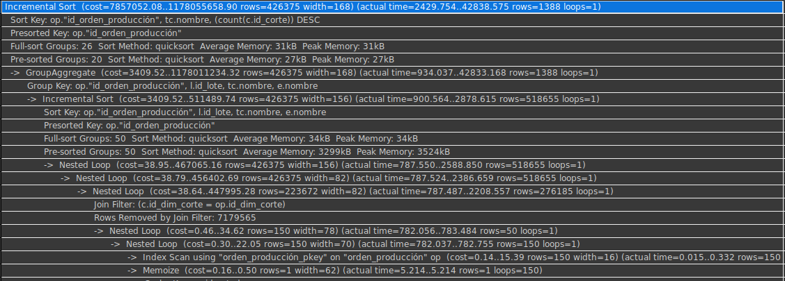
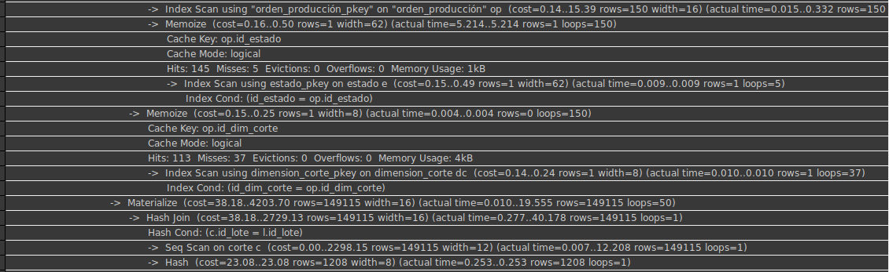
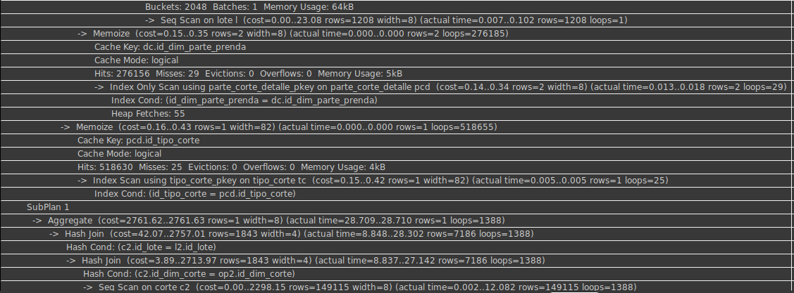
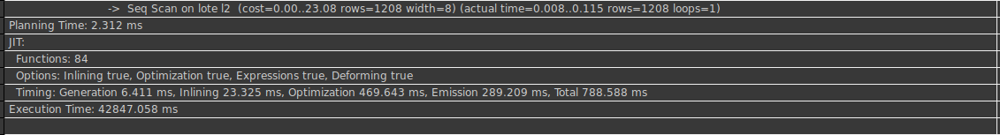

# Entregable 4 del proyecto
## Proceso Batch
### Enunciado:
* Obtener una vista del progreso de producción al final del día (medianoche) para registrar el avance diario. Se actualiza diariamente.

***Query SQL***
```sql
            explain analyze
             SELECT
                    op.id_orden_producción,
                    op.cantidad,
                    l.id_lote,
                    l.cantidad AS cantidad_lote,
                    tc.nombre AS tipo_corte,
                    COUNT(c.id_corte) AS cantidad_cortes,
                    e.nombre AS estado_orden,
                    (SELECT
                        (SUM(l2.cantidad) / op.cantidad) * 100
                     FROM lote l2
                     INNER JOIN corte c2 ON l2.id_lote = c2.id_lote
                     INNER JOIN orden_producción op2 ON op2.id_dim_corte = c2.id_dim_corte
                     WHERE op2.id_orden_producción = op.id_orden_producción) AS progreso_produccion
                FROM orden_producción op
                INNER JOIN estado e ON op.id_estado = e.id_estado
                INNER JOIN dimension_corte dc ON op.id_dim_corte = dc.id_dim_corte
                INNER JOIN corte c ON dc.id_dim_corte = c.id_dim_corte
                INNER JOIN lote l ON c.id_lote = l.id_lote
                INNER JOIN parte_corte_detalle pcd ON dc.id_dim_parte_prenda = pcd.id_dim_parte_prenda
                INNER JOIN tipo_corte tc ON pcd.id_tipo_corte = tc.id_tipo_corte
                GROUP BY
                    op.id_orden_producción,
                    op.cantidad,
                    l.id_lote,
                    l.cantidad,
                    tc.nombre,
                    e.nombre
                ORDER BY
                    op.id_orden_producción,
                    tc.nombre,
                    cantidad_cortes DESC;
                    

```






### PLPGSQL
```sql
CREATE OR REPLACE FUNCTION calcular_progreso_produccion()
RETURNS VOID AS $$
BEGIN
SELECT
  op.id_orden_producción,
  op.cantidad,
  l.id_lote,
  l.cantidad AS cantidad_lote,
  tc.nombre AS tipo_corte,
  COUNT(c.id_corte) AS cantidad_cortes,
  e.nombre AS estado_orden,
  (SELECT
    (SUM(l2.cantidad) / op.cantidad) * 100
      FROM lote l2
      INNER JOIN corte c2 ON l2.id_lote = c2.id_lote
      INNER JOIN orden_producción op2 ON op2.id_dim_corte = c2.id_dim_corte
      WHERE op2.id_orden_producción = op.id_orden_producción) AS progreso_produccion
          FROM orden_producción op
      INNER JOIN estado e ON op.id_estado = e.id_estado
      INNER JOIN dimension_corte dc ON op.id_dim_corte = dc.id_dim_corte
      INNER JOIN corte c ON dc.id_dim_corte = c.id_dim_corte
      INNER JOIN lote l ON c.id_lote = l.id_lote
      INNER JOIN parte_corte_detalle pcd ON dc.id_dim_parte_prenda = pcd.id_dim_parte_prenda
      INNER JOIN tipo_corte tc ON pcd.id_tipo_corte = tc.id_tipo_corte
        GROUP BY
          op.id_orden_producción,
          op.cantidad,
          l.id_lote,
          l.cantidad,
          tc.nombre,
          e.nombre
        ORDER BY
          op.id_orden_producción,
          tc.nombre,
          cantidad_cortes DESC;                  
END;
$$ LANGUAGE plpgsql;
```

### Usando Cron
Se agrega una entrada al archivo crontab para ejecutar un script de shell que invoque psql y ejecute la función todos los días a medianoche.
```
0 0 * * * psql -d vircatex -c 'SELECT calcular_progreso_produccion();'

```

### Enfoque Utilizando Funciones y Triggers en PostgreSQL

#### Paso 1: Crear una Función PL/pgSQL

Define tu función PL/pgSQL que encapsule la lógica que deseas ejecutar periódicamente. Por ejemplo:


```sql
CREATE OR REPLACE FUNCTION calcular_progreso_produccion()
RETURNS VOID AS $$
BEGIN
   -- Tu consulta SQL aquí
   SELECT
       op.id_orden_producción,
       op.cantidad,
       l.id_lote,
       l.cantidad AS cantidad_lote,
       tc.nombre AS tipo_corte,
       COUNT(c.id_corte) AS cantidad_cortes,
       e.nombre AS estado_orden,
       (SELECT
           (SUM(l2.cantidad) / op.cantidad) * 100
        FROM lote l2
        INNER JOIN corte c2 ON l2.id_lote = c2.id_lote
        INNER JOIN orden_producción op2 ON op2.id_dim_corte = c2.id_dim_corte
        WHERE op2.id_orden_producción = op.id_orden_producción) AS progreso_produccion
   FROM orden_producción op
   INNER JOIN estado e ON op.id_estado = e.id_estado
   INNER JOIN dimension_corte dc ON op.id_dim_corte = dc.id_dim_corte
   INNER JOIN corte c ON dc.id_dim_corte = c.id_dim_corte
   INNER JOIN lote l ON c.id_lote = l.id_lote
   INNER JOIN parte_corte_detalle pcd ON dc.id_dim_parte_prenda = pcd.id_dim_parte_prenda
   INNER JOIN tipo_corte tc ON pcd.id_tipo_corte = tc.id_tipo_corte
   GROUP BY
       op.id_orden_producción,
       op.cantidad,
       l.id_lote,
       l.cantidad,
       tc.nombre,
       e.nombre
   ORDER BY
       op.id_orden_producción,
       tc.nombre,
       cantidad_cortes DESC;
END;
$$ LANGUAGE plpgsql;
```

#### Paso 2: Crear un Trigger para Disparar la Función
Puedes utilizar un trigger que se active en un evento específico (como una inserción en una tabla de control de programación) para ejecutar la función. Aquí te muestro un ejemplo simplificado:

- Crear una Tabla de Control (opcional): Crea una tabla que actúe como un controlador para programar la ejecución de la función. Por ejemplo:
```sql
CREATE TABLE programacion_ejecucion (
    id SERIAL PRIMARY KEY,
    ejecutar BOOLEAN DEFAULT FALSE
);
```

- Crear un Trigger en PostgreSQL: Crea un trigger que active la función cuando se actualice la tabla de control. Por ejemplo:

```sql
CREATE OR REPLACE FUNCTION activar_programacion()
RETURNS TRIGGER AS $$
BEGIN
    IF NEW.ejecutar THEN
        PERFORM calcular_progreso_produccion();
    END IF;
    RETURN NEW;
END;
$$ LANGUAGE plpgsql;

CREATE TRIGGER trigger_activacion
AFTER INSERT OR UPDATE ON programacion_ejecucion
FOR EACH ROW
EXECUTE FUNCTION activar_programacion();
```

- Paso 3: Activar la Ejecución Programada
Para activar la ejecución programada, simplemente inserta o actualiza un registro en la tabla programacion_ejecucion con el campo ejecutar establecido en TRUE. Por ejemplo:
```sql
-- Insertar un registro para activar la ejecución
INSERT INTO programacion_ejecucion (ejecutar) VALUES (TRUE);
```
Esto disparará el trigger trigger_activacion, que a su vez ejecutará la función calcular_progreso_produccion().


[Regresar al índice](./indice.md)
