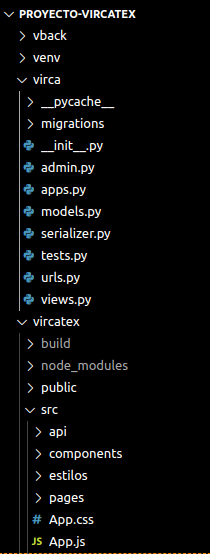
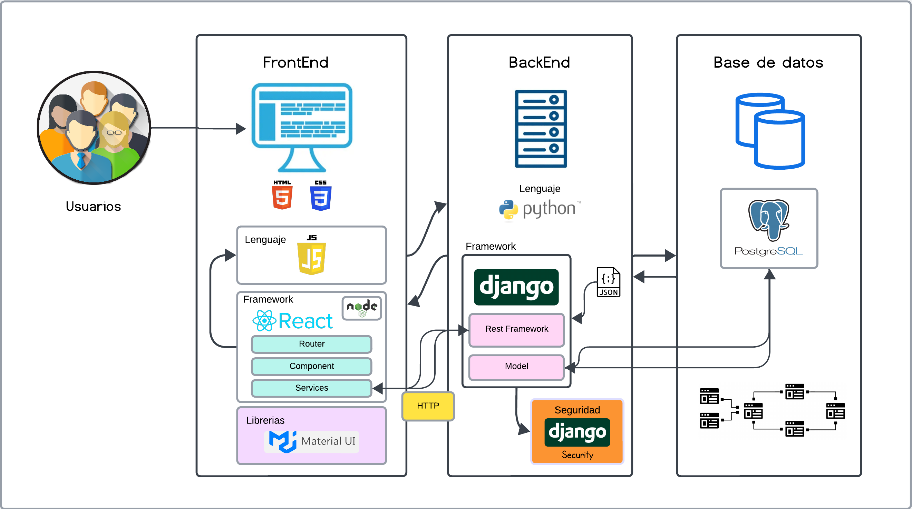
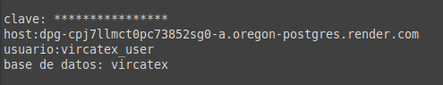
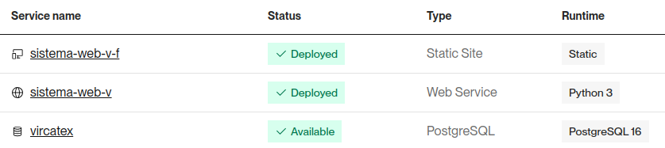
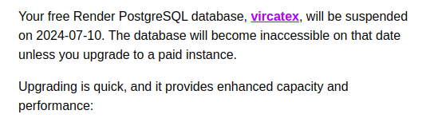
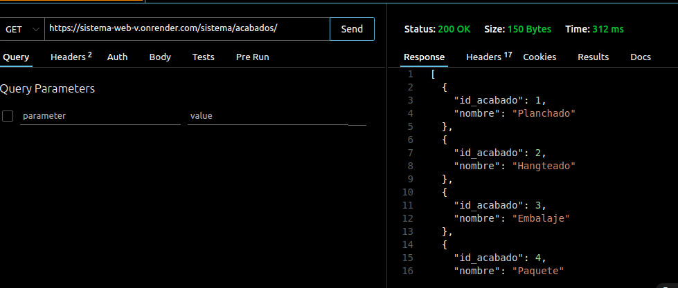

# Entregable 4 del proyecto

## Estructura del proyecto

Presentamos a continuación la estructura completa del proyecto de la App Web - Sistema Vircatex
- [Estructura de App Web](#1-estructura-de-app-web)
- [Arquitectura y tecnología](#2-arquitectura-y-tecnología)
  - [Stack](#stack)
  - [Arquitectura](#arquitectura)
  - [Producción](#producción)
  - [Herramientas](#herramientas)


## 1. Estructura de App Web

Se detalla la estructura que se usa para desarrollarla app web:
* **vback:** Django.
* **venv:** Entorno virtual de python.
* **virca:** Backend - Django Rest Framework y Python.
* **vircatex:** Frontend - React y Javascript.


  
### Requirements:
Archivo de componentes de instalación necesarios para el entorno de producción.
```
asgiref==3.8.1
dj-database-url==2.2.0
Django==5.0.6
django-cors-headers==4.3.1
djangorestframework==3.15.2
gunicorn==22.0.0
packaging==24.1
psycopg2-binary==2.9.9
python-decouple==3.8
sqlparse==0.5.0
typing-extensions==4.12.2
whitenoise==6.6.0
tzdata==2024.1
```
| Paquete                   | Versión  | Descripción                                                                                                              | Propósito                                                                                                                 |
|---------------------------|----------|--------------------------------------------------------------------------------------------------------------------------|---------------------------------------------------------------------------------------------------------------------------|
| asgiref                   | 3.8.1    | Biblioteca de referencia para ASGI (Asynchronous Server Gateway Interface).                                               | Proporciona herramientas y utilidades para implementar servidores y aplicaciones ASGI.                                     |
| dj-database-url           | 2.2.0    | Biblioteca para configurar la conexión a la base de datos usando URLs.                                                   | Simplifica la configuración de la base de datos, útil para despliegues en plataformas de nube.                             |
| Django                    | 5.0.6    | Framework web de alto nivel para desarrollo rápido de aplicaciones web.                                                  | Proporciona herramientas para construir aplicaciones web robustas y escalables.                                            |
| django-cors-headers       | 4.3.1    | Biblioteca que permite manejar CORS (Cross-Origin Resource Sharing) en Django.                                           | Facilita la configuración de CORS, esencial para aplicaciones con frontend separado del backend.                           |
| djangorestframework       | 3.15.2   | Biblioteca potente y flexible para construir APIs web en Django.                                                        | Proporciona herramientas para crear APIs RESTful, incluyendo serializadores y vistas basadas en clases.                    |
| gunicorn                  | 22.0.0   | Servidor HTTP WSGI para aplicaciones web Python.                                                                         | Desplegar aplicaciones Django en producción, robusto y de alto rendimiento.                                                |
| packaging                 | 24.1     | Biblioteca para manejar versiones y dependencias de paquetes Python.                                                     | Ayuda a interpretar versiones de paquetes y dependencias.                                                                 |
| psycopg2                  | 2.9.9    | Adaptador de base de datos PostgreSQL para Python.                                                                       | Permite que Django se comunique con una base de datos PostgreSQL.                                                          |
| python-decouple           | 3.8      | Biblioteca para separar configuraciones y credenciales del código fuente.                                                | Facilita la gestión de configuraciones, cargándolas desde archivos de entorno.                                             |
| sqlparse                  | 0.5.0    | Biblioteca para el análisis, formateación y manipulación de sentencias SQL.                                              | Usado por Django para formatear y manejar consultas SQL.                                                                   |
| typing_extensions         | 4.12.2   | Biblioteca que proporciona funcionalidades adicionales para el módulo `typing` de Python.                                | Permite el uso de anotaciones de tipos más recientes en versiones anteriores de Python.                                    |
| whitenoise                | 6.6.0    | Biblioteca que permite servir archivos estáticos directamente desde una aplicación Django en producción.                 | Facilita el manejo de archivos estáticos, mejorando el despliegue y el rendimiento.                                        |
| tzdata                | 2024.1    | Biblioteca que que contiene datos sobre las zonas horarias en todo el mundo.                 | Se utiliza para manejar correctamente las diferencias de tiempo en diferentes regiones, teniendo en cuenta factores como cambios de horario de verano y husos horarios específicos de cada región.                                        |


  [](#estructura-del-proyecto)

## 2. Arquitectura y tecnología

### Arquitectura de Software

| Aspecto de Arquitectura       | Detalle                                               |
|-------------------------------|-------------------------------------------------------|
| Frameworks de Front End      | React <br>[]()                                                 |
| Frameworks de Back End       | Django <br> []()                                               |
| Frameworks de Seguridad      | Django Security <br> []()                                      |
| Lenguaje de Programación de Base | JavaScript para el front-end (con React), Python para el back-end (con Django) <br> []()  []()|
| Editor de código             | Visual Studio Code <br> []()                                |
| Bibliotecas                  | Material UI <br> []() |


**React**

React es una biblioteca de JavaScript de código abierto desarrollada por Facebook. Se utiliza para construir interfaces de usuario (UI) de una sola página de manera eficiente. React emplea un modelo basado en componentes, permitiendo a los desarrolladores construir UIs complejas a partir de componentes pequeños y reutilizables. Utiliza un DOM virtual para mejorar el rendimiento y facilita el manejo del estado de la aplicación con su sistema de gestión de estado como React Context o bibliotecas como Redux.


**Django**

Django es un framework de desarrollo web de alto nivel para Python que fomenta un desarrollo rápido y un diseño limpio y pragmático. Ofrece una estructura completa para el desarrollo web, incluyendo un ORM (Object-Relational Mapping), un sistema de plantillas, validación de formularios, administración, autenticación, enrutamiento y más. Django sigue el principio DRY (Don't Repeat Yourself) y el patrón MVC (Model-View-Controller), aunque en su jerga se utiliza MVT (Model-View-Template).


**Django Security**

Django Security se refiere a las características y prácticas de seguridad incorporadas en el framework Django. Estas incluyen la protección contra ataques comunes en aplicaciones web, tales como inyección de SQL, cross-site scripting (XSS), cross-site request forgery (CSRF) y clickjacking. Django incluye middleware de seguridad, configuración segura por defecto y recomendaciones para prácticas seguras de desarrollo web.

**JavaScript**

JavaScript es un lenguaje de programación de alto nivel, dinámico y basado en prototipos, utilizado principalmente para el desarrollo del front-end de aplicaciones web. Es el lenguaje nativo de los navegadores web y permite la creación de contenido interactivo y dinámico en sitios web.

**Python**

Python es un lenguaje de programación interpretado, de alto nivel y con una sintaxis clara y legible. Es conocido por su simplicidad y productividad, lo que lo hace ideal para el desarrollo de back-end con frameworks como Django. Python soporta múltiples paradigmas de programación, incluyendo la programación orientada a objetos, imperativa y funcional.

**Editor de código: Visual Studio Code**

Visual Studio Code (VS Code) es un editor de código fuente desarrollado por Microsoft. Es ligero, rápido y extensible, soportando una amplia gama de lenguajes de programación y tecnologías. VS Code ofrece características como autocompletado, depuración integrada, terminal incorporado, y una vasta colección de extensiones para mejorar la productividad del desarrollo.

**Bibliotecas: Material UI**

Material UI es una biblioteca de componentes de interfaz de usuario para React que implementa el sistema de diseño Material Design de Google. Proporciona una colección de componentes de React que se pueden personalizar y utilizar para construir aplicaciones web atractivas y consistentes. Material UI incluye componentes pre-estilizados para botones, formularios, diálogos, tablas y más, facilitando el desarrollo de UIs modernas y receptivas.


### Arquitectura de Datos

| Aspecto de Arquitectura | Detalle       |
|--------------------------|---------------|
| Motor de Base de Datos   | PostgreSQL <br> []()    |

**PostgreSQL** es un sistema de gestión de bases de datos relacional y orientado a objetos de código abierto, conocido por su robustez, extensibilidad y cumplimiento de estándares SQL.

* Características Técnicas de PostgreSQL:

  - Conformidad con los estándares SQL: PostgreSQL cumple con muchos de los estándares SQL, lo que garantiza la portabilidad y la compatibilidad de las aplicaciones.
  - Extensibilidad: PostgreSQL permite a los desarrolladores crear nuevos tipos de datos, operadores, funciones, índices y métodos de acceso, lo que lo hace altamente flexible y adaptable a necesidades específicas.
  - Integridad de Datos: Ofrece características avanzadas para mantener la integridad de los datos, como claves primarias y foráneas, restricciones únicas y de verificación, y transacciones ACID (Atomicidad, Consistencia, Aislamiento, Durabilidad).
  - Soporte para JSON: PostgreSQL tiene un sólido soporte para datos JSON, permitiendo el almacenamiento y manipulación de datos en formato JSON, y facilitando su uso como base de datos híbrida relacional/noSQL.
  - Rendimiento y Escalabilidad: Ofrece herramientas y técnicas de optimización de rendimiento como índices avanzados (B-tree, Hash, GIN, GiST), particionamiento de tablas y paralelización de consultas.

* ¿Por qué elegir PostgreSQL frente a Oracle?

| **Características**                | **PostgreSQL**                                                     | **Oracle**                                                |
|------------------------------------|--------------------------------------------------------------------|-----------------------------------------------------------|
| **Costo**                          | Gratuito, de código abierto                                        | Licencias costosas                                         |
| **Licencia**                       | PostgreSQL License (similar a MIT)                                 | Licencia comercial restrictiva                             |
| **Cumplimiento de Estándares SQL** | Alta conformidad con los estándares SQL                            | Alta conformidad, pero con extensiones propietarias        |
| **Extensibilidad**                 | Altamente extensible, soporte para nuevos tipos de datos, funciones, operadores, y métodos de indexación | Extensible, pero con mayor complejidad y costo             |
| **Soporte para JSON**              | Robusto y eficiente                                                | Soporte disponible, pero menos intuitivo                   |
| **Rendimiento y Escalabilidad**    | Excelente rendimiento y capacidad de manejar grandes volúmenes de datos y usuarios concurrentes  | Alto rendimiento y escalabilidad, pero con mayores costos |
| **Seguridad**                      | Características de seguridad avanzadas, incluyendo RLS, autenticación basada en roles, cifrado de datos | Seguridad avanzada, pero depende de la licencia y configuración|
| **Comunidad y Ecosistema**         | Gran comunidad activa y amplio ecosistema de herramientas y extensiones | Soporte comercial sólido, pero menor comunidad activa      |
| **Integración con Herramientas y Frameworks** | Fácil integración con Django, React y otras herramientas populares | Integración disponible, pero puede ser más compleja        |
| **Replicación y Alta Disponibilidad** | Soporte para replicación en caliente, recuperación ante desastres, y alta disponibilidad | Características avanzadas disponibles, pero costosas       |
| **Documentación y Soporte**        | Extensa documentación, soporte comunitario y comercial disponible  | Documentación detallada, pero soporte principalmente comercial |


  [](#estructura-del-proyecto)

### Stack


### Arquitectura

***Herramienta: LucidSpark***

### Front end
[Vircatex - render](https://sistema-web-v-f.onrender.com/) <br>

### App Web
Despliegue Backend y PostgreSQL : [Render](https://render.com/)

### Conexión Base de datos (local)


### Conexión Base de datos (render)


  [](#estructura-del-proyecto)

### Producción


* Si desea ver el software funcional después del 10/07 contacte al administrador: jarteagag@uni.pe


  [](#estructura-del-proyecto)


### Herramientas
#### Entornos:
* **Node.js v18.16.1**
Descripción Formal:

Node.js es un entorno de ejecución de JavaScript de código abierto y multiplataforma que permite ejecutar código JavaScript en el lado del servidor. Basado en el motor V8 de Google Chrome, Node.js es conocido por su capacidad para manejar múltiples conexiones simultáneas con alto rendimiento, gracias a su modelo de E/S no bloqueante y orientado a eventos.

Versión:
18.16.1

    Características Clave:
    
    - Ecosistema de Paquetes: Node.js incluye npm (Node Package Manager), el gestor de paquetes más grande del mundo.
    - Escalabilidad: Diseñado para construir aplicaciones escalables y de alto rendimiento.
    - Event-Driven: Su arquitectura basada en eventos lo hace ideal para aplicaciones en tiempo real, como servidores web.
    - Asincronismo: Su modelo de programación asincrónica mejora la eficiencia y el rendimiento.
    - Extensibilidad: Compatible con la integración de varios módulos y bibliotecas.


* **ENV (GNU coreutils) 8.32**

env es una utilidad de línea de comandos que forma parte del paquete GNU Core Utilities (coreutils). Esta herramienta se utiliza para ejecutar un programa en un entorno modificado. env puede configurar variables de entorno para los procesos que se ejecuten con él, lo que resulta útil para cambiar temporalmente el entorno de ejecución.

Versión:
8.32

Licencia:
> Copyright © 2020 Free Software Foundation, Inc.
> License GPLv3+: GNU GPL version 3 or later <https://gnu.org/licenses/gpl.html>.
> This is free software: you are free to change and redistribute it.
> There is NO WARRANTY, to the extent permitted by law.


    Características Clave:
    
    - Modificación del Entorno: Permite cambiar las variables de entorno antes de ejecutar un comando.
    - Compatibilidad: Compatible con varios sistemas operativos basados en Unix.
    - Simplicidad: Su sintaxis y uso son simples y directos.
    - Scriptabilidad: Comúnmente utilizado en scripts de shell para asegurar que los comandos se ejecuten en un entorno controlado.


#### Pruebas

* **Postman**
Es una plataforma colaborativa para el desarrollo de APIs que facilita la creación, prueba, documentación y monitoreo de APIs. Es ampliamente utilizada por desarrolladores y equipos de desarrollo debido a su robustez y a las múltiples características que ofrece.

  - Funciones Principales:

    - Colecciones: Permite organizar las solicitudes en colecciones para mantener las pruebas estructuradas y reutilizables.
Variables de Entorno: Se pueden definir variables de entorno para manejar diferentes configuraciones (desarrollo, pruebas, producción) sin necesidad de cambiar los detalles de la solicitud.
    - Pre-request Scripts y Test Scripts: Permite ejecutar scripts (usando JavaScript) antes de enviar la solicitud y después de recibir la respuesta para automatizar pruebas y validar respuestas.
    - Historial de Solicitudes: Mantiene un historial de todas las solicitudes realizadas para fácil referencia y repetición.
Autenticación: Soporta varios tipos de autenticación (Bearer Token, OAuth, API Key, etc.), facilitando las pruebas de seguridad.
    - ocumentación de API: Genera documentación de API directamente desde las colecciones, útil para compartir con otros desarrolladores y equipos.
Monitoreo y Automación: Ofrece herramientas para monitorear el rendimiento de la API y automatizar las pruebas con integraciones CI/CD.

* **Thunder Client:**
Thunder Client es una extensión ligera para Visual Studio Code diseñada para probar APIs RESTful de una manera rápida y sencilla. Es ideal para desarrolladores que prefieren no salir de su editor de código para realizar pruebas de API.

  - Funciones Principales:

    - Interfaz Integrada en VS Code: Se ejecuta directamente dentro de VS Code, eliminando la necesidad de cambiar de aplicación para probar APIs.
Solicitudes Rápidas: Facilita la creación y ejecución de solicitudes HTTP de manera rápida sin necesidad de configuraciones extensas.
    - Variables de Entorno: Permite definir variables de entorno similares a Postman para manejar diferentes configuraciones.
Historial de Solicitudes: Guarda el historial de solicitudes realizadas para fácil referencia y repetición.
    - Colecciones y Carpetas: Permite organizar las solicitudes en colecciones y carpetas para mantener el proyecto estructurado.
Pre-request y Test Scripts: Soporta scripts de pre-request y de test utilizando JavaScript.
    - Soporte de Autenticación: Soporta varios métodos de autenticación (Bearer Token, Basic Auth, etc.).
   
  
   

**Aplicación en el Desarrollo y Pruebas del Proyecto**
Para el proyecto con Django, React y PostgreSQL, hemo usado las herramientas de la siguiente manera:

- Probar Endpoints de Django: Postman o Thunder Client para enviar solicitudes GET, POST, PUT y DELETE a los endpoints de tu API Django para asegurarte de que respondan correctamente.

- Validación de Datos: Verificar que las respuestas de la API correspondan con los datos esperados almacenados en PostgreSQL.

- Documentación y Colaboración: Uso de Postman para generar documentación interactiva de la API.

  [](#estructura-del-proyecto)

[Regresar al Índice](./indice.md)
