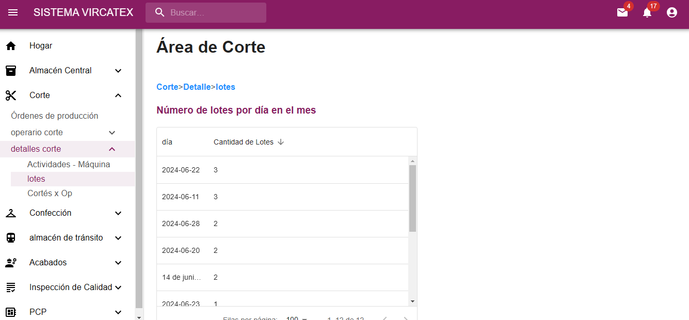
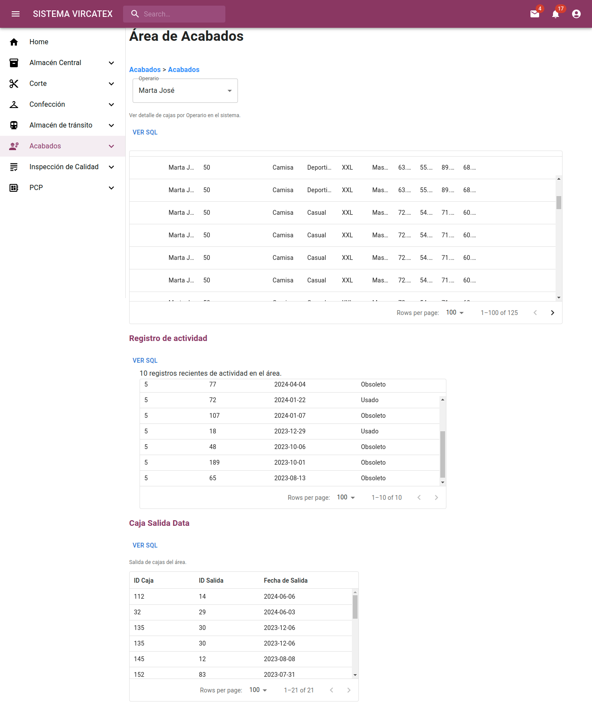

# Entregable 4 del proyecto
## Aplicación

### Front end
Abrir en Google Chrome: [Vircatex - render](https://sistema-web-v-f.onrender.com/#/acabados/lotes) 

[Github]() 


### App Web
Despliegue Backend y PostgreSQL : [Render](https://render.com/)

[Github]() 

### Conexión Base de datos (local)


## Versión final:
Presentamos el flujo de pantallas de la App Web: **[Sistema Vircatex](https://sistema-web-v-f.onrender.com/)**:

- [Almacén Central](#almacén-central)
- [Corte](#corte)
- [Confección](#confección)
- [Almacén_de_tránsito](#almacén-de-tránsito)
- [Acabados](#acabados)
- [Inspección_de_calidad](#inspección-de-calidad)
- [PCP - Abastecimiento](#pcp)


### Home


  [](#versión-final)

---

### Almacén Central

  [](#versión-final)

---

### Corte

<details>
  <summary>VER TODO</summary>
  
  #### Submenú 1: 
  **Navegación**: Corte > Ordenes de produccion.
  
Muestra los datos que recibe el jefe de corte de almacén central, sobre la orden de producción lo cual observa si la orden está en proceso, la cantidad que debe realizar, tipo de corte, etc; luego presiona asignar para más detalle.
  
  

  *Consulta 1: Lista de ordenes de produccion
  
  ```python
  class OrdenesListView(View):
    def get(self, request):
        with connection.cursor() as cursor:
            query = """
            SELECT
                o.id_orden_producción,
                o.fecha_inicio,
                o.fecha_fin,
                o.cantidad,
                e.nombre AS estado_orden,
                a.nombre AS area,
                tc.nombre AS tipo_corte,
                tmp.nombre AS tipo_materia_prima,
                o.id_orden_trabajo,
                o.fecha_creacion
            FROM
                orden_producción o
            JOIN
                estado e ON o.id_estado = e.id_estado
            JOIN
                area a ON o.id_area = a.id_area
            JOIN
                dimension_corte dc ON o.id_dim_corte = dc.id_dim_corte
            JOIN
                parte_corte_detalle pcd ON dc.id_dim_parte_prenda = pcd.id_dim_parte_prenda
            JOIN
                tipo_corte tc ON pcd.id_tipo_corte = tc.id_tipo_corte
            JOIN
                actividad_diaria ad ON o.id_orden_producción = ad.id_orden_producción
            JOIN
                registro_uso_lote rul ON ad.id_actividad = rul.id_actividad
            JOIN
                lote l ON rul.id_lote = l.id_lote
            JOIN
                dimension_materia_prima dmp ON l.id_dim_materia_prima = dmp.id_dim_materia_prima
            JOIN
                tipo_materia_prima tmp ON dmp.id_tipo_materia_prima = tmp.id_tipo_materia_prima
            WHERE
                a.nombre = 'Corte'
            GROUP BY
                o.id_orden_producción, o.fecha_inicio, o.fecha_fin, o.cantidad, e.nombre, a.nombre, tc.nombre, tmp.nombre,
                o.id_orden_trabajo, o.fecha_creacion
            ORDER BY
                o.fecha_inicio DESC;
            """
            cursor.execute(query)
            rows = cursor.fetchall()

        data = [
            {
                'id_orden_produccion': row[0],
                'fecha_inicio': row[1],
                'fecha_fin': row[2],
                'cantidad': row[3],
                'estado_orden': row[4],
                'area': row[5],
                'tipo_corte': row[6],
                'tipo_materia_prima': row[7],
                'id_orden_trabajo': row[8],
                'fecha_creacion': row[9]
            }
            for row in rows
        ]
        return JsonResponse(data, safe=False)
  ```

*Consulta 2: Botón Asignar: el jefe de corte asigna en cada orden de producción la fecha que la a realizar la actividad, que máquina lo va a realizar, y la cantidad ya hecha de la orden de producción si es que esa orden de producción ya se recibió y no se ha terminado.

  

```python
class AsignarView(View):
    def post(self, request, id_orden_produccion):
        body = json.loads(request.body)
        id_maquina = body['id_maquina']
        cantidad_hecha = body['cantidad_hecha']

        with connection.cursor() as cursor:
            cursor.execute(
                "INSERT INTO actividad_diaria (fecha_actividad, id_orden_producción) VALUES (NOW(), %s) RETURNING id_actividad;",
                [id_orden_produccion]
            )
            id_actividad = cursor.fetchone()[0]

            cursor.execute(
                "INSERT INTO maquina_actividad (id_actividad, id_maquina, cantidad_hecha) VALUES (%s, %s, %s);",
                [id_actividad, id_maquina, cantidad_hecha]
            )

        return JsonResponse({'status': 'success'})
```

#### Submenú 2: 
**Navegación**: Corte > operario corte > Actividades.

El operario recibe un informe para que programe la máquina, lo cual vemos en la pantalla y nos muestra las actividades que debe realizar cada maquina al día, donde se detalla la cantidad que hay en esa orden de producción, la cantidad hecha, el tipo de corte.


*Consulta:
```python
def actividad_diaria(request):
    with connection.cursor() as cursor:
        cursor.execute("""
            SELECT
                a.fecha_actividad,
                o.id_orden_producción,
                o.cantidad AS cantidad_orden,
                m.id_maquina,
                ma.cantidad_hecha AS cantidad_realizar,
                tc.nombre AS tipo_corte
            FROM actividad_diaria a
            JOIN maquina_actividad ma ON a.id_actividad = ma.id_actividad
            JOIN maquina m ON ma.id_maquina = m.id_maquina
            JOIN orden_producción o ON a.id_orden_producción = o.id_orden_producción
            JOIN corte c ON c.id_lote = o.id_dim_corte
            JOIN dimension_corte dc ON c.id_dim_corte = dc.id_dim_corte
            JOIN parte_corte_detalle pcd ON dc.id_dim_parte_prenda = pcd.id_dim_parte_prenda
            JOIN tipo_corte tc ON pcd.id_tipo_corte = tc.id_tipo_corte
            ORDER BY a.fecha_actividad DESC;
        """)
        rows = cursor.fetchall()
        columns = [col[0] for col in cursor.description]
        results = [dict(zip(columns, row)) for row in rows]
    
    return JsonResponse(results, safe=False)
```

#### Submenú 3: 
**Navegación**: Corte > operario corte > Corte de lote.

Inserta datos de la cantidad de corte realizado y la cantidad de lote usado, en qué estado se encuentra dicha orden de producción


*Consulta:
```python
@csrf_exempt
def insertar_datos(request):
    if request.method == 'POST':
        data = json.loads(request.body)
        
        id_tipo_lote = 2  # el valor constante como especificaste
        cantidad = data.get('cantidad')
        id_dim_corte = data.get('id_dim_corte')
        id_estado = data.get('id_estado')
        id_actividad = data.get('id_actividad')
        fecha_creacion = data.get('fecha_creacion')
        cantidad_usada = data.get('cantidad_usada')
        
        with connection.cursor() as cursor:
            cursor.execute(
                '''
                INSERT INTO lote (id_tipo_lote, cantidad, id_dim_corte, id_estado, id_dim_confeccion, id_dim_materia_prima, id_actividad, fecha_creacion)
                VALUES (%s, %s, %s, %s, NULL, NULL, %s, %s) RETURNING id;
                ''',
                [id_tipo_lote, cantidad, id_dim_corte, id_estado, id_actividad, fecha_creacion]
            )
            id_lote = cursor.fetchone()[0]
            
            cursor.execute(
                '''
                INSERT INTO Registro_uso_lote (id_actividad, id_lote, cantidad_usada)
                VALUES (%s, %s, %s);
                ''',
                [id_actividad, id_lote, cantidad_usada]
            )
        
        return JsonResponse({'success': True, 'id_lote': id_lote})
    return JsonResponse({'error': 'Invalid request method'}, status=400)
```

#### Submenú 4: 
**Navegación**: Corte > detalles corte > Actividades - Maquina.

En esta sección el jefe de corte observa el reporte de las actividades diarias de la maquinas, la capacidad de la maquina cantidad de actividades, luego presiona el botón ver actividad y nos muestra el detalle de la actividad.


*Consulta 1:
```python
def actividades(request):
    with connection.cursor() as cursor:
        cursor.execute("""
            SELECT 
                ma.id_maquina,
                m.capacidad_total,
                COUNT(ad.id_actividad) AS cantidad_actividades,
                ad.fecha_actividad
            FROM 
                actividad_diaria ad
            JOIN 
                maquina_actividad ma ON ad.id_actividad = ma.id_actividad
            JOIN 
                maquina m ON ma.id_maquina = m.id_maquina
            WHERE 
                ad.fecha_actividad = '2024-06-03'
            GROUP BY 
                ma.id_maquina, m.capacidad_total, ad.fecha_actividad
            ORDER BY 
                cantidad_actividades DESC;
        """)
        rows = cursor.fetchall()

    data = []
    for row in rows:
        data.append({
            'id_maquina': row[0],
            'capacidad_total': row[1],
            'cantidad_actividades': row[2],
            'fecha_actividad': row[3],
        })

    return JsonResponse(data, safe=False)
```
*Consulta 2: Botón ver actividad: Nos muestra el detalle de la actividad, como las máquinas realizan várias actividades, nos muestra el detalle de estas actividades, con la cantidad de cortes, el progreso que esta actividad tiene.


```python
def actividad_detalle(request, actividad_id):
    with connection.cursor() as cursor:
        cursor.execute("""
            SELECT
                ad.id_actividad,
                ad.fecha_actividad,
                COUNT(c.id_corte) AS cantidad_cortes,
                op.cantidad AS cantidad_orden_preproduccion,
                (SUM(l.cantidad) / op.cantidad) * 100 AS progreso_preproduccion
            FROM actividad_diaria ad
            JOIN orden_producción op ON ad.id_orden_producción = op.id_orden_producción
            JOIN lote l ON ad.id_actividad = l.id_actividad
            JOIN corte c ON l.id_lote = c.id_lote
            WHERE ad.id_actividad = %s
            GROUP BY
                ad.id_actividad,
                ad.fecha_actividad,
                op.cantidad
            ORDER BY
                ad.fecha_actividad DESC;
        """, [actividad_id])
        row = cursor.fetchone()

    data = {
        'id_actividad': row[0],
        'fecha_actividad': row[1],
        'cantidad_cortes': row[2],
        'cantidad_orden_preproduccion': row[3],
        'progreso_preproduccion': row[4],
    }

    return JsonResponse(data)
```

#### Submenú 5: 
**Navegación**: Corte > detalles corte > Lotes.

El jefe de corte observa el número de lotes por día en el mes, para analizar que día se hizo menos y el por qué.



*Consulta:
```python
class LotesView(View):
    def get(self, request):
        query = """
            SELECT 
                l.fecha_creacion::date AS dia,
                COUNT(l.id_lote) AS cantidad_lotes
            FROM 
                lote l
            JOIN 
                actividad_diaria ad ON l.id_actividad = ad.id_actividad
            JOIN 
                orden_producción op ON ad.id_orden_producción = op.id_orden_producción
            JOIN 
                area a ON op.id_area = a.id_area
            WHERE 
                a.nombre = 'Corte'
                AND DATE_TRUNC('month', l.fecha_creacion) = DATE_TRUNC('month', CURRENT_DATE)
            GROUP BY 
                l.fecha_creacion::date
            ORDER BY 
                cantidad_lotes DESC;
        """
        with connection.cursor() as cursor:
            cursor.execute(query)
            rows = cursor.fetchall()

        data = [{'dia': row[0], 'cantidad_lotes': row[1]} for row in rows]
        return JsonResponse(data, safe=False)
```

#### Submenú 6: 
**Navegación**: Corte > detalles corte > Corte x OP.

Muestra el detalle del número de cortes por el orden de producción, el jefe de corte visualizará dicho detalle cual es la cantidad de esa orden de producción, que cantidad de cortes y el tipo de corte, si la orden está en proceso, atrasado, etc; y el progreso dependiendo del estado.


*Consulta:
```python
class ProductionOrderView(View):
    def get(self, request):
        with connection.cursor() as cursor:
            cursor.execute("""
                SELECT
                    op.id_orden_producción,
                    op.cantidad,
                    l.id_lote,
                    l.cantidad AS cantidad_lote,
                    tc.nombre AS tipo_corte,
                    COUNT(c.id_corte) AS cantidad_cortes,
                    e.nombre AS estado_orden,
                    (SELECT
                        (SUM(l2.cantidad) / op.cantidad) * 100
                     FROM lote l2
                     INNER JOIN corte c2 ON l2.id_lote = c2.id_lote
                     INNER JOIN orden_producción op2 ON op2.id_dim_corte = c2.id_dim_corte
                     WHERE op2.id_orden_producción = op.id_orden_producción) AS progreso_produccion
                FROM orden_producción op
                INNER JOIN estado e ON op.id_estado = e.id_estado
                INNER JOIN dimension_corte dc ON op.id_dim_corte = dc.id_dim_corte
                INNER JOIN corte c ON dc.id_dim_corte = c.id_dim_corte
                INNER JOIN lote l ON c.id_lote = l.id_lote
                INNER JOIN parte_corte_detalle pcd ON dc.id_dim_parte_prenda = pcd.id_dim_parte_prenda
                INNER JOIN tipo_corte tc ON pcd.id_tipo_corte = tc.id_tipo_corte
                GROUP BY
                    op.id_orden_producción,
                    op.cantidad,
                    l.id_lote,
                    l.cantidad,
                    tc.nombre,
                    e.nombre
                ORDER BY
                    op.id_orden_producción,
                    tc.nombre,
                    cantidad_cortes DESC;
            """)
            rows = cursor.fetchall()
            columns = [col[0] for col in cursor.description]
            data = [dict(zip(columns, row)) for row in rows]

        return JsonResponse(data, safe=False)

```

</details>
  
  [](#versión-final)

---


### Confección

  [](#versión-final)

---
  
### Almacén de tránsito

  [](#versión-final)

---

### Acabados

<details>
  <summary>VERSIÓN 1</summary>
  
#### Submenú 1: **General**: 
**Navegación**: Acabados > General <br>
Muestra los datos generales del área.<br>
Se realizan dos consultas a la BD.


* Consulta 1: Lista de Operarios

```python
class EmpleadoListView(View):
    def get(self, request):
         with connection.cursor() as cursor:
            cursor.execute("SELECT id_empleado, nombre FROM empleado WHERE id_area = 5")
            rows = cursor.fetchall()
            result = [
                    {'id_empleado': row[0], 'nombre': row[1]}
                    for row in rows
                ]
            return JsonResponse(result, safe=False)
```

* Consulta 2: Lista de Acabados

```python
class AcabadoListView(APIView):
    def get(self, request):
        with connection.cursor() as cursor:
            cursor.execute("SELECT id_acabado, nombre FROM acabado")
            data = cursor.fetchall()
        
        # Formatear los resultados en un diccionario
        resultados = [{'id_acabado': row[0], 'nombre': row[1]} for row in data]
```

#### Submenú 2: **Lote-caja**: 


Muestra las cajas asignadas a los operarios de acabados y reporte entre fechas.

**Navegación**: Acabados > lotes >


* Consulta: Reporte entre dos fechas

```python
def get_lote_entrada_vista(request):
    with connection.cursor() as cursor:
        cursor.execute("""
            SELECT le.id_entrada, le.fecha_entrada, l.id_tipo_lote, l.cantidad, dc.id_dim_confeccion, dc.id_guia_confeccion
            FROM lote_entrada le
            JOIN lote l ON le.id_lote = l.id_lote
            JOIN dimension_confeccion dc ON l.id_dim_confeccion = dc.id_dim_confeccion
            LIMIT 200;
        """)
        columns = [col[0] for col in cursor.description]
        results = [dict(zip(columns, row)) for row in cursor.fetchall()]
    return JsonResponse(results, safe=False)
```

Cuando se hace click en el botón se direge a: "Reporte"

**Navegación**: Acabados > lotes > Reporte


* Consulta: Reporte entre dos fechas
```python
class ReporteAcabadosView(View):
    def get(self, request):
        fecha_inicio = request.GET.get('fecha_inicio')
        fecha_fin = request.GET.get('fecha_fin')

        query = """
        SELECT DISTINCT e.id_empleado, e.nombre, e.primer_apellido,
                        e.segundo_apellido, e.id_correo, e.dni, e.id_cargo,
                        caja_prenda.id_caja, caja_prenda.fecha_creacion,
                        tipo_prenda.nombre 
        FROM empleado e
        JOIN prenda ON e.id_empleado = prenda.id_empleado
        JOIN caja_prenda ON prenda.id_caja = caja_prenda.id_caja
        JOIN dimension_prenda ON caja_prenda.id_dim_prenda = dimension_prenda.id_dim_prenda
        JOIN dimension_confeccion ON dimension_prenda.id_dim_confeccion = dimension_confeccion.id_dim_confeccion
        JOIN guia_confeccion ON dimension_confeccion.id_guia_confeccion = guia_confeccion.id_guia_confeccion
        JOIN tipo_prenda ON dimension_confeccion.id_tipo_prenda = tipo_prenda.id_tipo_prenda
        WHERE id_area=5 AND id_cargo=2
        AND caja_prenda.fecha_creacion BETWEEN %s AND %s
        """

        with connection.cursor() as cursor:
            cursor.execute(query, [fecha_inicio, fecha_fin])
            rows = cursor.fetchall()

        resultados = [
            {
                "id_empleado": row[0],
                "nombre": row[1],
                "primer_apellido": row[2],
                "segundo_apellido": row[3],
                "id_correo": row[4],
                "dni": row[5],
                "id_cargo": row[6],
                "id_caja": row[7],
                "fecha_creacion": row[8],
                "tipo_prenda": row[9],
            }
            for row in rows
        ]

        return JsonResponse(resultados, safe=False)
```


#### Submenú 3: **Acabados**: 

Muestra la búsqueda de operarios y muestra los detalles generales, las cajas asignada y la navegación hasta la asignación de acabados.

**Navegación**: Acabados > acabados >


* Consulta: Búsqueda de operarios. De despliega un Dropdown con la lista de nombres

```python
def empleado_list_a(request):
    empleados = Empleado.objects.filter(id_area=5).values('nombre')
    return JsonResponse(list(empleados), safe=False)
```

* Grilla del operario: Grilla de datos por cajas y sus detalles de prenda y medidas según el orden de confección.
```python

def datos_list_a(request):
    query = """
    SELECT distinct(cp.id_caja) as ID_Caja, e.nombre, cp.cantidad,
    gconf.id_guia_confeccion as ID_guia, tp.nombre as tipo_prenda, ep.nombre as estilo_prenda, 
    t.nombre as talla, g.nombre as genero,
    COALESCE(gconf.medida_longitud::text, ' ') AS ml,
    COALESCE(gconf.medida_hombro::text, ' ') AS mh,
    COALESCE(gconf.medida_pecho::text, ' ') AS mp,
    COALESCE(gconf.medida_manga::text, ' ') AS mm,
    COALESCE(gconf.medida_cintura::text, ' ') AS mc,
    COALESCE(gconf.medida_cadera::text, ' ') AS mca,
    COALESCE(gconf.medida_muslo::text, ' ') AS mmu
    FROM dimension_confeccion dc
    JOIN guia_confeccion gconf ON dc.id_guia_confeccion = gconf.id_guia_confeccion
    JOIN tipo_prenda tp ON dc.id_tipo_prenda = tp.id_tipo_prenda
    JOIN estilo_prenda ep ON dc.id_estilo_prenda = ep.id_estilo_prenda
    JOIN talla t ON dc.id_talla = t.id_talla
    JOIN genero g ON dc.id_genero = g.id_genero
    JOIN dimension_prenda dp ON dc.id_dim_confeccion = dp.id_dim_confeccion
    JOIN caja_prenda cp ON dp.id_dim_prenda = cp.id_dim_prenda
    JOIN prenda p ON cp.id_caja = p.id_caja
    JOIN empleado e ON p.id_empleado = e.id_empleado
    WHERE e.nombre='Ana Sofía Zaida';
    """
    with connection.cursor() as cursor:
        cursor.execute(query)
        rows = cursor.fetchall()
        columns = [col[0] for col in cursor.description]
        result = [dict(zip(columns, row)) for row in rows]
    return JsonResponse(result, safe=False)

```




</details>


<details>
  <summary>VERSIÓN 2 - MEJORAS</summary>
  
#### Submenú 1: **General**: 
**Rol:** Supervisor
**Navegación 1**: Acabados > General <br>
Muestra los datos generales del área.<br>
Se realizan dos consultas a la BD.


* Consulta 1: Lista de Operarios

```python
class EmpleadoListView(View):
    def get(self, request):
         with connection.cursor() as cursor:
            cursor.execute("SELECT id_empleado, nombre FROM empleado WHERE id_area = 5")
            rows = cursor.fetchall()
            result = [
                    {'id_empleado': row[0], 'nombre': row[1]}
                    for row in rows
                ]
            return JsonResponse(result, safe=False)
```

* Consulta 2: Lista de Acabados

```python
class AcabadoListView(APIView):
    def get(self, request):
        with connection.cursor() as cursor:
            cursor.execute("SELECT id_acabado, nombre FROM acabado")
            data = cursor.fetchall()
        
        # Formatear los resultados en un diccionario
        resultados = [{'id_acabado': row[0], 'nombre': row[1]} for row in data]
```

#### Submenú 2: **Lotes**: 
**Rol:** Supervisor<br>

**Descripción:** Este submenú responde a los requerimientos de:
* Visualizar el progreso de acabados tanto por cajas y lotes, como el progreso diario y semanal. 
* Así también se tiene que visualizar la relación de cajas por lote listos para procesar en el área de acabados.
* También se podrá asignar, modificar o eliminar al operario que a una caja que va a ser procesada (Un operario maneja una caja desde el comienzo de su acabado hasta su empacado).
> Es importante destacar que tendremos que ver si esta caja tiene algín comentario o desaprobación del área de calidad, por lo cual tendremos que hacer consultas a su tablas respectivas para solo visualizar estados de la cajas.
---
**Navegación 2: Acabados > Lotes**<br>
**Descripción:** Esta primera pantalla contiene diferentes botones que brindarán los servicios para ser procesados o consultados por el **supervisor de acabados**.


**Navegación 2.1: Acabados > Acabados > Lotes-cajas** <br>
**Descripción:** Esta pantalla se consulta, al cargar la página,todas la cajas que entran al área de operarios, donde se pueden vicualizar todas las características. En esta pantalla se integran todas las funcionalidades en una pantalla (Que se prensentó en el submenú - versión 1) **operario de acabados**.


    - **Funcionalidades de la pantalla**

* **Filtrado entre fechas:** Con este filtro se visualiza el mismo reporte entre las fechas indicadas.
* **Imprimir:** Este botón imprime en pdf con un formato de la empresa el reporte que se elige en el filtro anterior.
* **Cancelar:** Este botón borra el filtro anterior.
* **Operario:** AL final de cada fila de la tabla, hay un botón que muestra un popup, donde se puede asignar, modificar o eliminar al operario por cada caja entrante.


**Navegación 2.2: Acabados > Acabados > Lotes** <br>
**Descripción:** Esta pantalla muestra los datos de un lote de entrada al área de acabados, así como también, las cajas contenidas que ingresan al aire.
> En esta pantalla se muestra los datos y observaciones de calida con respecto al lote.


**Navegación 2.3: Acabados > Acabados > Progreso** <br>
**Descripción:** Esta pantalla muestra las cajas según sus característica y las tablas de cantidades.


**Navegación 2.4: Acabados > Acabados > Registro-acabado** <br>
**Descripción:** Esta pantalla se registra, modifica o elimina un acabado registrado en el sistema.


**Navegación 2.5: Acabados > Acabados > Habilitar** <br>
**Descripción:** Esta pantalla se utiliza para habilitar el ingreso de registro de acabados para los operarios.


**Navegación 2.6: Acabados > Acabados > Programa** <br>
**Descripción:** Esta pantalla el Progreso mensual de acabado, incluyendo un filtro para personalizar el periodo de visualización y tabs para ver cantidades y caracteristicas por acabados.


**Navegación 2.7: Acabados > Acabados > Asignar-Operario** <br>
**Descripción:** Esta pantalla Muestra el reporte de operarios, operarios por caja y operarios por lotes.

* **FUNCIONALIDADES**
    * **Asignar Operario a caja:** Asignar, modificar o eliminar un operario a una caja determinada, que a su vez, son un grupo de cajas.


    * **Asignar Operario a lote:** Asignar, modificar o eliminar un operario a un lote determinado.


---
#### Submenú 3: **Acabados**: 
**Rol:** Supervisor<br>

**Descripción:** Este submenú responde a los requerimientos de:
* la consulta por operarios y sus cajas. En esta primera versión de la app (Sin autenticación ni autorización), se propone la visualización en general.
* Registrar cuando se realizan los acabados, esto responde a que cuando ingresan la cajas, ingresan con un ***ID***, pero al final del proceso, se le asigna otro ***ID***.
* También se visualiza el progreso del día y el progreso de acabados por cada operario según su avance.

**Navegación 3: Acabados > Acabados** <br>
**Descripción:** Esta primera pantalla contiene diferentes botones que brindarán los servicios para ser procesados o consultados por el **operario de acabados**.


**Navegación 3-1: Acabados > Acabados > Operarios** <br>
**Descripción:** En esta pantalla se consulta las cajas asignadas por cada operarios, así como tambión los lotes que tienen los operarios.

* **FUNCIONALIDADES**
    * **Ver Detalles de caja**
    * **Ver Detalles de lote**

**Navegación 3-2: Acabados > Acabados > Registro** <br>
**Descripción:** En esta pantalla se registran el avance de acabado por cajas.


**Navegación 3-3: Acabados > Acabados > Progreso** <br>
**Descripción:** En esta pantalla se consulta el progreso diario y mensual según cada operario

* **FUNCIONALIDADES**
    * **Registro:** Botón para registrar, que dirige a la pestaña para registrar avance de acabados e ID de salida.


  [](#versión-final)

---


### Inspección de calidad

  [](#versión-final)

---


### PCP

<details>
  <summary>PCP</summary>

*Lista orden de pedido:

```python
class OrdenPedidoListView(View):
    def get(self, request):
        with connection.cursor() as cursor:
            cursor.execute("""
                SELECT id_ordenpedido, fecha_creacion, fecha_fin, id_dimprenda, estado
                FROM orden_pedido
            """)
            rows = cursor.fetchall()
            result = [
                {
                    'id_ordenpedido': row[0],
                    'fecha_creacion': row[1].strftime('%Y-%m-%d') if row[1] else None,
                    'fecha_fin': row[2].strftime('%Y-%m-%d') if row[2] else None,
                    'id_dimprenda': row[3],
                    'estado': row[4]
                }
                for row in rows
            ]
            return JsonResponse(result, safe=False)
```

*Lista orden de producción:

```python
class OrdenProduccionView(View):
    def get(self, request):
        try:
            ordenes_produccion = OrdenProduccion.objects.all().values(
                'id_ordenproduccion', 
                'fecha_creacion', 
                'fecha_inicio', 
                'fecha_final', 
                'id_area__id',  # Accede al ID del área relacionada
                'id_ordentrabajo__id',  # Accede al ID de la orden de trabajo relacionada
                'estado'
            )

            result = list(ordenes_produccion)  # Convertir queryset a lista de diccionarios

            return JsonResponse(result, safe=False)

        except Exception as e:
            return JsonResponse({'error': str(e)}, status=500)
```

*Programar producción:

```python
class ProgramarProduccionView(View):
    def post(self, request):
        try:
            # Obtener datos del cuerpo de la solicitud POST
            tipo_prenda_id = request.POST.get('tipo_prenda_id')
            estilo_prenda_id = request.POST.get('estilo_prenda_id')
            talla_prenda_id = request.POST.get('talla_prenda_id')
            genero_prenda_id = request.POST.get('genero_prenda_id')
            guia_confeccion_id = request.POST.get('guia_confeccion_id')
            medidas_prenda_id = request.POST.get('medidas_prenda_id')

            # Obtener las instancias de los modelos relacionados
            tipo_prenda = get_object_or_404(TipoPrenda, id=tipo_prenda_id)
            estilo_prenda = get_object_or_404(EstiloPrenda, id=estilo_prenda_id)
            talla_prenda = get_object_or_404(TallaPrenda, id=talla_prenda_id)
            genero_prenda = get_object_or_404(GeneroPrenda, id=genero_prenda_id)
            guia_confeccion = get_object_or_404(GuiaConfeccion, id=guia_confeccion_id)
            medidas_prenda = get_object_or_404(MedidasPrenda, id=medidas_prenda_id)

            # Crear una nueva instancia de OrdenProduccion
            nueva_programacion = OrdenProduccion.objects.create(
                tipo_prenda=tipo_prenda,
                estilo_prenda=estilo_prenda,
                talla_prenda=talla_prenda,
                genero_prenda=genero_prenda,
                guia_confeccion=guia_confeccion,
                medidas_prenda=medidas_prenda,
                estado='Programada'  # Definir el estado inicial
                # Otros campos relevantes pueden ser definidos aquí
            )

            # Devolver una respuesta JSON indicando el éxito
            response_data = {
                'success': True,
                'message': 'Producción programada exitosamente.'
            }

            return JsonResponse(response_data)

        except Exception as e:
            # En caso de error, devolver un mensaje de error
            response_data = {
                'success': False,
                'message': f'Error al programar la producción: {str(e)}'
            }
            return JsonResponse(response_data, status=500)
  
```

  [](#versión-final)

```
[Regresar al Índice](./indice.md)


[Regresar al Índice](./indice.md)
