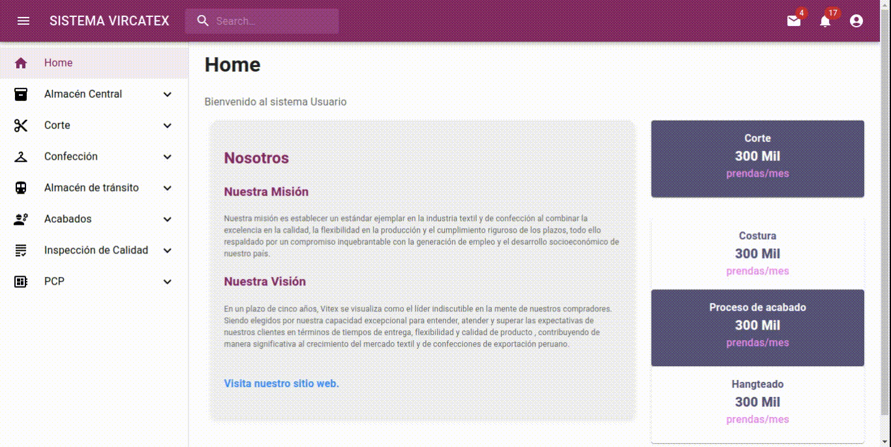

# Entregable 4 del proyecto
## Aplicación

### Front end
Abrir en Google Chrome: [Vircatex - render](https://sistema-web-v-f.onrender.com/#/acabados/lotes) 

[Github]() 


### App Web
Despliegue Backend y PostgreSQL : [Render](https://render.com/)

[Github]() 

### Conexión Base de datos (local)


## Versión final:
Presentamos el flujo de pantallas de la App Web: **[Sistema Vircatex](https://sistema-web-v-f.onrender.com/)**:

- [Almacén Central](#almacén-central)
- [Corte](#corte)
- [Confección](#confección)
- [Almacén_de_tránsito](#almacén-de-tránsito)
- [Acabados](#acabados)
- [Inspección_de_calidad](#inspección-de-calidad)
- [PCP - Abastecimiento](#pcp)


### Home




  [](#versión-final)

---

### Almacén Central

  [](#versión-final)

---

### Corte

<details>
  <summary>VER TODO</summary>
  
  #### Submenú 1: Corte > Ordenes de produccion
  Muestra los datos que debe tener una orden de produccion para el area de corte, luego de dar asignar se colora otra ventana
  

  *Consulta 1: Lista de ordenes de produccion
  
  ```python
  class OrdenesListView(View):
    def get(self, request):
        with connection.cursor() as cursor:
            query = """
            SELECT
                o.id_orden_producción,
                o.fecha_inicio,
                o.fecha_fin,
                o.cantidad,
                e.nombre AS estado_orden,
                a.nombre AS area,
                tc.nombre AS tipo_corte,
                tmp.nombre AS tipo_materia_prima,
                o.id_orden_trabajo,
                o.fecha_creacion
            FROM
                orden_producción o
            JOIN
                estado e ON o.id_estado = e.id_estado
            JOIN
                area a ON o.id_area = a.id_area
            JOIN
                dimension_corte dc ON o.id_dim_corte = dc.id_dim_corte
            JOIN
                parte_corte_detalle pcd ON dc.id_dim_parte_prenda = pcd.id_dim_parte_prenda
            JOIN
                tipo_corte tc ON pcd.id_tipo_corte = tc.id_tipo_corte
            JOIN
                actividad_diaria ad ON o.id_orden_producción = ad.id_orden_producción
            JOIN
                registro_uso_lote rul ON ad.id_actividad = rul.id_actividad
            JOIN
                lote l ON rul.id_lote = l.id_lote
            JOIN
                dimension_materia_prima dmp ON l.id_dim_materia_prima = dmp.id_dim_materia_prima
            JOIN
                tipo_materia_prima tmp ON dmp.id_tipo_materia_prima = tmp.id_tipo_materia_prima
            WHERE
                a.nombre = 'Corte'
            GROUP BY
                o.id_orden_producción, o.fecha_inicio, o.fecha_fin, o.cantidad, e.nombre, a.nombre, tc.nombre, tmp.nombre,
                o.id_orden_trabajo, o.fecha_creacion
            ORDER BY
                o.fecha_inicio DESC;
            """
            cursor.execute(query)
            rows = cursor.fetchall()

        data = [
            {
                'id_orden_produccion': row[0],
                'fecha_inicio': row[1],
                'fecha_fin': row[2],
                'cantidad': row[3],
                'estado_orden': row[4],
                'area': row[5],
                'tipo_corte': row[6],
                'tipo_materia_prima': row[7],
                'id_orden_trabajo': row[8],
                'fecha_creacion': row[9]
            }
            for row in rows
        ]
        return JsonResponse(data, safe=False)
  ```

*Consulta 2: Para Asignar

```python
class AsignarView(View):
    def post(self, request, id_orden_produccion):
        body = json.loads(request.body)
        id_maquina = body['id_maquina']
        cantidad_hecha = body['cantidad_hecha']

        with connection.cursor() as cursor:
            cursor.execute(
                "INSERT INTO actividad_diaria (fecha_actividad, id_orden_producción) VALUES (NOW(), %s) RETURNING id_actividad;",
                [id_orden_produccion]
            )
            id_actividad = cursor.fetchone()[0]

            cursor.execute(
                "INSERT INTO maquina_actividad (id_actividad, id_maquina, cantidad_hecha) VALUES (%s, %s, %s);",
                [id_actividad, id_maquina, cantidad_hecha]
            )

        return JsonResponse({'status': 'success'})
```


</details>
  
  [](#versión-final)

---


### Confección

  [](#versión-final)

---
  
### Almacén de tránsito

  [](#versión-final)

---

### Acabados

<details>
  <summary>VER TODO</summary>
  
#### Submenú 1: **General**: 
**Navegación**: Acabados > General <br>
Muestra los datos generales del área.<br>
Se realizan dos consultas a la BD.


* Consulta 1: Lista de Operarios

```python
class EmpleadoListView(View):
    def get(self, request):
         with connection.cursor() as cursor:
            cursor.execute("SELECT id_empleado, nombre FROM empleado WHERE id_area = 5")
            rows = cursor.fetchall()
            result = [
                    {'id_empleado': row[0], 'nombre': row[1]}
                    for row in rows
                ]
            return JsonResponse(result, safe=False)
```

* Consulta 2: Lista de Acabados

```python
class AcabadoListView(APIView):
    def get(self, request):
        with connection.cursor() as cursor:
            cursor.execute("SELECT id_acabado, nombre FROM acabado")
            data = cursor.fetchall()
        
        # Formatear los resultados en un diccionario
        resultados = [{'id_acabado': row[0], 'nombre': row[1]} for row in data]
```

#### Submenú 2: **Lote-caja**: 


Muestra las cajas asignadas a los operarios de acabados y reporte entre fechas.

**Navegación**: Acabados > lotes >


* Consulta: Reporte entre dos fechas

```python
def get_lote_entrada_vista(request):
    with connection.cursor() as cursor:
        cursor.execute("""
            SELECT le.id_entrada, le.fecha_entrada, l.id_tipo_lote, l.cantidad, dc.id_dim_confeccion, dc.id_guia_confeccion
            FROM lote_entrada le
            JOIN lote l ON le.id_lote = l.id_lote
            JOIN dimension_confeccion dc ON l.id_dim_confeccion = dc.id_dim_confeccion
            LIMIT 200;
        """)
        columns = [col[0] for col in cursor.description]
        results = [dict(zip(columns, row)) for row in cursor.fetchall()]
    return JsonResponse(results, safe=False)
```

Cuando se hace click en el botón se direge a: "Reporte"

**Navegación**: Acabados > lotes > Reporte


* Consulta: Reporte entre dos fechas
```python
class ReporteAcabadosView(View):
    def get(self, request):
        fecha_inicio = request.GET.get('fecha_inicio')
        fecha_fin = request.GET.get('fecha_fin')

        query = """
        SELECT DISTINCT e.id_empleado, e.nombre, e.primer_apellido,
                        e.segundo_apellido, e.id_correo, e.dni, e.id_cargo,
                        caja_prenda.id_caja, caja_prenda.fecha_creacion,
                        tipo_prenda.nombre 
        FROM empleado e
        JOIN prenda ON e.id_empleado = prenda.id_empleado
        JOIN caja_prenda ON prenda.id_caja = caja_prenda.id_caja
        JOIN dimension_prenda ON caja_prenda.id_dim_prenda = dimension_prenda.id_dim_prenda
        JOIN dimension_confeccion ON dimension_prenda.id_dim_confeccion = dimension_confeccion.id_dim_confeccion
        JOIN guia_confeccion ON dimension_confeccion.id_guia_confeccion = guia_confeccion.id_guia_confeccion
        JOIN tipo_prenda ON dimension_confeccion.id_tipo_prenda = tipo_prenda.id_tipo_prenda
        WHERE id_area=5 AND id_cargo=2
        AND caja_prenda.fecha_creacion BETWEEN %s AND %s
        """

        with connection.cursor() as cursor:
            cursor.execute(query, [fecha_inicio, fecha_fin])
            rows = cursor.fetchall()

        resultados = [
            {
                "id_empleado": row[0],
                "nombre": row[1],
                "primer_apellido": row[2],
                "segundo_apellido": row[3],
                "id_correo": row[4],
                "dni": row[5],
                "id_cargo": row[6],
                "id_caja": row[7],
                "fecha_creacion": row[8],
                "tipo_prenda": row[9],
            }
            for row in rows
        ]

        return JsonResponse(resultados, safe=False)
```


#### Submenú 3: **Acabados**: 

Muestra la búsqueda de operarios y muestra los detalles generales, las cajas asignada y la navegación hasta la asignación de acabados.

**Navegación**: Acabados > acabados >


* Consulta: Búsqueda de operarios. De despliega un Dropdown con la lista de nombres

```python
def empleado_list_a(request):
    empleados = Empleado.objects.filter(id_area=5).values('nombre')
    return JsonResponse(list(empleados), safe=False)
```

* Grilla del operario: Grilla de datos por cajas y sus detalles de prenda y medidas según el orden de confección.
```python

def datos_list_a(request):
    query = """
    SELECT distinct(cp.id_caja) as ID_Caja, e.nombre, cp.cantidad,
    gconf.id_guia_confeccion as ID_guia, tp.nombre as tipo_prenda, ep.nombre as estilo_prenda, 
    t.nombre as talla, g.nombre as genero,
    COALESCE(gconf.medida_longitud::text, ' ') AS ml,
    COALESCE(gconf.medida_hombro::text, ' ') AS mh,
    COALESCE(gconf.medida_pecho::text, ' ') AS mp,
    COALESCE(gconf.medida_manga::text, ' ') AS mm,
    COALESCE(gconf.medida_cintura::text, ' ') AS mc,
    COALESCE(gconf.medida_cadera::text, ' ') AS mca,
    COALESCE(gconf.medida_muslo::text, ' ') AS mmu
    FROM dimension_confeccion dc
    JOIN guia_confeccion gconf ON dc.id_guia_confeccion = gconf.id_guia_confeccion
    JOIN tipo_prenda tp ON dc.id_tipo_prenda = tp.id_tipo_prenda
    JOIN estilo_prenda ep ON dc.id_estilo_prenda = ep.id_estilo_prenda
    JOIN talla t ON dc.id_talla = t.id_talla
    JOIN genero g ON dc.id_genero = g.id_genero
    JOIN dimension_prenda dp ON dc.id_dim_confeccion = dp.id_dim_confeccion
    JOIN caja_prenda cp ON dp.id_dim_prenda = cp.id_dim_prenda
    JOIN prenda p ON cp.id_caja = p.id_caja
    JOIN empleado e ON p.id_empleado = e.id_empleado
    WHERE e.nombre='Ana Sofía Zaida';
    """
    with connection.cursor() as cursor:
        cursor.execute(query)
        rows = cursor.fetchall()
        columns = [col[0] for col in cursor.description]
        result = [dict(zip(columns, row)) for row in rows]
    return JsonResponse(result, safe=False)

```

</details>


  [](#versión-final)

---


### Inspección de calidad

  [](#versión-final)

---


### PCP

  [](#versión-final)
  
---


[Regresar al Índice](./indice.md)


[Regresar al Índice](./indice.md)
