# Entregable 4 del proyecto
## NoSQL

- [Base de datos NoSQL](#base-de-datos-nosql)
- [Base de datos NoSQL Elegido - ClickHouse](#base-de-datos-nosql-elegido)
    - [Caracteristicas](#características-de-clickhouse)
    - [Características Avanzadas de ClickHouse](#características-avanzadas-de-clickHouse)
    - [Clientes SQL](#clientes-sql)
    - [PostgreSQL vs Clickhouse](#postgresql-vs-clickhouse)
    - [TUTORIAL (Ejemplo con clickhouse-client)](#tutorial-ejemplo-con-clickhouse-client)
    - [Aplicación al trabajo (Ejemplo con clickhouse-client)](#aplicación-al-trabajo-ejemplo-con-clickhouse-client)
    - [Enlaces de referencia](#enlaces-de-referencia)


## Base de datos NoSQL

### Alistar entorno Clickhouse y PostgreSQL
#### CLickhouse
* **PASOS**
  1. Iniciar localmente ***Clickhouse***. Esto te llevará a la consola interactiva de ClickHouse, donde podrás ejecutar comandos SQL.:

```
  clickhouse-client

``` 
Obtendrás una repuesta (Si lo tienes instalado).
```
ClickHouse client version 22.2.2.1.
Connecting to localhost:9000 as user default.
Connected to ClickHouse server version 22.2.2 revision 54455.
```

2. **Crear** Base de datos que apunte a PostgreSQL.
```
CREATE DATABASE postgres_db ENGINE = PostgreSQL(
    'localhost:5432',
    'proba1',
    'postgres',
    'prueba'
);
```

3. **Automatizar** la creación de tablas:

Crear archivo *creacion-tablas.py*
```python
from clickhouse_driver import Client

# Conectar al cliente de ClickHouse
client = Client('localhost')

# Lista de tablas en PostgreSQL
tablas = [
    'direccion', 'proveedor', 'telefono', 'correo', 'area', 'empleado',
    'cargo', 'estado', 'maquina', 'color', 'dimension_materia_prima', 
    'tipo_materia_prima', 'tipo_parte_prenda', 'dimension_parte_prenda',
    'tipo_prenda', 'dimension_confeccion', 'estilo_prenda', 'guia_confeccion',
    'talla', 'genero', 'orden_pedido', 'plan_produccion', 'zona', 'aql_codigo',
    'aql_muestra', 'aql_lote_rango', 'aql_nivel', 'aql_resultado_rango', 
    'aql_significancia', 'dimension_corte', 'parte_corte_detalle', 'tipo_corte', 
    'dimension_prenda', 'orden_trabajo', 'pasillo', 'dim_confeccion_detalle', 
    'dim_prenda_detalle', 'acabado', 'pedido_detalle', 'estanteria', 
    'orden_producción', 'actividad_diaria', 'lote', 'tipo_lote', 
    'empleado_actividad', 'maquina_actividad', 'caja_prenda', 'materia_prima', 
    'corte', 'registro_uso_lote', 'caja_lote', 'espacio', 'lote_salida', 
    'inspeccion_calidad', 'inspeccion_descripcion', 'resultado', 'confeccion', 
    'registro_lote_caja', 'registro_transformacion_caja', 'prenda', 
    'caja_salida', 'lote_entrada'
]

# Crear tablas en ClickHouse
for tabla in tablas:
    query = f"CREATE TABLE postgres_{tabla} AS postgres_db.{tabla};"
    client.execute(query)
```

4. **Verificar** Tablas.
```sql
SHOW TABLES;
```
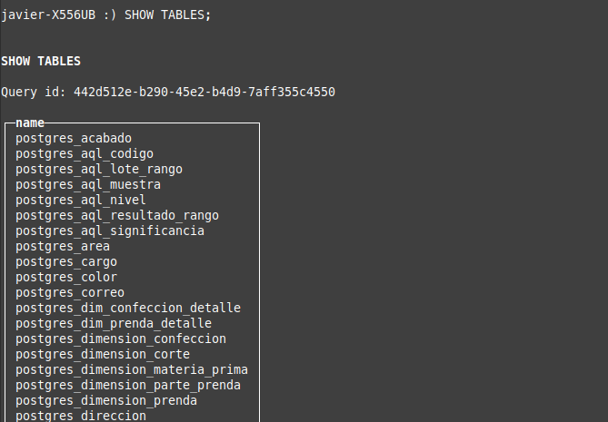

### Consultas Clickhouse - Postgres
#### Clickhouse Client
* **Caso 1:**
  - Proveedores:
  ```sql
  SELECT * FROM postgres_proveedor;
  ```
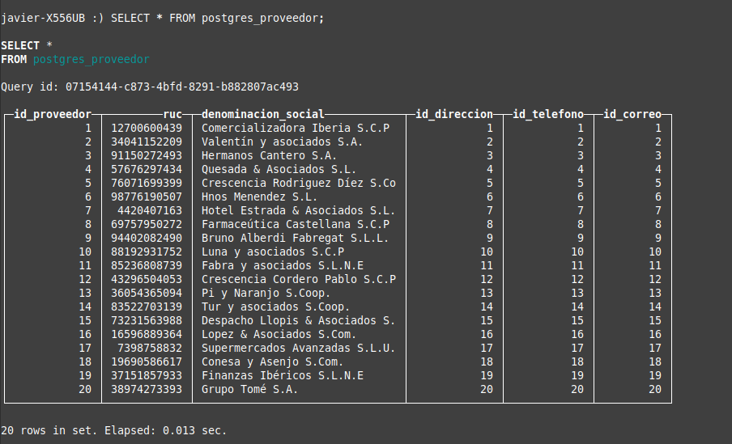

* **Caso 2:**
  - Empleados:
  ```sql
  SELECT * FROM postgres_empleado;

  -- 77 rows in set. Elapsed: 0.076 sec. 
  ```
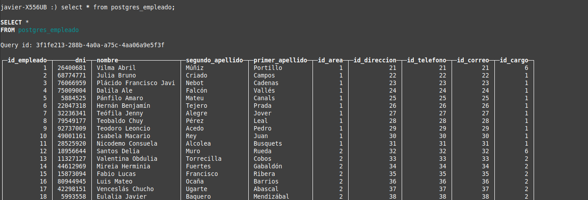

* **Caso 3: UPDATE** Cambiar nombre a acabado "Hangteado".
```sql
ALTER TABLE postgres_acabado UPDATE nombre = 'Etiquet' WHERE id_acabado = 1;  
```

* **Caso 4: DELETE** Eliminar empleados del área de acabados con el id '50' y '51'.
```sql
-- Verificar los empleados en el área 5
SELECT id_empleado FROM postgres_empleado WHERE id_area = '5';

-- Eliminar empleados con id_empleado 50 y 51
ALTER TABLE postgres_empleado DELETE WHERE id_empleado IN (50, 51);
```

#### DBeaver:
* **PASOS**
  1. Nueva *Conexión*
  
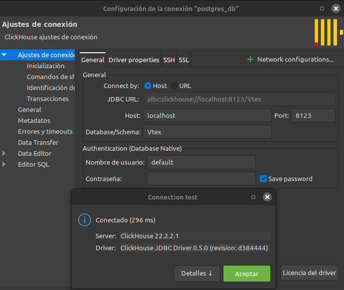

* **APLICACIÓN AL TRABAJO**

  1. **Ver** registros de confección:
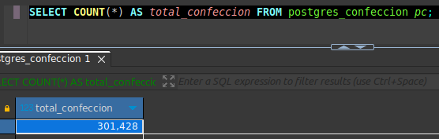

  2. **Consulta** Lista de cajas en la producción para realizar el acabado 'Hangteado':
```sql
select 
    c.id_confeccion, 
    tl.nombre, 
    cl.id_caja,
    acab.nombre, 
    e.nombre
from 
    confeccion c 
    join lote l on c.id_lote = l.id_lote 
    join tipo_lote tl on l.id_tipo_lote = tl.id_tipo_lote 
    join empleado e on c.id_empleado = e.id_empleado
    join caja_lote cl on c.id_caja = cl.id_caja
    join dimension_confeccion dc on c.id_dim_confeccion = dc.id_dim_confeccion
    join dimension_prenda dp on dc.id_dim_confeccion = dp.id_dim_confeccion 
    join dim_prenda_detalle dpd on dpd.id_dim_prenda = dp.id_dim_prenda 
    join acabado acab on dpd.id_acabado = acab.id_acabado 
where 
    acab.id_acabado = '1' 
    and e.nombre IN (select nombre from empleado where empleado.id_area = '5');
```
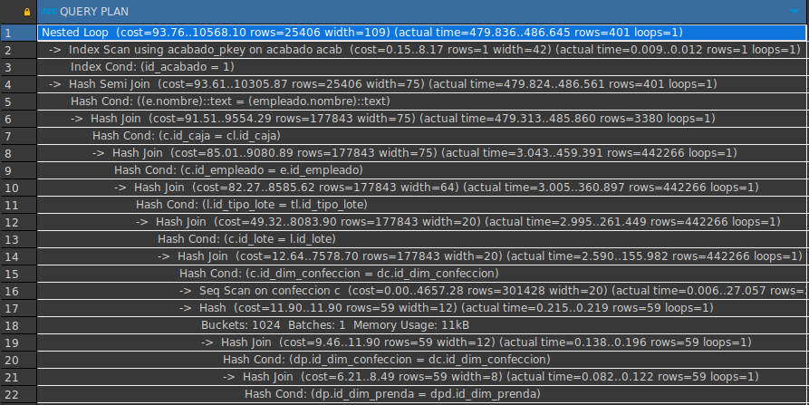
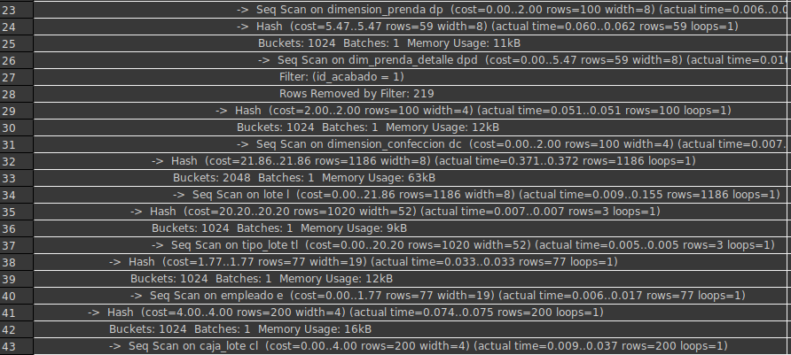
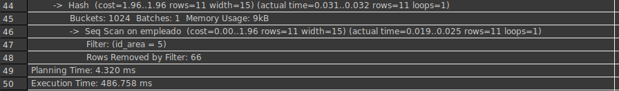

* ***Consulta en Clickhouse***
```sql
select 
    c.id_confeccion, 
    tl.nombre, 
    cl.id_caja,
    acab.nombre, 
    e.nombre
from 
    postgres_confeccion c 
    join postgres_lote l on c.id_lote = l.id_lote 
    join postgres_tipo_lote tl on l.id_tipo_lote = tl.id_tipo_lote 
    join postgres_empleado e on c.id_empleado = e.id_empleado
    join postgres_caja_lote cl on c.id_caja = cl.id_caja
    join postgres_dimension_confeccion dc on c.id_dim_confeccion = dc.id_dim_confeccion
    join postgres_dimension_prenda dp on dc.id_dim_confeccion = dp.id_dim_confeccion 
    join postgres_dim_prenda_detalle dpd on dpd.id_dim_prenda = dp.id_dim_prenda 
    join postgres_acabado acab on dpd.id_acabado = acab.id_acabado 
where 
    acab.id_acabado = '1' 
    and e.nombre IN (select nombre from postgres_empleado where postgres_empleado.id_area = '5');
```
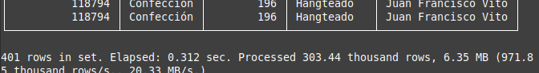

[](#nosql)


## Base de datos NoSQL Elegido
<div align=center>

[](https://clickhouse.com)
[](https://www.apache.org/licenses/LICENSE-2.0)

<picture align=center>
    <source media="(prefers-color-scheme: dark)" srcset="https://github.com/ClickHouse/clickhouse-docs/assets/9611008/4ef9c104-2d3f-4646-b186-507358d2fe28">
    <source media="(prefers-color-scheme: light)" srcset="https://github.com/ClickHouse/clickhouse-docs/assets/9611008/b001dc7b-5a45-4dcd-9275-e03beb7f9177">
    
</picture>

<h4>ClickHouse® es un sistema de gestión de bases de datos de código abierto orientado a columnas que permite generar informes analíticos de datos en tiempo real..</h4>

</div>

**ClickHouse®** es un sistema de gestión de bases de datos SQL de alto rendimiento orientado a columnas para el procesamiento analítico en línea (OLAP, por sus siglas en inglés). Está disponible tanto como software de código abierto como en una oferta en la nube.

**¿Qué es OLAP?**

Los escenarios OLAP requieren respuestas en tiempo real sobre conjuntos de datos grandes para consultas analíticas complejas con las siguientes características:

- Los conjuntos de datos pueden ser masivos, con miles de millones o billones de filas.
- Los datos están organizados en tablas que contienen muchas columnas.
- Solo se seleccionan unas pocas columnas para responder a cualquier consulta específica.
- Los resultados deben devolverse en milisegundos o segundos.


  [](#nosql)
  


### Características de clickhouse

| Característica                                          | Descripción                                                                                                                                                                                                                                                                                                                                                                                                                                                                                                                                                        |
|---------------------------------------------------------|--------------------------------------------------------------------------------------------------------------------------------------------------------------------------------------------------------------------------------------------------------------------------------------------------------------------------------------------------------------------------------------------------------------------------------------------------------------------------------------------------------------------------------------------------------------------|
| **Sistema Verdaderamente Orientado a Columnas**          | En un DBMS columnar verdadero, no se almacenan datos adicionales con los valores, lo que permite un almacenamiento compacto y eficiente. ClickHouse optimiza el rendimiento mediante compresión de datos especializada y procesamiento por vectores, lo que mejora la eficiencia de la CPU y permite altas velocidades de descompresión.                                                                                                                                                               |
| **Compresión de Datos**                                 | ClickHouse utiliza codecs de compresión eficientes para optimizar el rendimiento, ofreciendo compresión general y codecs especializados para tipos específicos de datos como series temporales. Esto le permite competir y superar a bases de datos más especializadas en escenarios analíticos.                                                                                                                                                                                                         |
| **Almacenamiento en Disco**                             | ClickHouse está diseñado para trabajar eficientemente con discos duros estándar, manteniendo un bajo costo por GB almacenado. También aprovecha SSD y RAM adicional si están disponibles para mejorar el rendimiento.                                                                                                                                                                                                                                                                                                                                         |
| **Procesamiento Paralelo en Múltiples Núcleos**          | Las consultas grandes se paralelizan de manera natural, utilizando todos los recursos disponibles en el servidor actual.                                                                                                                                                                                                                                                                                                                                                                                                                                        |
| **Procesamiento Distribuido en Múltiples Servidores**    | ClickHouse soporta consultas distribuidas, permitiendo que los datos residan en múltiples fragmentos (shards) que se utilizan en paralelo para ejecutar consultas de manera transparente para el usuario. Esto proporciona tolerancia a fallos y escalabilidad horizontal.                                                                                                                                                                                                                                                                                      |
| **Soporte SQL**                                         | ClickHouse soporta un lenguaje de consulta declarativo basado en SQL que es compatible con el estándar ANSI en muchos casos. Incluye funciones avanzadas como GROUP BY, JOIN, funciones de ventana y subconsultas escalares, aunque las subconsultas correlacionadas no están soportadas actualmente.                                                                                                                                                                                                                                                      |
| **Motor de Cálculo Vectorial**                          | Los datos se procesan en vectores (partes de columnas), lo cual maximiza la eficiencia de la CPU y el rendimiento general del sistema.                                                                                                                                                                                                                                                                                                                                                                                                                           |
| **Inserciones de Datos en Tiempo Real**                  | ClickHouse admite inserciones de datos continuas en tablas con clave primaria, utilizando un árbol de fusión para mantener la ordenación incremental de los datos y permitir consultas eficientes sobre el rango de la clave primaria sin bloqueos durante la ingestión de nuevos datos.                                                                                                                                                                                                                                                            |
| **Índices Primarios y Secundarios**                      | Los índices primarios permiten recuperar datos con baja latencia según valores específicos o rangos de valores de la clave primaria. Los índices secundarios en ClickHouse permiten omitir datos que no coinciden con las condiciones de filtrado de la consulta, optimizando la recuperación de datos sin necesidad de leer todos los datos relevantes.                                                                                                                                                                                                        |
| **Adecuado para Consultas en Línea (OLAP)**              | ClickHouse está optimizado para consultas OLAP con baja latencia, proporcionando respuestas rápidas y eficientes incluso para grandes volúmenes de datos.                                                                                                                                                                                                                                                                                                                                                                                                        |
| **Soporte para Cálculos Aproximados**                    | ClickHouse ofrece funciones de agregación para cálculos aproximados de valores distintos, medianas y cuantiles, así como la capacidad de ejecutar consultas basadas en muestras de datos para obtener resultados aproximados con menos recursos. Esto mejora el rendimiento en escenarios donde la precisión exacta no es crítica.                                                                                                                                                                                                           |
| **Algoritmo de JOIN Adaptativo**                         | ClickHouse adapta dinámicamente cómo unir múltiples tablas, prefiriendo el algoritmo de hash-join y utilizando merge-join en caso de tablas grandes.                                                                                                                                                                                                                                                                                                                                                                                                          |
| **Replicación de Datos y Soporte de Integridad**         | ClickHouse utiliza replicación asíncrona multi-maestro para mantener datos idénticos en réplicas diferentes, proporcionando recuperación automática después de la mayoría de las fallas.                                                                                                                                                                                                                                                                                                                                                                       |
| **Control de Acceso Basado en Roles**                    | Implementa gestión de cuentas de usuario mediante consultas SQL y configuración de control de acceso basado en roles, siguiendo estándares como ANSI SQL y otros sistemas de gestión de bases de datos relacionales populares.                                                                                                                                                                                                                                                                                                                               |
| **Limitaciones Potenciales**                             | Carece de transacciones completas y la capacidad de modificar o eliminar datos insertados con alta velocidad y baja latencia. Las operaciones de eliminación y actualización están disponibles pero pueden no ser tan eficientes en comparación con otras operaciones de lectura y escritura.                                                                                                                                                                                                                                                            |

  [](#nosql)
  


### Características Avanzadas de ClickHouse

<table>
  <thead>
    <tr>
      <th style="padding:10px;">Categoría</th>
      <th style="padding:10px;">Descripción</th>
    </tr>
  </thead>
  <tbody>
    <tr>
      <td style=" padding:10px;" colspan="2"><b>Índices y Particionamiento</b></td>
    </tr>
    <tr>
      <td style="padding:10px;">Primary Key y Orden de Índices</td>
      <td style="padding:10px;">ClickHouse permite definir una clave primaria y un orden de índice para optimizar las consultas. El índice primario no garantiza la unicidad, sino que organiza los datos para una lectura eficiente.</td>
    </tr>
    <tr>
      <td style="padding:10px;">Particionamiento</td>
      <td style="padding:10px;">Los datos pueden ser particionados para mejorar el rendimiento de las consultas y la gestión del almacenamiento. El particionamiento puede basarse en campos como fechas, útil para datos de series temporales.</td>
    </tr>
    <tr>
      <td style="background-color:#e6f7ff; padding:10px;" colspan="2"><b>Ingesta y Procesamiento de Datos</b></td>
    </tr>
    <tr>
      <td style="padding:10px;">Batch y Streaming</td>
      <td style="padding:10px;">ClickHouse soporta tanto la ingesta en batch como en streaming, lo que lo hace flexible para diferentes flujos de trabajo de datos. Puedes usar Kafka, RabbitMQ o sistemas similares para la ingesta en tiempo real.</td>
    </tr>
    <tr>
      <td style="padding:10px;">Materialized Views</td>
      <td style="padding:10px;">Las vistas materializadas permiten almacenar resultados precomputados de consultas complejas, mejorando el rendimiento en consultas repetitivas.</td>
    </tr>
    <tr>
      <td style="background-color:#e6f7ff; padding:10px;" colspan="2"><b>Alta Disponibilidad y Recuperación de Desastres</b></td>
    </tr>
    <tr>
      <td style="padding:10px;">Replica Sets</td>
      <td style="padding:10px;">ClickHouse soporta la replicación de datos entre nodos, proporcionando alta disponibilidad y tolerancia a fallos. Los datos se replican de manera asíncrona, asegurando que las copias de seguridad estén siempre disponibles.</td>
    </tr>
    <tr>
      <td style="padding:10px;">Backups y Restauración</td>
      <td style="padding:10px;">Las herramientas integradas permiten realizar backups incrementales y restauraciones, facilitando la recuperación ante desastres.</td>
    </tr>
    <tr>
      <td style=" padding:10px;" colspan="2"><b>Interoperabilidad</b></td>
    </tr>
    <tr>
      <td style="padding:10px;">Integración con Ecosistemas de Big Data</td>
      <td style="padding:10px;">ClickHouse puede integrarse con herramientas y plataformas de big data como Hadoop, Spark, y herramientas de BI como Tableau, Grafana, y Power BI.</td>
    </tr>
    <tr>
      <td style="padding:10px;">APIs y Conectores</td>
      <td style="padding:10px;">Proporciona APIs y conectores para diferentes lenguajes de programación, facilitando su integración en aplicaciones existentes.</td>
    </tr>
  </tbody>
</table>

  [](#nosql)


### Clientes SQL
| SQL Client     | Descripción                                                                 | Características clave                                                                                   |
|----------------|-----------------------------------------------------------------------------|---------------------------------------------------------------------------------------------------------|
| **DataGrip**       | Herramienta de JetBrains para bases de datos SQL y no SQL, incluido ClickHouse. | Soporte completo para SQL de ClickHouse, resaltado de sintaxis, completado de código, edición de datos. |
| **DBeaver**        | Herramienta universal de base de datos que admite ClickHouse.                 | Interfaz intuitiva, soporte SQL completo, visualización de esquemas, importación/exportación de datos.  |
| **DbVisualizer**   | Herramienta universal para bases de datos, compatible con ClickHouse.         | Edición y ejecución de consultas SQL, generación de informes, exportación e importación de datos.       |
| **Jupyter Notebooks** | Entorno interactivo para análisis y prototipado, compatible con ClickHouse.   | Conexión mediante `clickhouse-driver` en Python, ideal para análisis exploratorio y generación de informes. |
| **qStudio**        | Entorno interactivo para análisis de datos, compatible con ClickHouse.       | Interfaz gráfica para escribir y ejecutar consultas SQL, visualizaciones integradas, análisis avanzado.  |
| **TABLUM.IO**      | Plataforma de visualización y análisis de datos, conectada a ClickHouse.     | Creación de paneles de control interactivos, visualizaciones avanzadas basadas en datos en tiempo real. |

  [](#nosql)


### PostgreSQL vs Clickhouse

| Característica            | PostgreSQL                                       | ClickHouse                                           |
|---------------------------|--------------------------------------------------|------------------------------------------------------|
| **Modelo de Datos**       | Orientado a filas (row-oriented)                 | Orientado a columnas (column-oriented)               |
| **Lenguaje de Consulta**  | SQL estándar con extensiones                     | SQL estándar con extensiones para OLAP               |
| **Transacciones**         | Soporte completo para transacciones ACID         | Soporte básico para transacciones                    |
| **Índices**               | B-tree, hash, GIN, GiST, etc.                    | Índices optimizados para columnas                    |
| **Rendimiento OLAP**      | Adecuado pero menos eficiente para OLAP          | Alta velocidad para consultas analíticas complejas   |
| **Compresión de Datos**   | Soporte básico                                  | Soporte nativo con múltiples algoritmos             |
| **Escritura y Lectura**   | Bueno para OLTP                                  | Excelente para OLAP                                 |
| **Escalabilidad Horizontal** | Replica en clústeres                           | Soporte para clústeres                              |
| **Seguridad**             | Modelos robustos de autenticación y autorización | Básico                                              |
| **Herramientas de Gestión** | Amplia gama de herramientas                     | Herramientas limitadas                              |
| **Tolerancia a Fallos**   | Alta disponibilidad y replicación                | Diseñado para ser tolerante a fallos                |
| **Uso Típico**            | Aplicaciones transaccionales y analíticas simples| Análisis de datos a gran escala y consultas complejas|

  [](#nosql)


### TUTORIAL (Ejemplo)
<details>
<summary>Abrir para ver</summary>
    
**1. Crear una Nueva Tabla**
    
Los datos de los taxis de la ciudad de Nueva York contienen detalles de millones de viajes en taxi, con columnas como horarios y ubicaciones de recogida y entrega, coste, propina, peajes, tipo de pago, etc. Creemos una tabla para almacenar estos datos...

**Conéctese a la consola SQL**

> Si necesita una conexión cliente SQL, su servicio ClickHouse Cloud tiene una consola SQL basada en web asociada.

* **Conecte a la consola SQL**
En la lista de servicios de ClickHouse Cloud, elija el servicio con el que va a trabajar y haga clic en Conectar. Desde aquí puedes Abrir la consola SQL:
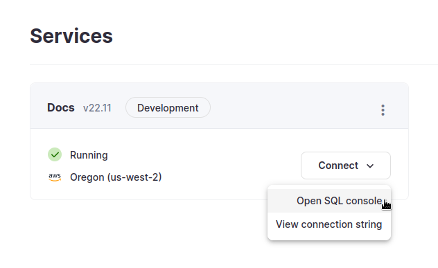

* Crear la tabla trips
```sql
CREATE TABLE trips
(
    `trip_id` UInt32,
    `vendor_id` Enum8('1' = 1, '2' = 2, '3' = 3, '4' = 4, 'CMT' = 5, 'VTS' = 6, 'DDS' = 7, 'B02512' = 10, 'B02598' = 11, 'B02617' = 12, 'B02682' = 13, 'B02764' = 14, '' = 15),
    `pickup_date` Date,
    `pickup_datetime` DateTime,
    `dropoff_date` Date,
    `dropoff_datetime` DateTime,
    `store_and_fwd_flag` UInt8,
    `rate_code_id` UInt8,
    `pickup_longitude` Float64,
    `pickup_latitude` Float64,
    `dropoff_longitude` Float64,
    `dropoff_latitude` Float64,
    `passenger_count` UInt8,
    `trip_distance` Float64,
    `fare_amount` Float32,
    `extra` Float32,
    `mta_tax` Float32,
    `tip_amount` Float32,
    `tolls_amount` Float32,
    `ehail_fee` Float32,
    `improvement_surcharge` Float32,
    `total_amount` Float32,
    `payment_type` Enum8('UNK' = 0, 'CSH' = 1, 'CRE' = 2, 'NOC' = 3, 'DIS' = 4),
    `trip_type` UInt8,
    `pickup` FixedString(25),
    `dropoff` FixedString(25),
    `cab_type` Enum8('yellow' = 1, 'green' = 2, 'uber' = 3),
    `pickup_nyct2010_gid` Int8,
    `pickup_ctlabel` Float32,
    `pickup_borocode` Int8,
    `pickup_ct2010` String,
    `pickup_boroct2010` String,
    `pickup_cdeligibil` String,
    `pickup_ntacode` FixedString(4),
    `pickup_ntaname` String,
    `pickup_puma` UInt16,
    `dropoff_nyct2010_gid` UInt8,
    `dropoff_ctlabel` Float32,
    `dropoff_borocode` UInt8,
    `dropoff_ct2010` String,
    `dropoff_boroct2010` String,
    `dropoff_cdeligibil` String,
    `dropoff_ntacode` FixedString(4),
    `dropoff_ntaname` String,
    `dropoff_puma` UInt16
)
ENGINE = MergeTree
PARTITION BY toYYYYMM(pickup_date)
ORDER BY pickup_datetime;
```

**2. Insertar la data**

Ahora que tienes una tabla creada, vamos a añadir los datos de taxis de NYC. Están en archivos CSV en S3, y puedes cargar los datos desde allí.

* El siguiente comando inserta ~2.000.000 de filas en su tabla viajes desde dos archivos diferentes en S3: viajes_1.tsv.gz y viajes_2.tsv.gz:

```sql
INSERT INTO trips
SELECT * FROM s3(
    'https://datasets-documentation.s3.eu-west-3.amazonaws.com/nyc-taxi/trips_{1..2}.gz',
    'TabSeparatedWithNames', "
    `trip_id` UInt32,
    `vendor_id` Enum8('1' = 1, '2' = 2, '3' = 3, '4' = 4, 'CMT' = 5, 'VTS' = 6, 'DDS' = 7, 'B02512' = 10, 'B02598' = 11, 'B02617' = 12, 'B02682' = 13, 'B02764' = 14, '' = 15),
    `pickup_date` Date,
    `pickup_datetime` DateTime,
    `dropoff_date` Date,
    `dropoff_datetime` DateTime,
    `store_and_fwd_flag` UInt8,
    `rate_code_id` UInt8,
    `pickup_longitude` Float64,
    `pickup_latitude` Float64,
    `dropoff_longitude` Float64,
    `dropoff_latitude` Float64,
    `passenger_count` UInt8,
    `trip_distance` Float64,
    `fare_amount` Float32,
    `extra` Float32,
    `mta_tax` Float32,
    `tip_amount` Float32,
    `tolls_amount` Float32,
    `ehail_fee` Float32,
    `improvement_surcharge` Float32,
    `total_amount` Float32,
    `payment_type` Enum8('UNK' = 0, 'CSH' = 1, 'CRE' = 2, 'NOC' = 3, 'DIS' = 4),
    `trip_type` UInt8,
    `pickup` FixedString(25),
    `dropoff` FixedString(25),
    `cab_type` Enum8('yellow' = 1, 'green' = 2, 'uber' = 3),
    `pickup_nyct2010_gid` Int8,
    `pickup_ctlabel` Float32,
    `pickup_borocode` Int8,
    `pickup_ct2010` String,
    `pickup_boroct2010` String,
    `pickup_cdeligibil` String,
    `pickup_ntacode` FixedString(4),
    `pickup_ntaname` String,
    `pickup_puma` UInt16,
    `dropoff_nyct2010_gid` UInt8,
    `dropoff_ctlabel` Float32,
    `dropoff_borocode` UInt8,
    `dropoff_ct2010` String,
    `dropoff_boroct2010` String,
    `dropoff_cdeligibil` String,
    `dropoff_ntacode` FixedString(4),
    `dropoff_ntaname` String,
    `dropoff_puma` UInt16
") SETTINGS input_format_try_infer_datetimes = 0
```

* Cuando insertamos las data, verificamos que trabaja

```sql
SELECT count() FROM trips
```
Deberías de ver 2M de filas (1,999,657 rows, para ser precisos).

* Si se ejecuta una consulta que requiere cada fila, se observará que es necesario procesar un número considerablemente mayor de filas, pero el tiempo de ejecución sigue siendo rapidísimo:

```sql
SELECT DISTINCT(pickup_ntaname) FROM trips
```

**3. Analizar la Data**

Vamos a ejecutar algunas consultas para analizar los 2M de filas de datos.

**Empezaremos con algunos cálculos sencillos, como calcular el importe medio de las propinas:**

```sql
SELECT round(avg(tip_amount), 2) FROM trips
```
Respuesta:

```sql
┌─round(avg(tip_amount), 2)─┐
│                      1.68 │
└───────────────────────────┘
```

**Esta consulta calcula el coste medio en función del número de pasajeros:**
  ```sql
SELECT
    passenger_count,
    ceil(avg(total_amount),2) AS average_total_amount
FROM trips
GROUP BY passenger_count
```
El passenger_count oscila entre 0 y 9:

```sql
┌─passenger_count─┬─average_total_amount─┐
│               0 │                22.69 │
│               1 │                15.97 │
│               2 │                17.15 │
│               3 │                16.76 │
│               4 │                17.33 │
│               5 │                16.35 │
│               6 │                16.04 │
│               7 │                 59.8 │
│               8 │                36.41 │
│               9 │                 9.81 │
└─────────────────┴──────────────────────┘
```

**Esta consulta que calcula el número diario de recogidas por barrio:**

```sql
SELECT
    pickup_date,
    pickup_ntaname,
    SUM(1) AS number_of_trips
FROM trips
GROUP BY pickup_date, pickup_ntaname
ORDER BY pickup_date ASC
```
Resultado:

```sql
┌─pickup_date─┬─pickup_ntaname───────────────────────────────────────────┬─number_of_trips─┐
│  2015-07-01 │ Brooklyn Heights-Cobble Hill                             │              13 │
│  2015-07-01 │ Old Astoria                                              │               5 │
│  2015-07-01 │ Flushing                                                 │               1 │
│  2015-07-01 │ Yorkville                                                │             378 │
│  2015-07-01 │ Gramercy                                                 │             344 │
│  2015-07-01 │ Fordham South                                            │               2 │
│  2015-07-01 │ SoHo-TriBeCa-Civic Center-Little Italy                   │             621 │
│  2015-07-01 │ Park Slope-Gowanus                                       │              29 │
│  2015-07-01 │ Bushwick South                                           │               5 │
```

**Veamos los trayectos a los aeropuertos de LaGuardia o JFK:**

```sql
SELECT
    pickup_datetime,
    dropoff_datetime,
    total_amount,
    pickup_nyct2010_gid,
    dropoff_nyct2010_gid,
    CASE
        WHEN dropoff_nyct2010_gid = 138 THEN 'LGA'
        WHEN dropoff_nyct2010_gid = 132 THEN 'JFK'
    END AS airport_code,
    EXTRACT(YEAR FROM pickup_datetime) AS year,
    EXTRACT(DAY FROM pickup_datetime) AS day,
    EXTRACT(HOUR FROM pickup_datetime) AS hour
FROM trips
WHERE dropoff_nyct2010_gid IN (132, 138)
ORDER BY pickup_datetime
```
Respuesta
```sql
┌─────pickup_datetime─┬────dropoff_datetime─┬─total_amount─┬─pickup_nyct2010_gid─┬─dropoff_nyct2010_gid─┬─airport_code─┬─year─┬─day─┬─hour─┐
│ 2015-07-01 00:04:14 │ 2015-07-01 00:15:29 │         13.3 │                 -34 │                  132 │ JFK          │ 2015 │   1 │    0 │
│ 2015-07-01 00:09:42 │ 2015-07-01 00:12:55 │          6.8 │                  50 │                  138 │ LGA          │ 2015 │   1 │    0 │
│ 2015-07-01 00:23:04 │ 2015-07-01 00:24:39 │          4.8 │                -125 │                  132 │ JFK          │ 2015 │   1 │    0 │
│ 2015-07-01 00:27:51 │ 2015-07-01 00:39:02 │        14.72 │                -101 │                  138 │ LGA          │ 2015 │   1 │    0 │
│ 2015-07-01 00:32:03 │ 2015-07-01 00:55:39 │        39.34 │                  48 │                  138 │ LGA          │ 2015 │   1 │    0 │
│ 2015-07-01 00:34:12 │ 2015-07-01 00:40:48 │         9.95 │                 -93 │                  132 │ JFK          │ 2015 │   1 │    0 │
│ 2015-07-01 00:38:26 │ 2015-07-01 00:49:00 │         13.3 │                 -11 │                  138 │ LGA          │ 2015 │   1 │    0 │
│ 2015-07-01 00:41:48 │ 2015-07-01 00:44:45 │          6.3 │                 -94 │                  132 │ JFK          │ 2015 │   1 │    0 │
│ 2015-07-01 01:06:18 │ 2015-07-01 01:14:43 │        11.76 │                  37 │                  132 │ JFK          │ 2015 │   1 │    1 │
```

**4. Actualización de datos**

Utilice el comando ALTER TABLE...UPDATE para actualizar las filas de una tabla:
```sql
ALTER TABLE [<database>.]<table> UPDATE <column> = <expression> WHERE <filter_expr>
```
**5. Borrado de datos**

Utilice el comando ALTER TABLE para borrar filas:
```sql
ALTER TABLE [<database>.]<table> DELETE WHERE <filter_expr>
```

**6. Realizar un Join:**

Escribamos algunas consultas que unan el taxi_zone_dictionary con la tabla trips.

**Podemos empezar con un simple JOIN que actúa de forma similar a la consulta anterior sobre aeropuertos:**
```sql
SELECT
    count(1) AS total,
    Borough
FROM trips
JOIN taxi_zone_dictionary ON toUInt64(trips.pickup_nyct2010_gid) = taxi_zone_dictionary.LocationID
WHERE dropoff_nyct2010_gid = 132 OR dropoff_nyct2010_gid = 138
GROUP BY Borough
ORDER BY total DESC
```

Respuesta
```sql
┌─total─┬─Borough───────┐
│  7053 │ Manhattan     │
│  6828 │ Brooklyn      │
│  4458 │ Queens        │
│  2670 │ Bronx         │
│   554 │ Staten Island │
│    53 │ EWR           │
└───────┴───────────────┘

6 rows in set. Elapsed: 0.034 sec. Processed 2.00 million rows, 4.00 MB (59.14 million rows/s., 118.29 MB/s.)
```
</details>

  [](#nosql)


### TUTORIAL (Ejemplo con clickhouse-client)
<details>
<summary>Abrir para ver</summary>
    
**1. Descarga e ingesta de datos**

**Descargue el archivo TSV comprimido con los resultados:**
    
```sql
curl https://datasets.clickhouse.com/hits/tsv/hits_v1.tsv.xz | unxz --threads=`nproc` > hits_v1.tsv
# Validate the checksum
md5sum hits_v1.tsv
# Checksum should be equal to: f3631b6295bf06989c1437491f7592cb
```
**Crear la base de datos y la tabla:**
```sql
clickhouse-client --query "CREATE DATABASE IF NOT EXISTS datasets"
```

Para hits_v1
```sql
clickhouse-client --query "CREATE TABLE datasets.hits_v1 ( WatchID UInt64,  JavaEnable UInt8,  Title String,  GoodEvent Int16,  EventTime DateTime,  EventDate Date,  CounterID UInt32,  ClientIP UInt32,  ClientIP6 FixedString(16),  RegionID UInt32,  UserID UInt64,  CounterClass Int8,  OS UInt8,  UserAgent UInt8,  URL String,  Referer String,  URLDomain String,  RefererDomain String,  Refresh UInt8,  IsRobot UInt8,  RefererCategories Array(UInt16),  URLCategories Array(UInt16), URLRegions Array(UInt32),  RefererRegions Array(UInt32),  ResolutionWidth UInt16,  ResolutionHeight UInt16,  ResolutionDepth UInt8,  FlashMajor UInt8, FlashMinor UInt8,  FlashMinor2 String,  NetMajor UInt8,  NetMinor UInt8, UserAgentMajor UInt16,  UserAgentMinor FixedString(2),  CookieEnable UInt8, JavascriptEnable UInt8,  IsMobile UInt8,  MobilePhone UInt8,  MobilePhoneModel String,  Params String,  IPNetworkID UInt32,  TraficSourceID Int8, SearchEngineID UInt16,  SearchPhrase String,  AdvEngineID UInt8,  IsArtifical UInt8,  WindowClientWidth UInt16,  WindowClientHeight UInt16,  ClientTimeZone Int16,  ClientEventTime DateTime,  SilverlightVersion1 UInt8, SilverlightVersion2 UInt8,  SilverlightVersion3 UInt32,  SilverlightVersion4 UInt16,  PageCharset String,  CodeVersion UInt32,  IsLink UInt8,  IsDownload UInt8,  IsNotBounce UInt8,  FUniqID UInt64,  HID UInt32,  IsOldCounter UInt8, IsEvent UInt8,  IsParameter UInt8,  DontCountHits UInt8,  WithHash UInt8, HitColor FixedString(1),  UTCEventTime DateTime,  Age UInt8,  Sex UInt8,  Income UInt8,  Interests UInt16,  Robotness UInt8,  GeneralInterests Array(UInt16), RemoteIP UInt32,  RemoteIP6 FixedString(16),  WindowName Int32,  OpenerName Int32,  HistoryLength Int16,  BrowserLanguage FixedString(2),  BrowserCountry FixedString(2),  SocialNetwork String,  SocialAction String,  HTTPError UInt16, SendTiming Int32,  DNSTiming Int32,  ConnectTiming Int32,  ResponseStartTiming Int32,  ResponseEndTiming Int32,  FetchTiming Int32,  RedirectTiming Int32, DOMInteractiveTiming Int32,  DOMContentLoadedTiming Int32,  DOMCompleteTiming Int32,  LoadEventStartTiming Int32,  LoadEventEndTiming Int32, NSToDOMContentLoadedTiming Int32,  FirstPaintTiming Int32,  RedirectCount Int8, SocialSourceNetworkID UInt8,  SocialSourcePage String,  ParamPrice Int64, ParamOrderID String,  ParamCurrency FixedString(3),  ParamCurrencyID UInt16, GoalsReached Array(UInt32),  OpenstatServiceName String,  OpenstatCampaignID String,  OpenstatAdID String,  OpenstatSourceID String,  UTMSource String, UTMMedium String,  UTMCampaign String,  UTMContent String,  UTMTerm String, FromTag String,  HasGCLID UInt8,  RefererHash UInt64,  URLHash UInt64,  CLID UInt32,  YCLID UInt64,  ShareService String,  ShareURL String,  ShareTitle String,  ParsedParams Nested(Key1 String,  Key2 String, Key3 String, Key4 String, Key5 String,  ValueDouble Float64),  IslandID FixedString(16),  RequestNum UInt32,  RequestTry UInt8) ENGINE = MergeTree() PARTITION BY toYYYYMM(EventDate) ORDER BY (CounterID, EventDate, intHash32(UserID)) SAMPLE BY intHash32(UserID) SETTINGS index_granularity = 8192"
```

**Importar su data:**
```sql
cat hits_v1.tsv | clickhouse-client --query "INSERT INTO datasets.hits_v1 FORMAT TSV" --max_insert_block_size=100000
```

Verificar el recuento de filas
```sql
clickhouse-client --query "SELECT COUNT(*) FROM datasets.hits_v1"
---
8873898
```

**Descargue el archivo TSV comprimido de las visits:**
```sql
curl https://datasets.clickhouse.com/visits/tsv/visits_v1.tsv.xz | unxz --threads=`nproc` > visits_v1.tsv
# Validate the checksum
md5sum visits_v1.tsv
# Checksum should be equal to: 6dafe1a0f24e59e3fc2d0fed85601de6
```

Crea la tabla visits:
```sql
clickhouse-client --query "CREATE TABLE datasets.visits_v1 ( CounterID UInt32,  StartDate Date,  Sign Int8,  IsNew UInt8,  VisitID UInt64,  UserID UInt64,  StartTime DateTime,  Duration UInt32,  UTCStartTime DateTime,  PageViews Int32,  Hits Int32,  IsBounce UInt8,  Referer String,  StartURL String,  RefererDomain String,  StartURLDomain String,  EndURL String,  LinkURL String,  IsDownload UInt8,  TraficSourceID Int8,  SearchEngineID UInt16,  SearchPhrase String,  AdvEngineID UInt8,  PlaceID Int32,  RefererCategories Array(UInt16),  URLCategories Array(UInt16),  URLRegions Array(UInt32),  RefererRegions Array(UInt32),  IsYandex UInt8,  GoalReachesDepth Int32,  GoalReachesURL Int32,  GoalReachesAny Int32,  SocialSourceNetworkID UInt8,  SocialSourcePage String,  MobilePhoneModel String,  ClientEventTime DateTime,  RegionID UInt32,  ClientIP UInt32,  ClientIP6 FixedString(16),  RemoteIP UInt32,  RemoteIP6 FixedString(16),  IPNetworkID UInt32,  SilverlightVersion3 UInt32,  CodeVersion UInt32,  ResolutionWidth UInt16,  ResolutionHeight UInt16,  UserAgentMajor UInt16,  UserAgentMinor UInt16,  WindowClientWidth UInt16,  WindowClientHeight UInt16,  SilverlightVersion2 UInt8,  SilverlightVersion4 UInt16,  FlashVersion3 UInt16,  FlashVersion4 UInt16,  ClientTimeZone Int16,  OS UInt8,  UserAgent UInt8,  ResolutionDepth UInt8,  FlashMajor UInt8,  FlashMinor UInt8,  NetMajor UInt8,  NetMinor UInt8,  MobilePhone UInt8,  SilverlightVersion1 UInt8,  Age UInt8,  Sex UInt8,  Income UInt8,  JavaEnable UInt8,  CookieEnable UInt8,  JavascriptEnable UInt8,  IsMobile UInt8,  BrowserLanguage UInt16,  BrowserCountry UInt16,  Interests UInt16,  Robotness UInt8,  GeneralInterests Array(UInt16),  Params Array(String),  Goals Nested(ID UInt32, Serial UInt32, EventTime DateTime,  Price Int64,  OrderID String, CurrencyID UInt32),  WatchIDs Array(UInt64),  ParamSumPrice Int64,  ParamCurrency FixedString(3),  ParamCurrencyID UInt16,  ClickLogID UInt64,  ClickEventID Int32,  ClickGoodEvent Int32,  ClickEventTime DateTime,  ClickPriorityID Int32,  ClickPhraseID Int32,  ClickPageID Int32,  ClickPlaceID Int32,  ClickTypeID Int32,  ClickResourceID Int32,  ClickCost UInt32,  ClickClientIP UInt32,  ClickDomainID UInt32,  ClickURL String,  ClickAttempt UInt8,  ClickOrderID UInt32,  ClickBannerID UInt32,  ClickMarketCategoryID UInt32,  ClickMarketPP UInt32,  ClickMarketCategoryName String,  ClickMarketPPName String,  ClickAWAPSCampaignName String,  ClickPageName String,  ClickTargetType UInt16,  ClickTargetPhraseID UInt64,  ClickContextType UInt8,  ClickSelectType Int8,  ClickOptions String,  ClickGroupBannerID Int32,  OpenstatServiceName String,  OpenstatCampaignID String,  OpenstatAdID String,  OpenstatSourceID String,  UTMSource String,  UTMMedium String,  UTMCampaign String,  UTMContent String,  UTMTerm String,  FromTag String,  HasGCLID UInt8,  FirstVisit DateTime,  PredLastVisit Date,  LastVisit Date,  TotalVisits UInt32,  TraficSource    Nested(ID Int8,  SearchEngineID UInt16, AdvEngineID UInt8, PlaceID UInt16, SocialSourceNetworkID UInt8, Domain String, SearchPhrase String, SocialSourcePage String),  Attendance FixedString(16),  CLID UInt32,  YCLID UInt64,  NormalizedRefererHash UInt64,  SearchPhraseHash UInt64,  RefererDomainHash UInt64,  NormalizedStartURLHash UInt64,  StartURLDomainHash UInt64,  NormalizedEndURLHash UInt64,  TopLevelDomain UInt64,  URLScheme UInt64,  OpenstatServiceNameHash UInt64,  OpenstatCampaignIDHash UInt64,  OpenstatAdIDHash UInt64,  OpenstatSourceIDHash UInt64,  UTMSourceHash UInt64,  UTMMediumHash UInt64,  UTMCampaignHash UInt64,  UTMContentHash UInt64,  UTMTermHash UInt64,  FromHash UInt64,  WebVisorEnabled UInt8,  WebVisorActivity UInt32,  ParsedParams    Nested(Key1 String,  Key2 String,  Key3 String,  Key4 String, Key5 String, ValueDouble    Float64),  Market Nested(Type UInt8, GoalID UInt32, OrderID String,  OrderPrice Int64,  PP UInt32,  DirectPlaceID UInt32,  DirectOrderID  UInt32,  DirectBannerID UInt32,  GoodID String, GoodName String, GoodQuantity Int32,  GoodPrice Int64),  IslandID FixedString(16)) ENGINE = CollapsingMergeTree(Sign) PARTITION BY toYYYYMM(StartDate) ORDER BY (CounterID, StartDate, intHash32(UserID), VisitID) SAMPLE BY intHash32(UserID) SETTINGS index_granularity = 8192"
```

**Importar data de visits**
```sql
cat visits_v1.tsv | clickhouse-client --query "INSERT INTO datasets.visits_v1 FORMAT TSV" --max_insert_block_size=100000
```

Verificar:
```sql
clickhouse-client --query "SELECT COUNT(*) FROM datasets.visits_v1"
--
1680609
```

* Agrupando hits y visits:
```sql
SELECT
    CounterID,
    hits,
    visits
FROM
(
    SELECT
        CounterID % 100000 AS CounterID,
        COUNT(*) AS hits
    FROM datasets.hits_v1
    GROUP BY CounterID
) AS h
FULL OUTER JOIN
(
    SELECT
        CounterID % 100000 AS CounterID,
        SUM(Sign) AS visits
    FROM datasets.visits_v1
    GROUP BY CounterID
    HAVING visits > 0
) AS v USING (CounterID)
WHERE (hits = 0) OR (visits = 0)
ORDER BY
    hits + (visits * 10) DESC,
    CounterID ASC
LIMIT 20

```

Resultado:

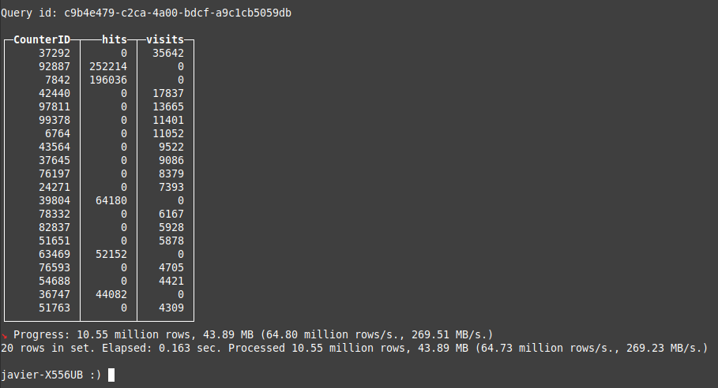


#### Un ejemplo de JOIN:
```sql
clickhouse-client --query "SELECT
    EventDate,
    hits,
    visits
FROM
(
    SELECT
        EventDate,
        count() AS hits
    FROM datasets.hits_v1
    GROUP BY EventDate
) ANY LEFT JOIN
(
    SELECT
        StartDate AS EventDate,
        sum(Sign) AS visits
    FROM datasets.visits_v1
    GROUP BY EventDate
) USING EventDate
ORDER BY hits DESC
LIMIT 10
SETTINGS joined_subquery_requires_alias = 0
FORMAT PrettyCompact"
```
**Resultado**

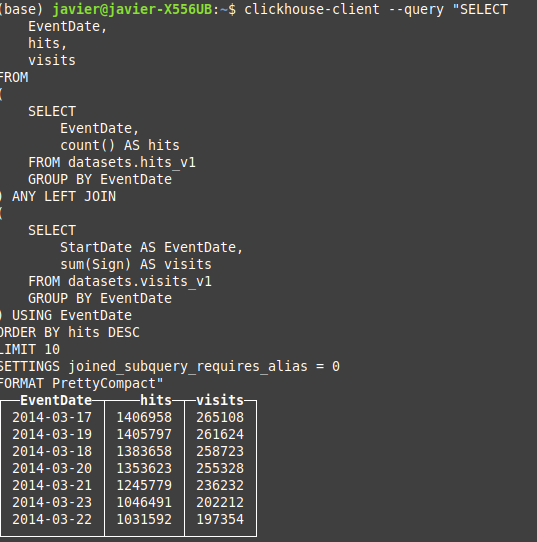

* Consulta: 

```sql
SELECT
    CounterID,
    hits,
    visits
FROM
(
    SELECT
        CounterID % 100000 AS CounterID,
        count() AS hits
    FROM datasets.hits_v1
    GROUP BY CounterID
) AS h
ANY LEFT JOIN
(
    SELECT
        CounterID % 100000 AS CounterID,
        sum(Sign) AS visits
    FROM datasets.visits_v1
    GROUP BY CounterID
    HAVING visits > 0
) AS v USING (CounterID)
WHERE (hits = 0) OR (visits = 0)
ORDER BY
    hits + (visits * 10) DESC,
    CounterID ASC
LIMIT 20;
```

**Resultado**

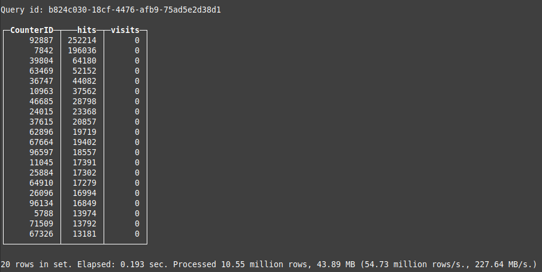
</details>


  [](#nosql)


### Aplicación al trabajo (Ejemplo con clickhouse-client)

Se realiza un revisión de consultas de todas las tabla de postgres y se importan a clickhouse.

A partir de este proceso, he realizado una inspección de la tabla confección que ha sido alimentado con aprox. 300000 registros (contiene las ordenes totales cruzadas de confección).

Y dado el nivel transaccional y de consultas, se puede optimizar el tiempo de respuesta para la aplicación. Así también, se puede realizar Update's and delete's de manera óptima, con un motor que permita dichas operaciones. 

Para el actual trabajo, he trabajado con Clickhouse Client, DBeaver, MergeTree y ClickHouse Cloud. 

  [](#nosql)

### Enlaces de referencia

* [Official website](https://clickhouse.com/) tiene una rápida visión general de ClickHouse en la página principal.
* [ClickHouse Cloud](https://clickhouse.cloud) ClickHouse como servicio, construido por los creadores y mantenedores.
* [Tutorial](https://clickhouse.com/docs/en/getting_started/tutorial/) muestra cómo configurar y consultar un pequeño clúster ClickHouse.
* [Documentation](https://clickhouse.com/docs/en/) ofrece información más detallada.
* [YouTube channel](https://www.youtube.com/c/ClickHouseDB) tiene mucho contenido sobre ClickHouse en formato de vídeo.
* [Slack](https://clickhouse.com/slack) y [Telegram](https://telegram.me/clickhouse_en) permiten chatear con los usuarios de ClickHouse en tiempo real.
* [Blog](https://clickhouse.com/blog/) contiene diversos artículos relacionados con ClickHouse, así como anuncios e informes sobre eventos.
* [Code Browser (github.dev)](https://github.dev/ClickHouse/ClickHouse) con resaltado de sintaxis, impulsado por github.dev.
* [Contacts](https://clickhouse.com/company/contact) resuelve dudas.

  [](#nosql)

[Regresar al índice](./indice.md)
