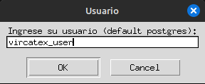

# Entregable 4 - Guías
## Guía del desarrollador

- [Base de datos (Postgres)](#base-de-datos)
- [FrontEnd](#frontend)
- [Backend](#backend)

---

### Base de datos

> Pre-requisitos:
> * Instalar Postgres
> * Instalar Python3
> * Instalar Visual Studio Code (Instalar Extensión Python)
> * Instalar pip install psycopg2 faker
> * Descargar scripts de ***Querys***

1. Abrir DBeaver.
2. Crear base de datos: vircatex.
3. Copiar y pegar contenido de archivo ***CreadorDB.sql*** en Dbeaver.
- Ejecutar script.
- Verificar creación de tablas.
4. Ejecutar archivos ***.py*** en Visual Studio Code.
- Ejecutar archivo en terminal: ***inserts8_9.py***
- Ingresar datos de host, database, port, password, user.

- Carga de data generada:

5. Verificar creación de data en cada tabla de la base de datos 'vircatex'.

  

---

### FrontEnd

  

---

### Backend

  
  
---

[Regresar a Documentación](../../entregable%204-documentacion.md)

[Regresar a Próximos Pasos](../proximos-pasos.md)
