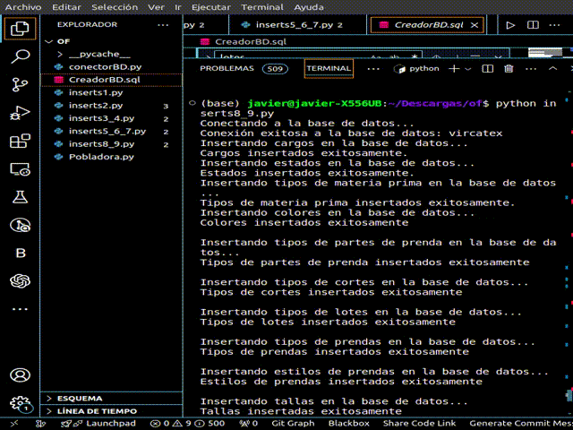

# Entregable 4 del proyecto
## Código

### Front end
Abrir en Google Chrome: [Vircatex - render](https://sistema-web-v-f.onrender.com/) 

[Github FrontEnd - React](https://github.com/javierarteagagonzales/sistema-web-v-f) 

### App Web
Despliegue FrontEnd, Backend y PostgreSQL : [Render](https://render.com/)

[Github BackEnd - React](https://github.com/javierarteagagonzales/sistema-web-v) 

### Conexión Base de datos (local)


### Conexión Base de datos (render)


### Querys e insert de data 

[Github - querys SQL](./querys) 



**Tablas**

Total de registros, mediante el siguiente bloque PL/pgSQL: 

<details>
  <summary>Ver totales</summary>
  
```sql
DO $$
DECLARE
    rec RECORD;
    total_records BIGINT := 0;
    table_records BIGINT;
BEGIN
    FOR rec IN 
        SELECT table_name 
        FROM information_schema.tables 
        WHERE table_schema = 'public'
    LOOP
        EXECUTE 'SELECT COUNT(*) FROM ' || rec.table_name INTO table_records;
        total_records := total_records + table_records;
        RAISE NOTICE 'Table %: % records', rec.table_name, table_records;
    END LOOP;
    RAISE NOTICE 'Total records in all tables: %', total_records;
END $$;

```

**Resultado:**

- **Table direccion**: 97 records
- **Table proveedor**: 20 records
- **Table telefono**: 97 records
- **Table correo**: 97 records
- **Table area**: 7 records
- **Table empleado**: 77 records
- **Table cargo**: 6 records
- **Table estado**: 12 records
- **Table maquina**: 30 records
- **Table color**: 15 records
- **Table dimension_materia_prima**: 100 records
- **Table tipo_materia_prima**: 8 records
- **Table tipo_parte_prenda**: 16 records
- **Table dimension_parte_prenda**: 100 records
- **Table tipo_prenda**: 6 records
- **Table dimension_confeccion**: 100 records
- **Table estilo_prenda**: 3 records
- **Table guia_confeccion**: 100 records
- **Table talla**: 7 records
- **Table genero**: 2 records
- **Table orden_pedido**: 100 records
- **Table plan_produccion**: 100 records
- **Table zona**: 5 records
- **Table aql_codigo**: 16 records
- **Table aql_muestra**: 105 records
- **Table aql_lote_rango**: 15 records
- **Table aql_nivel**: 7 records
- **Table aql_resultado_rango**: 176 records
- **Table aql_significancia**: 11 records
- **Table dimension_corte**: 100 records
- **Table parte_corte_detalle**: 191 records
- **Table tipo_corte**: 27 records
- **Table dimension_prenda**: 100 records
- **Table orden_trabajo**: 50 records
- **Table pasillo**: 50 records
- **Table dim_confeccion_detalle**: 691 records
- **Table dim_prenda_detalle**: 278 records
- **Table acabado**: 5 records
- **Table pedido_detalle**: 296 records
- **Table estanteria**: 250 records
- **Table orden_producción**: 150 records
- **Table actividad_diaria**: 1186 records
- **Table lote**: 1186 records
- **Table tipo_lote**: 3 records
- **Table empleado_actividad**: 300 records
- **Table maquina_actividad**: 100 records
- **Table caja_prenda**: 200 records
- **Table materia_prima**: 39100 records
- **Table corte**: 147179 records
- **Table registro_uso_lote**: 400 records
- **Table caja_lote**: 200 records
- **Table espacio**: 10000 records
- **Table lote_salida**: 200 records
- **Table inspeccion_calidad**: 100 records
- **Table inspeccion_descripcion**: 57 records
- **Table resultado**: 2 records
- **Table confeccion**: 301428 records
- **Table registro_lote_caja**: 50 records
- **Table registro_transformacion_caja**: 50 records
- **Table prenda**: 12692 records
- **Table caja_salida**: 100 records
- **Table lote_entrada**: 200 records

**Total records in all tables**: 518356


</details>


## Gestión de la configuración:

El versionado semántico es un estándar ampliamente aceptado para versionar software. Se compone de tres números separados por puntos: MAJOR.MINOR.PATCH.

* MAJOR: Incrementa cuando se hacen cambios incompatibles en la API.
* MINOR: Incrementa cuando se añaden funcionalidades de manera retrocompatible.
* PATCH: Incrementa cuando se hacen correcciones de errores retrocompatibles.

A continuación presentamos el versionado de Sistema Vircatex

### V 1.0 FrontEnd de la App web
[FrontEnd](https://vircatex.netlify.app/) 

### V 1.1 Desarrollo FullStack con Conexión ORM

### V 1.2.1. Desarrollo FullStack con Querys SQL

[Github FrontEnd - React](https://github.com/javierarteagagonzales/sistema-web-v-f) 

[Github BackEnd - React](https://github.com/javierarteagagonzales/sistema-web-v) 


[](./entregable%204-indice.md)

